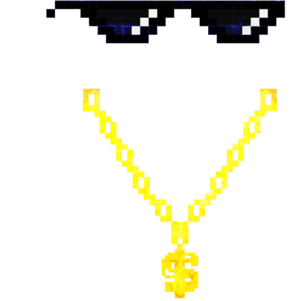

# EASY Onboarding

   

Because you’re here, you’re a rare breed of crypto lover: one who wants financial energy to return to people creating real value. The people experiencing life, sharing their gifts, walking dharma and ikigai, making their own meaning.

You’re in good company. I take it as my duty to see this through by gathering the best people, ideas, and mechanisms to make it happen.

- Welcome,  
  Gudasol 🜛

## Onboard to EASY

- Get a [**Wallet**](https://webauth.com) and fund it with XPR or USD(c) via CEX like [KuCoin](https://www.kucoin.com/), or use [crypto bridge](https://www.flex.town/) / [card](https://webauth.com) after KYC
- [Swap](https://alcor.exchange/v/xpr/swap?input=XUSDC-xtokens&output=EASY-mon3y) to buy **[EASY](https://alcor.exchange/v/xpr/swap?input=XUSDC-xtokens&output=EASY-mon3y)** here or choose **[WON](https://alcor.exchange/v/xpr/swap?output=WON-w3won)**, **[MEME](https://alcor.exchange/v/xpr/swap?output=MEME-m3m3)**, or **[GRAMS](https://alcor.exchange/v/xpr/swap?output=GRAMS-gold.mon3y)**
- Flex: (change) your reward token, send out rewards + set a beneficiary via [flex.town](https://flex.town), and [request invite](https://flex.town) to the **Welcome program**
- Take it EASY. Stack rewards + tell friends about EASY

Bookmark **[flex.town](https://flex.town)** to send reflections, change rewards, and more.
