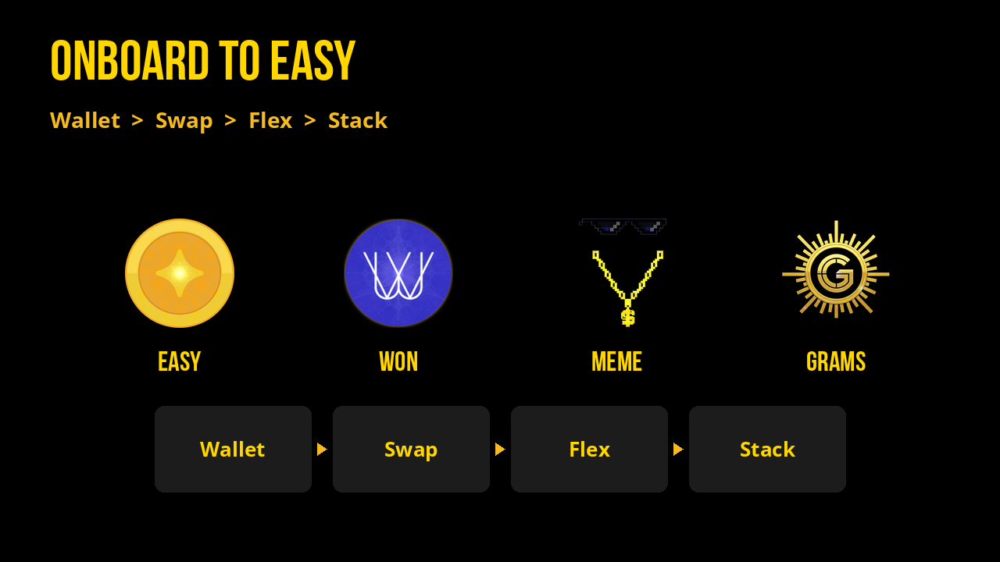

# EASY Onboarding

XPR Wallet → Alcor Exchange → EASY → Flex Yields.

1. Get a [WebAuth](https://webauth.com) wallet. Fund it with XPR or USD(c).
   - CEX: KuCoin (or similar) → withdraw to WebAuth
   - Bridge: [Metal X](https://app.metalx.com/bridge)
   - Card: after KYC via WebAuth / Metal Pay
2. [Swap](https://alcor.exchange/v/xpr/swap?input=XUSDC-xtokens&output=EASY-mon3y) into EASY. Or pick [WON](https://alcor.exchange/v/xpr/swap?output=WON-w3won), [MEME](https://alcor.exchange/v/xpr/swap?output=MEME-m3m3), or [GRAMS](https://alcor.exchange/v/xpr/swap?output=GRAMS-gold.mon3y).
3. Hold **100+ EASY** so reflections pay you. On [flex.town](https://flex.town): set your reward token, send rewards, name a beneficiary, request a Welcome invite.
4. Keep the bag. Tell one person.

Bookmark [flex.town](https://flex.town).

Take it EASY. Welcome, Gudasol 🜛
