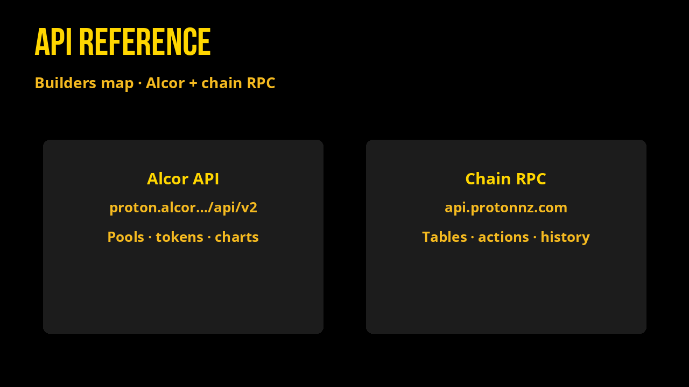

# API Reference



Public reads used by this docs site, published here as a builder’s map. Endpoints are **Alcor (XPR)** and **XPR chain RPC**; treat them like Flex Report’s data plane.

Base hosts:

| Layer | Host |
| --- | --- |
| Alcor API (XPR) | `https://proton.alcor.exchange/api/v2/` |
| Alcor API docs | [api.alcor.exchange](https://api.alcor.exchange/) |
| Chain RPC | `https://api.protonnz.com/v1/chain/` (fallback `https://proton.greymass.com`) |
| Explorer | [explorer.xprnetwork.org](https://explorer.xprnetwork.org/) |
| UI (v2) | [alcor.exchange/v/xpr/…](https://alcor.exchange/v/xpr/swap) |

---

## 1. Call contract actions (Explorer)

Open the contract account → click **Contract** → pick an action → sign with WebAuth.

| Token | Explorer | Common actions |
| --- | --- | --- |
| **EASY** | [`mon3y`](https://explorer.xprnetwork.org/account/mon3y) | `distribute`, `setflextoken`, `noflexzone` |
| **WON** | [`w3won`](https://explorer.xprnetwork.org/account/w3won) | `radiate`, `sprouttoken`, `settree`, `optoutoftax` |
| **MEME** | [`m3m3`](https://explorer.xprnetwork.org/account/m3m3) | `distribute`, `setflextoken`, `noflexzone` |
| **GRAMS** | [`gold.mon3y`](https://explorer.xprnetwork.org/account/gold.mon3y) | `reflect`, `interestoken`, `inheritance`, `renounce` |

Full action lists: [Smart Contracts](smart-contracts/README.md).

---

## 2. Pending reflection pool (on-chain)

`POST https://api.protonnz.com/v1/chain/get_table_rows`

Read `stat.reflection_pool` (the pending splash balance before someone calls `distribute` / `radiate` / `reflect`).

| Token | `code` | `scope` | `table` |
| --- | --- | --- | --- |
| **EASY** | `mon3y` | `EASY` | `stat` |
| **WON** | `w3won` | `WON` | `stat` |
| **MEME** | `m3m3` | `MEME` | `stat` |
| **GRAMS** | `gold.mon3y` | `GRAMS` | `stat` |

Example body (EASY):

```json
{
  "code": "mon3y",
  "scope": "EASY",
  "table": "stat",
  "json": true,
  "limit": 1
}
```

Field of interest: `rows[0].reflection_pool` (also `supply`, `max_supply`, and on WON/GRAMS `project_pool`).

---

## 3. Flexer / holder rows

Same `get_table_rows` endpoint. Scope is the **contract account** (not the symbol).

| Token | `code` | `scope` | `table` |
| --- | --- | --- | --- |
| **EASY** | `mon3y` | `mon3y` | `flexers` |
| **WON** | `w3won` | `w3won` | `flexers` |
| **MEME** | `m3m3` | `m3m3` | `flexers` |
| **GRAMS** | `gold.mon3y` | `gold.mon3y` | `flexers` |

Paginate with `limit` (e.g. `1000`) and `lower_bound` / `next_key` while `more` is true. Used for holder counts on [Market Stats](market-stats.md).

---

## 4. Token price & metadata (Alcor)

`GET` (open in browser or curl):

| Token | Endpoint |
| --- | --- |
| **EASY** | [tokens/easy-mon3y](https://proton.alcor.exchange/api/v2/tokens/easy-mon3y) |
| **WON** | [tokens/won-w3won](https://proton.alcor.exchange/api/v2/tokens/won-w3won) |
| **MEME** | [tokens/meme-m3m3](https://proton.alcor.exchange/api/v2/tokens/meme-m3m3) |
| **GRAMS** | [tokens/grams-gold.mon3y](https://proton.alcor.exchange/api/v2/tokens/grams-gold.mon3y) |

Useful fields: `usd_price`, `system_price` (XPR).

UI mirrors:

| Token | Analytics |
| --- | --- |
| **EASY** | [analytics/tokens/EASY-mon3y](https://alcor.exchange/v/xpr/analytics/tokens/EASY-mon3y) |
| **WON** | [analytics/tokens/WON-w3won](https://alcor.exchange/v/xpr/analytics/tokens/WON-w3won) |
| **MEME** | [analytics/tokens/MEME-m3m3](https://alcor.exchange/v/xpr/analytics/tokens/MEME-m3m3) |
| **GRAMS** | [analytics/tokens/GRAMS-gold.mon3y](https://alcor.exchange/v/xpr/analytics/tokens/GRAMS-gold.mon3y) |

---

## 5. Swap pools (volume, depth, arb)

| Call | Link |
| --- | --- |
| All swap pools | [GET …/swap/pools](https://proton.alcor.exchange/api/v2/swap/pools) |

Filter client-side where `tokenA` or `tokenB` is the Flex token (`EASY@mon3y`, `WON@w3won`, `MEME@m3m3`, `GRAMS@gold.mon3y`).

Useful fields: `volumeUSD24`, `volumeUSDWeek`, `volumeUSDMonth`, `tokenA.quantity` / `tokenB.quantity`, `change24`.

Pool UI example (EASY/XUSDC): [analytics/pools/4065](https://alcor.exchange/v/xpr/analytics/pools/4065).

Optional pair charts:

| | |
| --- | --- |
| Example | [GET …/swap/charts?tokenA=easy-mon3y&tokenB=xusdc-xtokens](https://proton.alcor.exchange/api/v2/swap/charts?tokenA=easy-mon3y&tokenB=xusdc-xtokens) |

---

## 6. Exchange-wide Alcor (XPR) analytics

| Window | Endpoint |
| --- | --- |
| 1D | [analytics/global?resolution=1D](https://proton.alcor.exchange/api/v2/analytics/global?resolution=1D) |
| 1W | [analytics/global?resolution=1W](https://proton.alcor.exchange/api/v2/analytics/global?resolution=1W) |
| 1M | [analytics/global?resolution=1M](https://proton.alcor.exchange/api/v2/analytics/global?resolution=1M) |

`swapTradingVolume` is the denominator for “EASY share of Alcor swap” on Market Stats.

---

## 7. History (example account)

| | |
| --- | --- |
| Example | [get_actions?account=thelake&filter=mon3y:transfer](https://proton.eosusa.io/v2/history/get_actions?account=thelake&filter=mon3y:transfer&sort=asc) |

Inbound `from=mon3y` transfers ≈ reflection payments for that account.

---

## Swap & farms (UI)

| | |
| --- | --- |
| [Swap EASY](https://alcor.exchange/v/xpr/swap?input=XUSDC-xtokens&output=EASY-mon3y) | Exact XUSDC → EASY pair |
| [Farms](https://alcor.exchange/v/xpr/analytics?tab=farms) | Alcor XPR farms |

Pages powered by these calls: [Market Stats](market-stats.md) · [Stablecoin Arbitrage](arbitrage.md) · [Success Stories](our-story/success-stories.md).
