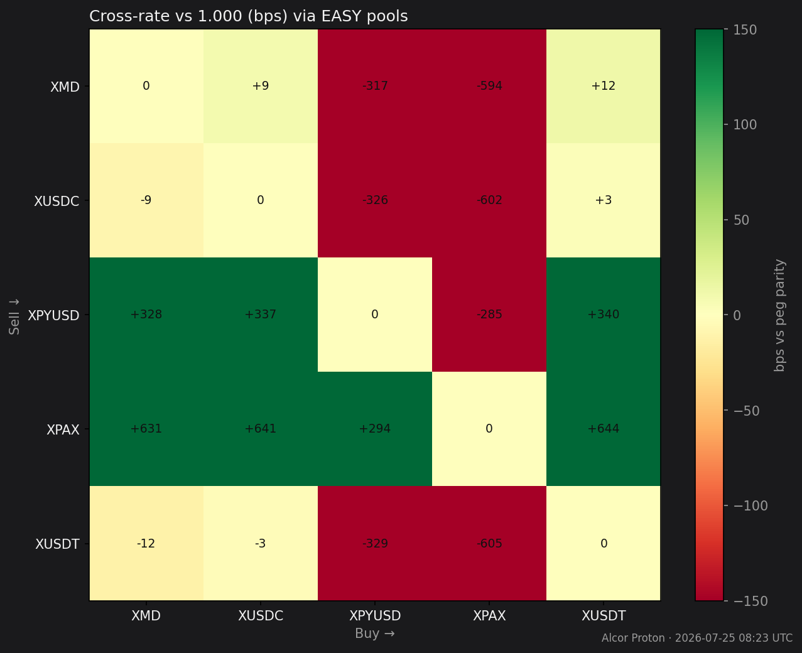

# Stablecoin Arbitrage (XPR)

Dated cross-rates for selling each of **XMD · XUSDC · XPYUSD · XPAX · XUSDT** into the others on Alcor (XPR Network).

*Snapshot: **2026-07-25 08:23 UTC** · Primary path: deepest **EASY**↔stable pools · Also listed: direct stable↔stable pools*

## How to read

- Rows = **sell** this coin. Columns = **buy** that coin.
- Cell = how many **buy** tokens you get per **1.0 sell** token (implied), routing **sell → EASY → buy**.
- **bps** = distance from 1.0000 (parity). Green opportunity when you receive more than 1.0 of a same-peg asset after fees/slippage — always simulate on [Alcor Swap](https://proton.alcor.exchange/swap) before sizing.

Fees, hop slippage, and pool depth can erase small edges. EASY transfer tax (2%) applies when EASY moves to non-exempt accounts — prefer routing that stays inside `swap.alcor` memos when possible.

## Implied rates via EASY (amount of Buy per 1 Sell)

| Sell ↓ \ Buy → | XMD | XUSDC | XPYUSD | XPAX | XUSDT |
| --- | ---: | ---: | ---: | ---: | ---: |
| **XMD** | 1.000000 | 1.000916 | 0.968272 | 0.940640 | 1.001220 |
| **XUSDC** | 0.999085 | 1.000000 | 0.967386 | 0.939779 | 1.000304 |
| **XPYUSD** | 1.032768 | 1.033714 | 1.000000 | 0.971462 | 1.034028 |
| **XPAX** | 1.063106 | 1.064080 | 1.029376 | 1.000000 | 1.064404 |
| **XUSDT** | 0.998781 | 0.999696 | 0.967092 | 0.939493 | 1.000000 |

### Same matrix in basis points vs 1.000

| Sell ↓ \ Buy → | XMD | XUSDC | XPYUSD | XPAX | XUSDT |
| --- | ---: | ---: | ---: | ---: | ---: |
| **XMD** | +0.0 | +9.2 | -317.3 | -593.6 | +12.2 |
| **XUSDC** | -9.1 | +0.0 | -326.1 | -602.2 | +3.0 |
| **XPYUSD** | +327.7 | +337.1 | +0.0 | -285.4 | +340.3 |
| **XPAX** | +631.1 | +640.8 | +293.8 | +0.0 | +644.0 |
| **XUSDT** | -12.2 | -3.0 | -329.1 | -605.1 | +0.0 |

## Standout legs (this snapshot)

- Sell **XPAX** → buy **XUSDT**: **1.064404** (+644.0 bps) via EASY
- Sell **XPAX** → buy **XUSDC**: **1.064080** (+640.8 bps) via EASY
- Sell **XPAX** → buy **XMD**: **1.063106** (+631.1 bps) via EASY
- Sell **XPYUSD** → buy **XUSDT**: **1.034028** (+340.3 bps) via EASY
- Sell **XPYUSD** → buy **XUSDC**: **1.033714** (+337.1 bps) via EASY
- Sell **XUSDT** → buy **XPAX**: **0.939493** (-605.1 bps) via EASY
- Sell **XUSDC** → buy **XPAX**: **0.939779** (-602.2 bps) via EASY
- Sell **XMD** → buy **XPAX**: **0.940640** (-593.6 bps) via EASY
- Sell **XUSDT** → buy **XPYUSD**: **0.967092** (-329.1 bps) via EASY
- Sell **XUSDC** → buy **XPYUSD**: **0.967386** (-326.1 bps) via EASY

## EASY pool anchors

| Stable | Pool | EASY per 1 stable | TVL | 24h vol |
| --- | --- | ---: | ---: | ---: |
| XMD | [4067](https://proton.alcor.exchange/analytics/pools/4067) | 60.5532 | $65,268 | $6,639 |
| XUSDC | [4065](https://proton.alcor.exchange/analytics/pools/4065) | 60.4978 | $65,137 | $2,815 |
| XPYUSD | [4068](https://proton.alcor.exchange/analytics/pools/4068) | 62.5374 | $54,029 | $50 |
| XPAX | [4070](https://proton.alcor.exchange/analytics/pools/4070) | 64.3745 | $55,515 | $1 |
| XUSDT | [4066](https://proton.alcor.exchange/analytics/pools/4066) | 60.4794 | $64,933 | $1,270 |

### Alcor mark prices

| | XMD | XUSDC | XPYUSD | XPAX | XUSDT |
| --- | ---: | ---: | ---: | ---: | ---: |
| `usd_price` | $0.9825 | $1.0000 | $1.0295 | $1.0457 | $0.9831 |

## Direct stable↔stable pools (best TVL each pair)

| Pair | Pool | TVL | Rate | Inverse |
| --- | --- | ---: | --- | --- |
| XUSDC/XUSDT | 0 | $1,524.10 | 1.000010 XUSDT per XUSDC | 0.999992 XUSDC per XUSDT |
| XMD/XUSDC | 7420 | $326.37 | 0.999783 XUSDC per XMD | 1.000220 XMD per XUSDC |
| XPYUSD/XUSDC | 2768 | $18.77 | 1.029800 XUSDC per XPYUSD | 0.971061 XPYUSD per XUSDC |
| XMD/XPAX | 2769 | $13.65 | 0.960791 XPAX per XMD | 1.040810 XMD per XPAX |
| XPYUSD/XUSDT | 2775 | $8.94 | 1.023880 XUSDT per XPYUSD | 0.976678 XPYUSD per XUSDT |
| XPAX/XUSDT | 3045 | $7.71 | 1.057280 XUSDT per XPAX | 0.945823 XPAX per XUSDT |
| XPAX/XUSDC | 2770 | $4.68 | 1.055330 XUSDC per XPAX | 0.947567 XPAX per XUSDC |
| XMD/XPYUSD | 2767 | $1.96 | 0.956549 XPYUSD per XMD | 1.045420 XMD per XPYUSD |
| XMD/XUSDT | 1277 | $0.01 | 0.982915 XUSDT per XMD | 1.017380 XMD per XUSDT |
| XPAX/XPYUSD | 2766 | $0.00 | 1.054530 XPYUSD per XPAX | 0.948293 XPAX per XPYUSD |

Many direct books are thin — the EASY matrix is usually the practical arb surface (and why EASY volume dominates Alcor).

## Share / refresh

Copy the dated tables above into Telegram or Club notes. Say **update stats** in Cursor to refresh this page with a new timestamp.
