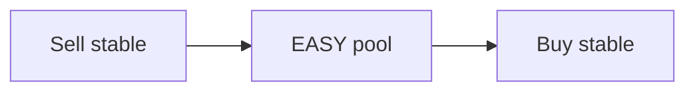

# Stablecoin Arbitrage (XPR)

Dated cross-rates for selling each of **XMD · XUSDC · XPYUSD · XPAX · XUSDT** into the others on Alcor (XPR Network).

*Snapshot: **2026-07-25 09:41 UTC** · Primary path: deepest **EASY**↔stable pools*

## Cross-rate heatmap (bps)

## How to read

- Rows = **sell** this coin. Columns = **buy** that coin.
- Cell = how many **buy** tokens you get per **1.0 sell** token (implied), routing **sell → EASY → buy**.
- **bps** = distance from 1.0000 (parity). Green opportunity when you receive more than 1.0 of a same-peg asset after fees/slippage. Always simulate on [Alcor Swap](https://alcor.exchange/v/xpr/swap) before sizing.

Fees, hop slippage, and pool depth can erase small edges. EASY transfer tax (2%) applies when EASY moves to non-exempt accounts. Prefer routing that stays inside `swap.alcor` memos when possible.

## Implied rates via EASY (amount of Buy per 1 Sell)

| Sell ↓ \ Buy → | XMD | XUSDC | XPYUSD | XPAX | XUSDT |
| --- | ---: | ---: | ---: | ---: | ---: |
| **XMD** | 1.000000 | 1.000681 | 0.968272 | 0.940640 | 1.001214 |
| **XUSDC** | 0.999320 | 1.000000 | 0.967613 | 0.940000 | 1.000532 |
| **XPYUSD** | 1.032768 | 1.033471 | 1.000000 | 0.971462 | 1.034021 |
| **XPAX** | 1.063106 | 1.063830 | 1.029376 | 1.000000 | 1.064397 |
| **XUSDT** | 0.998788 | 0.999468 | 0.967098 | 0.939499 | 1.000000 |

### Same matrix in basis points vs 1.000

| Sell ↓ \ Buy → | XMD | XUSDC | XPYUSD | XPAX | XUSDT |
| --- | ---: | ---: | ---: | ---: | ---: |
| **XMD** | +0.0 | +6.8 | -317.3 | -593.6 | +12.1 |
| **XUSDC** | -6.8 | +0.0 | -323.9 | -600.0 | +5.3 |
| **XPYUSD** | +327.7 | +334.7 | +0.0 | -285.4 | +340.2 |
| **XPAX** | +631.1 | +638.3 | +293.8 | +0.0 | +644.0 |
| **XUSDT** | -12.1 | -5.3 | -329.0 | -605.0 | +0.0 |

## Standout legs (this snapshot)

- Sell **XPAX** → buy **XUSDT**: **1.064397** (+644.0 bps) via EASY
- Sell **XPAX** → buy **XUSDC**: **1.063830** (+638.3 bps) via EASY
- Sell **XPAX** → buy **XMD**: **1.063106** (+631.1 bps) via EASY
- Sell **XPYUSD** → buy **XUSDT**: **1.034021** (+340.2 bps) via EASY
- Sell **XPYUSD** → buy **XUSDC**: **1.033471** (+334.7 bps) via EASY
- Sell **XUSDT** → buy **XPAX**: **0.939499** (-605.0 bps) via EASY
- Sell **XUSDC** → buy **XPAX**: **0.940000** (-600.0 bps) via EASY
- Sell **XMD** → buy **XPAX**: **0.940640** (-593.6 bps) via EASY
- Sell **XUSDT** → buy **XPYUSD**: **0.967098** (-329.0 bps) via EASY
- Sell **XUSDC** → buy **XPYUSD**: **0.967613** (-323.9 bps) via EASY

## EASY pool anchors

**Stable TVL** = USD value of the non-EASY side only (XMD / XUSDC / XPYUSD / XPAX / XUSDT depth in that pool).

| Stable | Pool | EASY per 1 stable | Stable TVL | 24h vol |
| --- | --- | ---: | ---: | ---: |
| XMD | [4067](https://alcor.exchange/v/xpr/analytics/pools/4067) | 60.5532 | $11,925 | $6,581 |
| XUSDC | [4065](https://alcor.exchange/v/xpr/analytics/pools/4065) | 60.5120 | $11,990 | $2,798 |
| XPYUSD | [4068](https://alcor.exchange/v/xpr/analytics/pools/4068) | 62.5374 | $11,450 | $50 |
| XPAX | [4070](https://alcor.exchange/v/xpr/analytics/pools/4070) | 64.3745 | $11,498 | $1 |
| XUSDT | [4066](https://alcor.exchange/v/xpr/analytics/pools/4066) | 60.4798 | $11,782 | $1,270 |

### Alcor mark prices

| Stable | usd_price |
| --- | ---: |
| XMD | $0.9805 |
| XUSDC | $1.0000 |
| XPYUSD | $1.0308 |
| XPAX | $1.0443 |
| XUSDT | $0.9815 |
