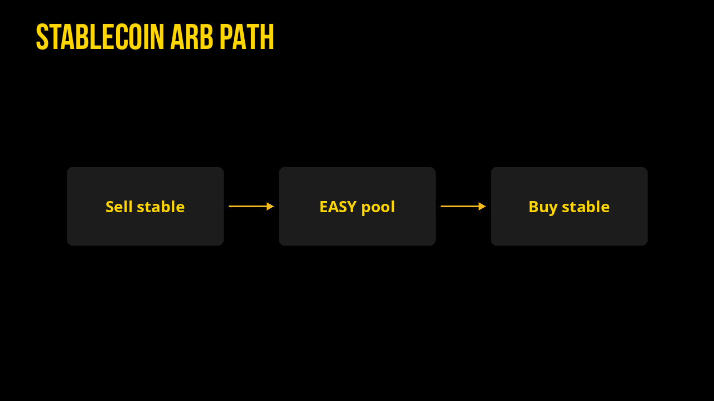

# Stablecoin Arbitrage (XPR)

Dated cross-rates for selling each of **XMD · XUSDC · XPYUSD · XPAX · XUSDT** into the others on Alcor (XPR Network).

*Snapshot: **2026-08-15 13:24 UTC** · Primary path: deepest **EASY**↔stable pools*

## Cross-rate heatmap (+/- percent)

## How to read

- Rows = **sell** this coin. Columns = **buy** that coin.
- Cell = how many **buy** tokens you get per **1.0 sell** token (implied), routing **sell → EASY → buy**.
- Heatmap / percent table = distance from 1.0000 (parity) as **+/- percent** (green when you receive more than 1.0 of a same-peg asset after fees/slippage). Always simulate on [Alcor Swap](https://alcor.exchange/v/xpr/swap) before sizing.

Fees, hop slippage, and pool depth can erase small edges. EASY transfer tax (2%) applies when EASY moves to non-exempt accounts. Prefer routing that stays inside `swap.alcor` memos when possible.

## Implied rates via EASY (amount of Buy per 1 Sell)

| Sell ↓ \ Buy → | XMD | XUSDC | XPYUSD | XPAX | XUSDT |
| --- | ---: | ---: | ---: | ---: | ---: |
| **XMD** | 1.000000 | 0.999980 | 1.000876 | 1.000992 | 0.983201 |
| **XUSDC** | 1.000020 | 1.000000 | 1.000896 | 1.001012 | 0.983220 |
| **XPYUSD** | 0.999125 | 0.999105 | 1.000000 | 1.000116 | 0.982340 |
| **XPAX** | 0.999009 | 0.998989 | 0.999884 | 1.000000 | 0.982226 |
| **XUSDT** | 1.017086 | 1.017066 | 1.017977 | 1.018095 | 1.000000 |

### Same matrix as +/- percent vs 1.000

| Sell ↓ \ Buy → | XMD | XUSDC | XPYUSD | XPAX | XUSDT |
| --- | ---: | ---: | ---: | ---: | ---: |
| **XMD** | +0.00 | -0.00 | +0.09 | +0.10 | -1.68 |
| **XUSDC** | +0.00 | +0.00 | +0.09 | +0.10 | -1.68 |
| **XPYUSD** | -0.09 | -0.09 | +0.00 | +0.01 | -1.77 |
| **XPAX** | -0.10 | -0.10 | -0.01 | +0.00 | -1.78 |
| **XUSDT** | +1.71 | +1.71 | +1.80 | +1.81 | +0.00 |

## Standout legs (this snapshot)

- Sell **XUSDT** → buy **XPAX**: **1.018095** (+1.81% vs parity) via EASY
- Sell **XUSDT** → buy **XPYUSD**: **1.017977** (+1.80% vs parity) via EASY
- Sell **XUSDT** → buy **XMD**: **1.017086** (+1.71% vs parity) via EASY
- Sell **XUSDT** → buy **XUSDC**: **1.017066** (+1.71% vs parity) via EASY
- Sell **XUSDC** → buy **XPAX**: **1.001012** (+0.10% vs parity) via EASY
- Sell **XPAX** → buy **XUSDT**: **0.982226** (-1.78% vs parity) via EASY
- Sell **XPYUSD** → buy **XUSDT**: **0.982340** (-1.77% vs parity) via EASY
- Sell **XMD** → buy **XUSDT**: **0.983201** (-1.68% vs parity) via EASY
- Sell **XUSDC** → buy **XUSDT**: **0.983220** (-1.68% vs parity) via EASY
- Sell **XPAX** → buy **XUSDC**: **0.998989** (-0.10% vs parity) via EASY

## EASY pool anchors

**Stable TVL** = USD value of the non-EASY side only (XMD / XUSDC / XPYUSD / XPAX / XUSDT depth in that pool).

| Stable | Pool | EASY per 1 stable | Stable TVL | 24h vol |
| --- | --- | ---: | ---: | ---: |
| XMD | [4067](https://alcor.exchange/v/xpr/analytics/pools/4067) | 60.4406 | $11,998 | $974 |
| XUSDC | [4065](https://alcor.exchange/v/xpr/analytics/pools/4065) | 60.4418 | $12,021 | $3,347 |
| XPYUSD | [4068](https://alcor.exchange/v/xpr/analytics/pools/4068) | 60.3877 | $12,098 | $101 |
| XPAX | [4070](https://alcor.exchange/v/xpr/analytics/pools/4070) | 60.3807 | $12,635 | $99 |
| XUSDT | [4066](https://alcor.exchange/v/xpr/analytics/pools/4066) | 61.4733 | $11,747 | $1,593 |

### Alcor mark prices

| Stable | usd_price |
| --- | ---: |
| XMD | $0.9980 |
| XUSDC | $1.0000 |
| XPYUSD | $1.0044 |
| XPAX | $0.9990 |
| XUSDT | $1.0156 |
