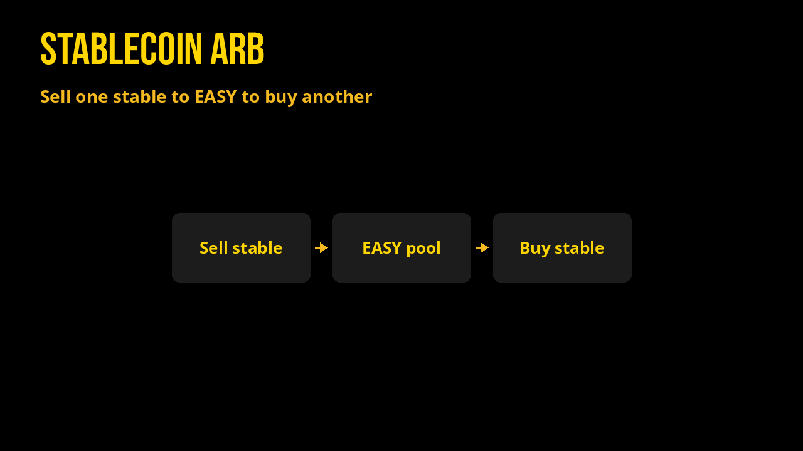

# Stablecoin Arbitrage (XPR)

Dated cross-rates for selling each of **XMD · XUSDC · XPYUSD · XPAX · XUSDT** into the others on Alcor (XPR Network).

*Snapshot: **2026-07-25 20:03 UTC** · Primary path: deepest **EASY**↔stable pools*

## Cross-rate heatmap (+/- percent)

## How to read

- Rows = **sell** this coin. Columns = **buy** that coin.
- Cell = how many **buy** tokens you get per **1.0 sell** token (implied), routing **sell → EASY → buy**.
- Heatmap / percent table = distance from 1.0000 (parity) as **+/- percent** (green when you receive more than 1.0 of a same-peg asset after fees/slippage). Always simulate on [Alcor Swap](https://alcor.exchange/v/xpr/swap) before sizing.

Fees, hop slippage, and pool depth can erase small edges. EASY transfer tax (2%) applies when EASY moves to non-exempt accounts. Prefer routing that stays inside `swap.alcor` memos when possible.

## Implied rates via EASY (amount of Buy per 1 Sell)

| Sell ↓ \ Buy → | XMD | XUSDC | XPYUSD | XPAX | XUSDT |
| --- | ---: | ---: | ---: | ---: | ---: |
| **XMD** | 1.000000 | 1.000873 | 0.969828 | 0.942174 | 1.001790 |
| **XUSDC** | 0.999128 | 1.000000 | 0.968982 | 0.941352 | 1.000917 |
| **XPYUSD** | 1.031111 | 1.032011 | 1.000000 | 0.971485 | 1.032957 |
| **XPAX** | 1.061375 | 1.062302 | 1.029352 | 1.000000 | 1.063276 |
| **XUSDT** | 0.998213 | 0.999084 | 0.968095 | 0.940490 | 1.000000 |

### Same matrix as +/- percent vs 1.000

| Sell ↓ \ Buy → | XMD | XUSDC | XPYUSD | XPAX | XUSDT |
| --- | ---: | ---: | ---: | ---: | ---: |
| **XMD** | +0.00 | +0.09 | -3.02 | -5.78 | +0.18 |
| **XUSDC** | -0.09 | +0.00 | -3.10 | -5.86 | +0.09 |
| **XPYUSD** | +3.11 | +3.20 | +0.00 | -2.85 | +3.30 |
| **XPAX** | +6.14 | +6.23 | +2.94 | +0.00 | +6.33 |
| **XUSDT** | -0.18 | -0.09 | -3.19 | -5.95 | +0.00 |

## Standout legs (this snapshot)

- Sell **XPAX** → buy **XUSDT**: **1.063276** (+6.33% vs parity) via EASY
- Sell **XPAX** → buy **XUSDC**: **1.062302** (+6.23% vs parity) via EASY
- Sell **XPAX** → buy **XMD**: **1.061375** (+6.14% vs parity) via EASY
- Sell **XPYUSD** → buy **XUSDT**: **1.032957** (+3.30% vs parity) via EASY
- Sell **XPYUSD** → buy **XUSDC**: **1.032011** (+3.20% vs parity) via EASY
- Sell **XUSDT** → buy **XPAX**: **0.940490** (-5.95% vs parity) via EASY
- Sell **XUSDC** → buy **XPAX**: **0.941352** (-5.86% vs parity) via EASY
- Sell **XMD** → buy **XPAX**: **0.942174** (-5.78% vs parity) via EASY
- Sell **XUSDT** → buy **XPYUSD**: **0.968095** (-3.19% vs parity) via EASY
- Sell **XUSDC** → buy **XPYUSD**: **0.968982** (-3.10% vs parity) via EASY

## EASY pool anchors

**Stable TVL** = USD value of the non-EASY side only (XMD / XUSDC / XPYUSD / XPAX / XUSDT depth in that pool).

| Stable | Pool | EASY per 1 stable | Stable TVL | 24h vol |
| --- | --- | ---: | ---: | ---: |
| XMD | [4067](https://alcor.exchange/v/xpr/analytics/pools/4067) | 60.6515 | $11,955 | $632 |
| XUSDC | [4065](https://alcor.exchange/v/xpr/analytics/pools/4065) | 60.5986 | $11,951 | $696 |
| XPYUSD | [4068](https://alcor.exchange/v/xpr/analytics/pools/4068) | 62.5384 | $11,478 | $49 |
| XPAX | [4070](https://alcor.exchange/v/xpr/analytics/pools/4070) | 64.3740 | $11,535 | $1 |
| XUSDT | [4066](https://alcor.exchange/v/xpr/analytics/pools/4066) | 60.5431 | $11,768 | $46 |

### Alcor mark prices

| Stable | usd_price |
| --- | ---: |
| XMD | $0.9866 |
| XUSDC | $1.0000 |
| XPYUSD | $1.0334 |
| XPAX | $1.0476 |
| XUSDT | $0.9827 |
