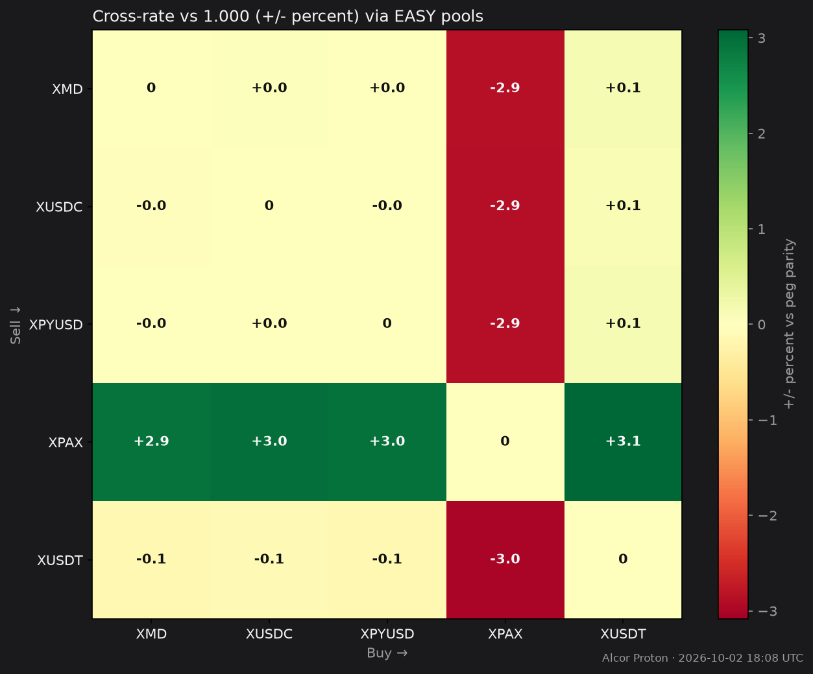
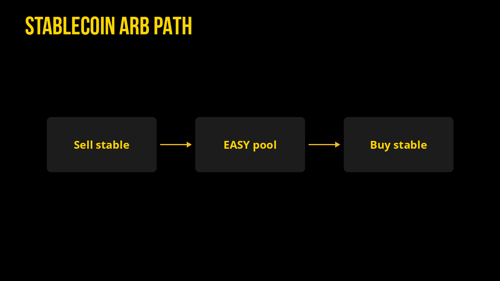

# Stablecoin Arbitrage (XPR)

Dated cross-rates for selling each of **XMD · XUSDC · XPYUSD · XPAX · XUSDT** into the others on Alcor (XPR Network).

*Snapshot: **2026-10-03 16:53 UTC** · Primary path: deepest **EASY**↔stable pools*

## Cross-rate heatmap (+/- percent)

## How to read

- Rows = **sell** this coin. Columns = **buy** that coin.
- Cell = how many **buy** tokens you get per **1.0 sell** token (implied), routing **sell → EASY → buy**.
- Heatmap / percent table = distance from 1.0000 (parity) as **+/- percent** (green when you receive more than 1.0 of a same-peg asset after fees/slippage). Always simulate on [Alcor Swap](https://alcor.exchange/v/xpr/swap) before sizing.

Fees, hop slippage, and pool depth can erase small edges. EASY transfer tax (2%) applies when EASY moves to non-exempt accounts. Prefer routing that stays inside `swap.alcor` memos when possible.

## Implied rates via EASY (amount of Buy per 1 Sell)

| Sell ↓ \ Buy → | XMD | XUSDC | XPYUSD | XPAX | XUSDT |
| --- | ---: | ---: | ---: | ---: | ---: |
| **XMD** | 1.000000 | 0.999703 | 0.999398 | 0.971660 | 0.994461 |
| **XUSDC** | 1.000298 | 1.000000 | 0.999695 | 0.971949 | 0.994757 |
| **XPYUSD** | 1.000602 | 1.000305 | 1.000000 | 0.972245 | 0.995060 |
| **XPAX** | 1.029167 | 1.028861 | 1.028547 | 1.000000 | 1.023466 |
| **XUSDT** | 1.005570 | 1.005271 | 1.004964 | 0.977072 | 1.000000 |

### Same matrix as +/- percent vs 1.000

| Sell ↓ \ Buy → | XMD | XUSDC | XPYUSD | XPAX | XUSDT |
| --- | ---: | ---: | ---: | ---: | ---: |
| **XMD** | +0.00 | -0.03 | -0.06 | -2.83 | -0.55 |
| **XUSDC** | +0.03 | +0.00 | -0.03 | -2.81 | -0.52 |
| **XPYUSD** | +0.06 | +0.03 | +0.00 | -2.78 | -0.49 |
| **XPAX** | +2.92 | +2.89 | +2.85 | +0.00 | +2.35 |
| **XUSDT** | +0.56 | +0.53 | +0.50 | -2.29 | +0.00 |

## Standout legs (this snapshot)

- Sell **XPAX** → buy **XMD**: **1.029167** (+2.92% vs parity) via EASY
- Sell **XPAX** → buy **XUSDC**: **1.028861** (+2.89% vs parity) via EASY
- Sell **XPAX** → buy **XPYUSD**: **1.028547** (+2.85% vs parity) via EASY
- Sell **XPAX** → buy **XUSDT**: **1.023466** (+2.35% vs parity) via EASY
- Sell **XUSDT** → buy **XMD**: **1.005570** (+0.56% vs parity) via EASY
- Sell **XMD** → buy **XPAX**: **0.971660** (-2.83% vs parity) via EASY
- Sell **XUSDC** → buy **XPAX**: **0.971949** (-2.81% vs parity) via EASY
- Sell **XPYUSD** → buy **XPAX**: **0.972245** (-2.78% vs parity) via EASY
- Sell **XUSDT** → buy **XPAX**: **0.977072** (-2.29% vs parity) via EASY
- Sell **XMD** → buy **XUSDT**: **0.994461** (-0.55% vs parity) via EASY

## EASY pool anchors

**Stable TVL** = USD value of the non-EASY side only (XMD / XUSDC / XPYUSD / XPAX / XUSDT depth in that pool).

| Stable | Pool | EASY per 1 stable | Stable TVL | 24h vol |
| --- | --- | ---: | ---: | ---: |
| XMD | [4067](https://alcor.exchange/v/xpr/analytics/pools/4067) | 54.1124 | $15,547 | $1,518 |
| XUSDC | [4065](https://alcor.exchange/v/xpr/analytics/pools/4065) | 54.1285 | $15,087 | $2,722 |
| XPYUSD | [4068](https://alcor.exchange/v/xpr/analytics/pools/4068) | 54.1450 | $15,140 | $469 |
| XPAX | [4070](https://alcor.exchange/v/xpr/analytics/pools/4070) | 55.6907 | $14,733 | $1 |
| XUSDT | [4066](https://alcor.exchange/v/xpr/analytics/pools/4066) | 54.4138 | $14,936 | $715 |

### Alcor mark prices

| Stable | usd_price |
| --- | ---: |
| XMD | $0.9981 |
| XUSDC | $1.0000 |
| XPYUSD | $1.0041 |
| XPAX | $1.0295 |
| XUSDT | $1.0000 |
