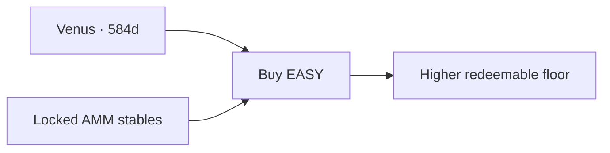
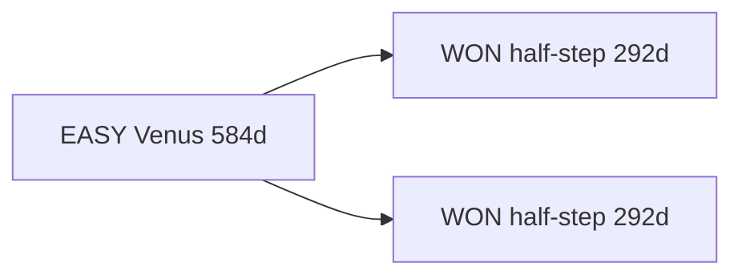

# Celestial Buybacks

Scheduled buybacks on celestial time — not arbitrary calendars. Liquidity stays locked in the pools; buybacks reinforce the floor on a rhythm humans can feel in the sky.

## Venus buybacks (EASY)

**Venus** returns to the same place relative to Earth and the Sun about every **584 days** (the Venus synodic period). EASY’s major buyback cadence follows that cycle.

| | |
| --- | --- |
| **Cadence** | Every **584 days** (Venus) |
| **What** | Buy EASY with accumulated USD(c)-side profits / protocol reserves |
| **Why celestial** | A rare, memorable beat — long enough to compound, short enough to anticipate |
| **Near-term marker** | Target window around **October 24, 2026** (aligns with the EASY buyback / chain milestone) |

Between Venus beats, day-to-day floor support still comes from the living loop: USD(c) swap profits buy EASY; EASY-side profits re-pool. See [Tokenomics](tokenomics.md) and [Liquidity & Farms](core-tech/liquidity-and-farms.md).

## WON buybacks (half-step)

**WON** buybacks run on the **half-step** of the Venus cycle — every **292 days** (~½ × 584).

| | |
| --- | --- |
| **Cadence** | Every **292 days** (half Venus) |
| **What** | Buybacks supporting the WON / EASY stack |
| **Relation** | Two WON beats per one EASY Venus beat |

## Why it matters

Celestial timing turns buybacks into **appointments**, not surprises. Holders can plan around a sky-clock; contributors can narrate the next Venus window the way clubs narrate the next meeting.

Live depth and volume while you wait: [Market Stats](market-stats.md). Trade: [Swap EASY](https://alcor.exchange/v/xpr/swap?input=XUSDC-xtokens&output=EASY-mon3y).
