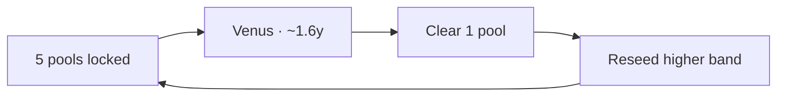
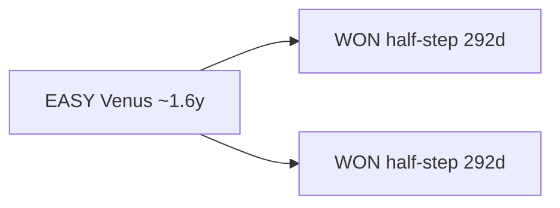

# Celestial Buybacks

Scheduled buybacks on celestial time, not arbitrary calendars. Liquidity stays locked until a Venus window; then **one** project pool is cleared and re-seeded higher.

## The Venus Buyback Option

I made this video to build understanding of EASY’s hidden problem that could hinder a big moon, and how Venus Buybacks fix it: [watch on YouTube](https://www.youtube.com/watch?v=HoZTD60D1lw).

This option **locks each of the 5 project EASY/stable pools** until dates of Venus alignments (**~1.6 years / 584 days apart**). At each alignment, **exactly one of the five pools** unlocks for a buyback: that pool is cleared, and the stables + EASY go right back into pools at a **new range** (same end price of **100K USD / EASY**, new start price = current market price).

All other pools remain locked. Tokens pulled out go right back in at a higher price.

| | |
| --- | --- |
| **Cadence** | Every **~1.6 years** (Venus synodic · ~584 days) |
| **What unlocks** | **One** of the five project EASY/stable pools (not all at once) |
| **What happens** | Clear that pool → redeploy stables + EASY at a higher band |
| **Range** | New start = market price · end still **$100,000 / EASY** |
| **Vote** | Once community has time to understand, we’ll hold a vote |

**Why it matters**

- Creates rising support  
- Protects deeper support  
- Something to look forward to and celebrate together every 1.6 years  
- An EASY life in harmony with self, community, earth, and stars  

I welcome all questions. For a better understanding + visual explanation, [watch the video](https://www.youtube.com/watch?v=HoZTD60D1lw).

### The five locked project pools

| Pool | Alcor |
| --- | --- |
| EASY / XMD | [4067](https://alcor.exchange/v/xpr/analytics/pools/4067) |
| EASY / XUSDC | [4065](https://alcor.exchange/v/xpr/analytics/pools/4065) |
| EASY / XPYUSD | [4068](https://alcor.exchange/v/xpr/analytics/pools/4068) |
| EASY / XPAX | [4070](https://alcor.exchange/v/xpr/analytics/pools/4070) |
| EASY / XUSDT | [4066](https://alcor.exchange/v/xpr/analytics/pools/4066) |

Between Venus beats, day-to-day floor support still comes from the living loop: USD(c) swap profits buy EASY; EASY-side profits re-pool. See [Tokenomics](tokenomics.md) and [Liquidity & Farms](core-tech/liquidity-and-farms.md).

## WON buybacks (half-step)

**WON** buybacks run on the **half-step** of the Venus cycle, every **292 days** (~½ × 584).

| | |
| --- | --- |
| **Cadence** | Every **292 days** (half Venus) |
| **What** | Buybacks supporting the WON / EASY stack |
| **Relation** | Two WON beats per one EASY Venus beat |

Live depth and volume while you wait: [Market Stats](market-stats.md). Trade: [Swap EASY](https://alcor.exchange/v/xpr/swap?input=XUSDC-xtokens&output=EASY-mon3y).
