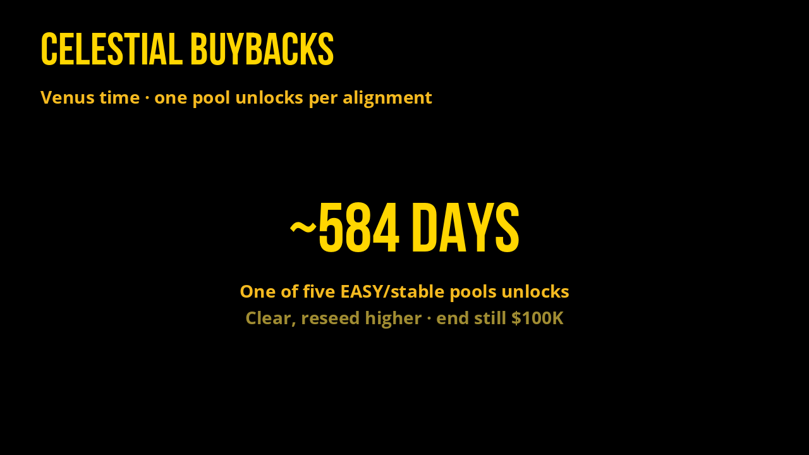
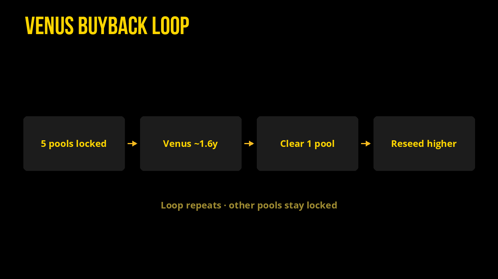
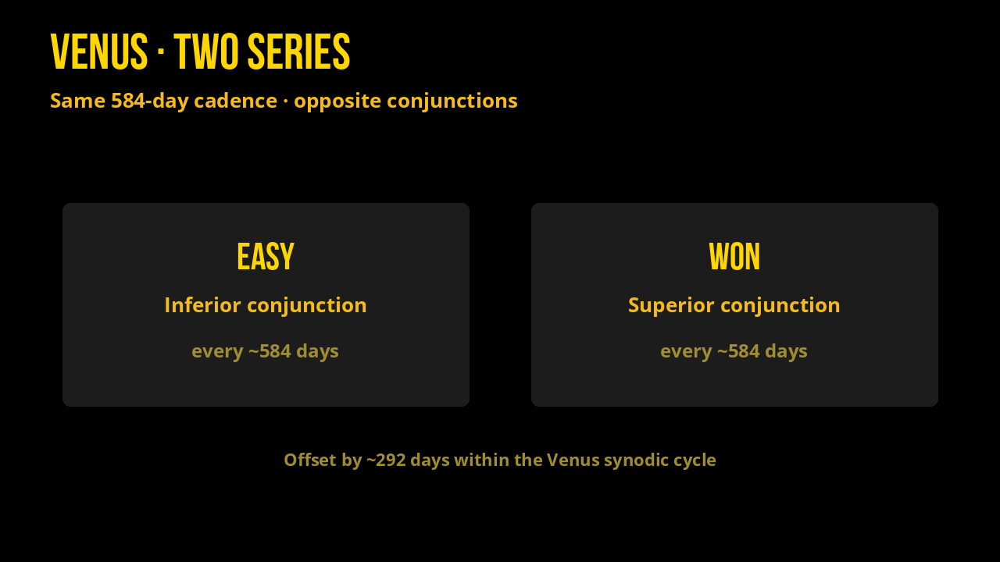

# Celestial Buybacks

Day-one project liquidity stays **date-locked** until a Venus window. Then **one** pool is cleared and re-seeded higher.

## Venus buybacks (passed)

Five EASY/stable project pools lock until Venus alignments (**≈584 days** / ≈1.6 years, inferior conjunction). At each alignment, **exactly one** pool unlocks: clear it, redeploy stables + EASY at a new range (start = current market price; end still **$100,000 / EASY**). The other four stay locked.

| | |
| --- | --- |
| **Cadence** | Every **≈584 days** |
| **What unlocks** | **One** of the five project EASY/stable pools |
| **What happens** | Clear that pool → redeploy at a higher band |
| **Range** | New start = market · end = **$100,000 / EASY** |

[YouTube explanation](https://www.youtube.com/watch?v=HoZTD60D1lw)

### Locked project pools

| Pool | Alcor |
| --- | --- |
| EASY / XMD | [4067](https://alcor.exchange/v/xpr/analytics/pools/4067) |
| EASY / XUSDC | [4065](https://alcor.exchange/v/xpr/analytics/pools/4065) |
| EASY / XPYUSD | [4068](https://alcor.exchange/v/xpr/analytics/pools/4068) |
| EASY / XPAX | [4070](https://alcor.exchange/v/xpr/analytics/pools/4070) |
| EASY / XUSDT | [4066](https://alcor.exchange/v/xpr/analytics/pools/4066) |

Between beats: stable-side swap fees buy EASY and re-pool; EASY-side fees fund Welcome / Club / MEME.

## WON buybacks

Same **≈584-day** cadence, keyed to **superior conjunction** (≈292 days from EASY’s beat). Buybacks support the WON / EASY stack.

Live depth: [Market Stats](market-stats.md) · Trade: [Swap EASY](https://alcor.exchange/v/xpr/swap?input=XUSDC-xtokens&output=EASY-mon3y).
