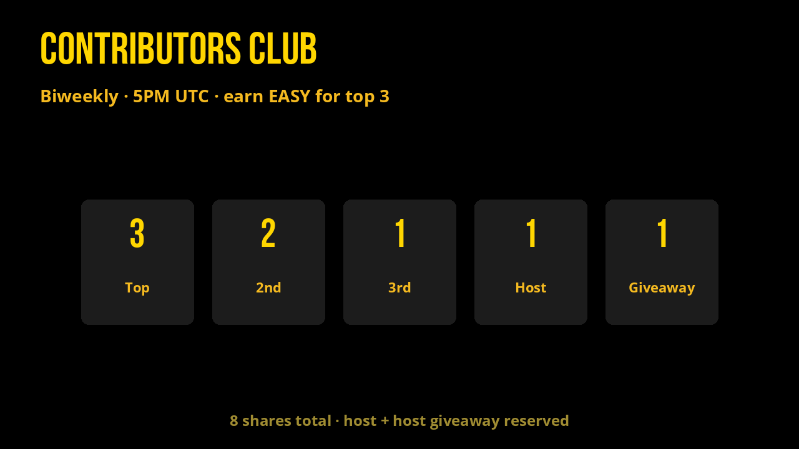

# Community & Contributions

Break bread. Show two weeks of work. Rank three people. Get paid in EASY.

## Contributors Club

Every **2 weeks**, **5PM UTC**. [Google Meet](https://meet.google.com/dqq-yian-hch). [Add to calendar](https://calendar.google.com/calendar/u/0/r/eventedit?text=Contributors+Club&dates=20260127T170000Z/20260127T180000Z&details=Share+your+contributions+to+EASY+and+WON+in+3-5+minutes+and+rank+others+to+distribute+shares.+www.flex.town.%0A%0AAlways+5PM+UTC%0AReal+Link:+https://meet.google.com/dqq-yian-hch&location=https://meet.google.com/dqq-yian-hch&recur=RRULE:FREQ%3DWEEKLY;INTERVAL%3D2;BYDAY%3DTU).

Public call. 60-80 minutes. Present 3-5 minutes on work for EASY, GRAMS, MEME, or WON. Top 3 are paid from [`reflections`](https://explorer.xprnetwork.org/account/reflections).

Living board: [Notion Contributions](https://www.notion.so/aquariusacademy/2e7ac693574b80eda6a1eda98e6732e0?v=2e7ac693574b80aa8435000c8a44e1ae).

| Time | Block |
| --- | --- |
| 10 min | Landing |
| 30 min | Each present ≈3 min |
| 20 min | 1 · 2 · 3 consensus |
| 20 min | Roundtable |

Budget that meeting is split into **8 shares** (example: 8,800 EASY → 1,100 per share):

| Place | Shares |
| --- | ---: |
| Top | 3 |
| 2nd | 2 |
| 3rd | 1 |
| Host | 1 |
| Host giveaway | 1 |

Every 2 weeks: Club payouts. Every 2 weeks: EASY Quests. Active devs get **500 EASY** to spend on the ecosystem.

Telegram: [t.me/flextokens](https://t.me/flextokens).

If you only want the token: [buy EASY](https://alcor.exchange/v/xpr/swap?input=XUSDC-xtokens&output=EASY-mon3y).
