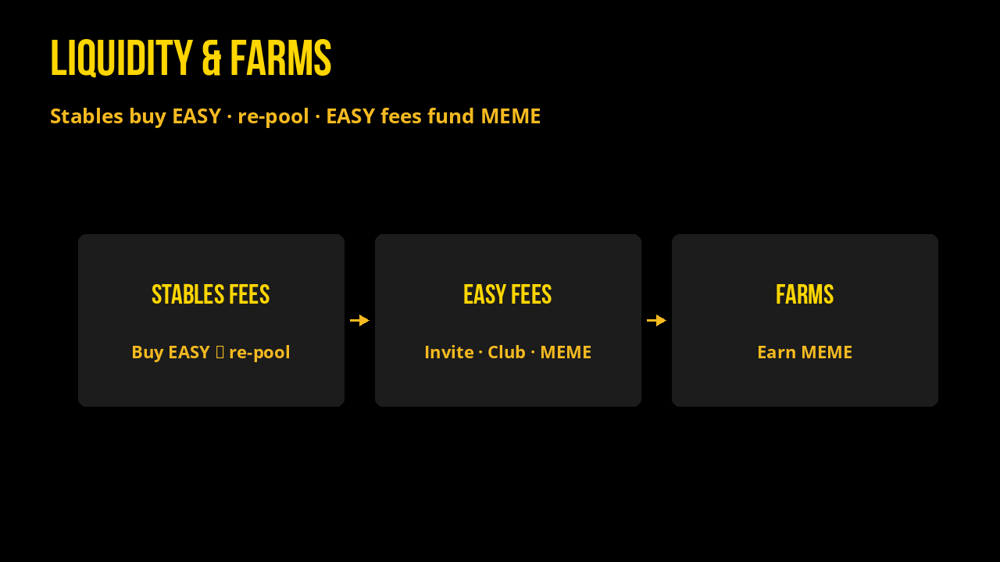
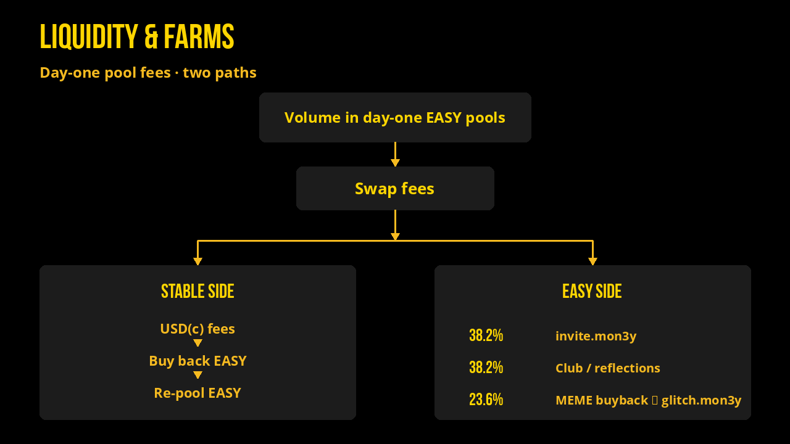

# Liquidity & Farms

100% of supply stashed in stablecoin pools day 1.  
**Stablecoin-side** pool fees are bought back into EASY via smart contract and re-pooled (raising the redeemable price of EASY).  
**EASY-side** fees from those day-one project pools are split for Welcome / Club / MEME. Farm MEME by providing liquidity.

Liquidity positions are managed within the `reflections` account and go back to the rewards pool. View them on Alcor anytime by searching `reflections`.

Additionally, `m3m3` feeds the `reflections` account with their earned LP fees.

Pool-fee split applies to **EASY-side fees only**: **38.2%** Welcome ([`invite.mon3y`](https://explorer.xprnetwork.org/account/invite.mon3y)), **38.2%** Contributors Club (`reflections`), **23.6%** MEME buyback into locked [`glitch.mon3y`](https://explorer.xprnetwork.org/account/glitch.mon3y). See [Tokenomics](../tokenomics.md).

Farms: [alcor.exchange/v/xpr/analytics?tab=farms](https://alcor.exchange/v/xpr/analytics?tab=farms)
