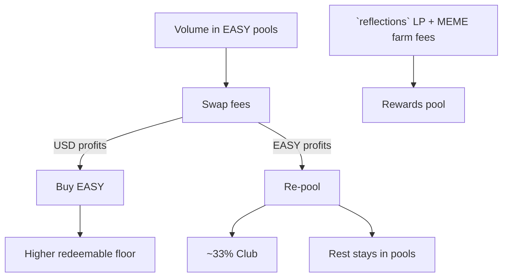

# Liquidity & Farms

100% of supply stashed in stablecoin pools day 1.  
100% of USD(c) profits used to purchase EASY (raising the redeemable price of EASY).  
Extensive rewards pools available. Farm MEME by providing liquidity.

Liquidity positions are managed within the `reflections` account and go back to the rewards pool. View them on Alcor anytime by searching `reflections`.

Additionally, `m3m3` feeds the `reflections` account with their earned LP fees.

Farms: [alcor.exchange/v/xpr/analytics?tab=farms](https://alcor.exchange/v/xpr/analytics?tab=farms)
