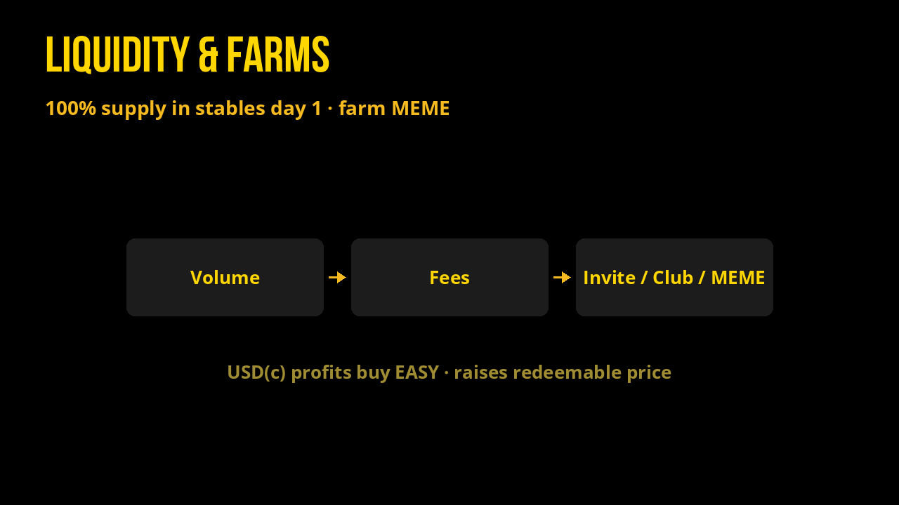
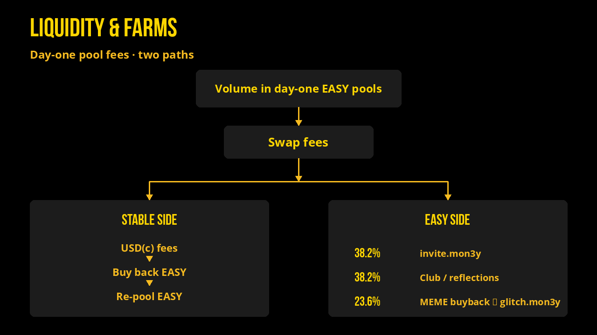

# Liquidity & Farms

Day-one EASY sat in five locked stable pools. Extra books (XPR, XXRP, METAL, XBTC, and others) sit on Alcor. Prefer **1% fee** pools when you LP. Opt out of tax on the LP account first so deposits and exits are not hit with 2%.

Liquidity positions are managed within the `reflections` account and go back to the rewards pool. View them on Alcor anytime by searching `reflections`.

Additionally, `m3m3` feeds the `reflections` account with their earned LP fees.

Pool-fee split applies to **EASY-side fees only**: **38.2%** Welcome ([`invite.mon3y`](https://explorer.xprnetwork.org/account/invite.mon3y)), **38.2%** Contributors Club (`reflections`), **23.6%** MEME buyback into locked [`glitch.mon3y`](https://explorer.xprnetwork.org/account/glitch.mon3y). See [Tokenomics](../tokenomics.md).

Farms: [alcor.exchange/v/xpr/analytics?tab=farms](https://alcor.exchange/v/xpr/analytics?tab=farms)
