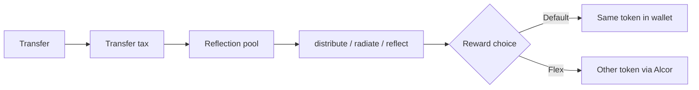

# Reflections and Reflexions

All transfer fees go in the reflection pool. The reflection rate goes to direct payments to accounts holding that token.

**Reflect** = rewards stay in the same token. **Reflexive** = you flex rewards into something else (XBTC, GRAMS, …).

## Fee glance

| Token | Reflection | Burn | Team / project | Hold to earn | Pool to pay |
| --- | ---: | ---: | ---: | ---: | ---: |
| **EASY** | 2% | - | - | 100+ | 1,000 EASY |
| **WON** | 2.2% | - | 0.8% | 1.0+ | 8 WON |
| **MEME** | 1% | 1% | - | 1M+ | 10M MEME |
| **GRAMS** | 1.1% | - | 0.11% | see contract | see contract |

Each may have additional farming rewards. EASY alone has a protocol fee path that funds Flex volunteer work and infrastructure.

Liquidity positions are managed within the `reflections` account and go back to the rewards pool. View them on Alcor anytime by searching `reflections`.

Additionally, `m3m3` feeds the `reflections` account with their earned LP fees.
