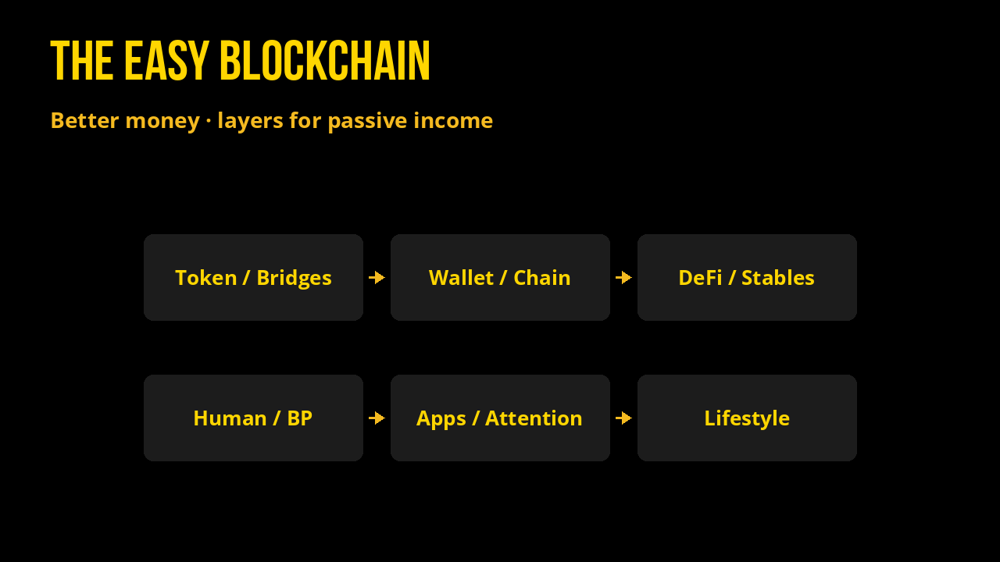
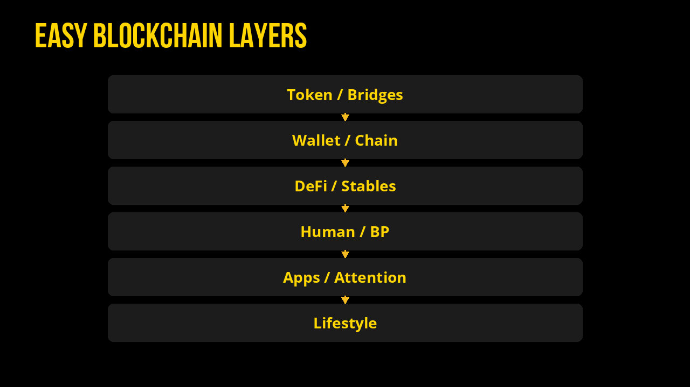
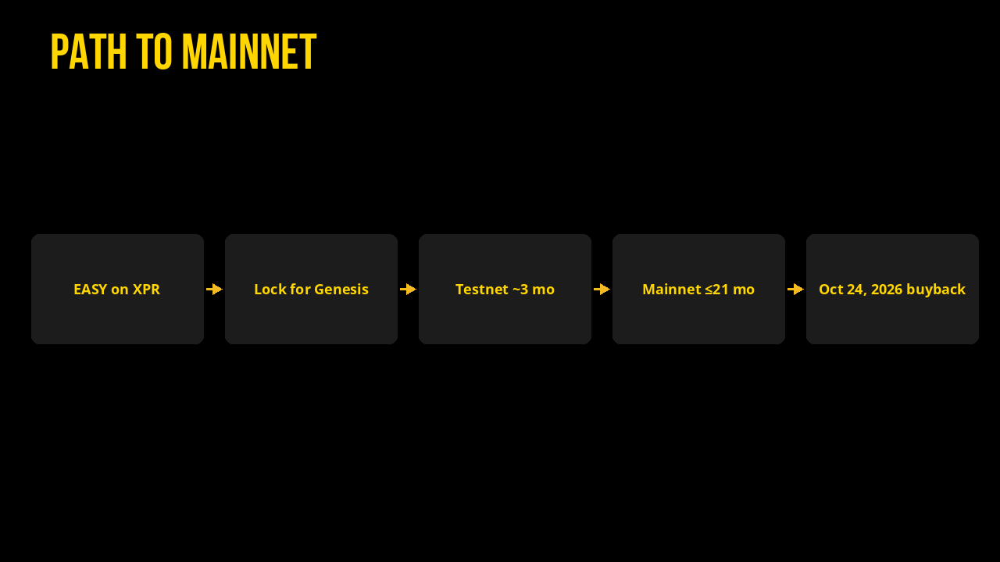

# Soon: The EASY Blockchain

**The EASY Blockchain Manifesto**, by Gudasol

Blockchain was supposed to make money better. **EASY is better money.**

The EASY Blockchain helps people earn passive income on existing assets, without the hassle of tech or risks of loss.

## Layers

- **Token**: efficient reflections (direct-to-wallet earnings from transfer tax)
- **Bridges**: reflective / non-reflective version of each bridged token
- **Wallet**: WebAuth logins, account recovery, one-click actions
- **Blockchain**: Antelope (EOS, WAX, Telos) on steroids: easy permission delegation, resource subsidies, and more
- **Stable-backing**: deep USDC-style support under EASY via locked AMM liquidity + scheduled buybacks every **584 days**
- **DeFi**: negative-interest loans; Alcor DEX (CLMM, spot, LP farms)
- **Human**: competitive consensus meetings that put people in power and pay the community
- **Infra + BP**: democratically vetted core group paid in USDC; finalizers paid in RAM
- **Application**: WebAuth-signed experiences
- **Advertising / Attention**: tokenized offers for non-tokenized goods/services on a global map, fulfilled by EASY (based on [cXc.world](https://cxc.world))

- **EASY Lifestyle**: tech-positive minimalists maximizing output; paid Skool community (optional lifetime buy-in with EASY)
- **EASY Wins**: retroactive public goods game
- **Super Club**: fractal meetings with rewards every 2 weeks

## Why it works

- **1:1 launch price** paired with EASY on XPR (currently the #1 Antelope-alt)
- Buy in via EASY on XPR and lock for a place in the **Genesis Block**
- Free transactions, human-readable accounts, instant one-click bridging both ways
- EASY holders can take **USDC loans at negative interest** with **1:1 EASY collateral**

## Who it’s for

- Low-risk crypto holders who want dead-simple yield and still see the asset in-wallet
- People fed up with blockchain complexity who want real DeFi without bank dependence
- Existing EOSIO / Antelope holders eager for lasting use of the tech they love
- Merchants desperate for attention (once the attention network hits critical mass)

## Snapshot

| | |
| --- | --- |
| **Name + token** | The EASY Blockchain (**EASY**, 6 decimals) |
| **Key value** | Easy, fast, free. Reflective ONTs (Other Network’s Tokens) with above-market yield + strong USDC backing |
| **Products** | Reflective ONTs · Bridge · DEX · Tap-to-pay / virtual merchants · Attention network · Negative-% USDC loans (1:1 EASY collateral) |

## Differentiation

**From all chains**

- Tap two cellphones to pay in-app at **0 fee**
- Network token EASY is **stable+** with first-of-kind USDC backing
- Protocol-level reflection wraps ONTs (and soon tokenized stocks), layering dividends on existing assets

**From non-Antelope**

- Account names under 5 chars are premium; advanced permissions
- **RAM (ARIES)** secondary system token paid to BPs and finalizers; free TX
- Contract- and chain-sponsored actions as paradigm (e.g. transferring USDC always free)

**From other Antelope**

- BPs paid in **USDC**; finalizers paid in **RAM (ARIES)**
- Professional incentives + ecosystem revival focus

## Brand

- Surface: living an **easy life**; cooler / lightyears-better option vs status-quo chains
- Look: **black + gold**, golden tokens, abundance
- Underneath: restore faith in blockchain; Antelope’s best systems + uniting people to struggle less, together

## Launch (21 months)

- Ride EASY-on-XPR momentum: referrals, frequent votes, hype while securing funding
- Lock EASY on XPR as investment in the new chain; incentives before the **October 24** buyback window
- Buy-in via bluechip deposit addresses; discounts for Antelope tokens (A/EOS, WAX, Telos, XPR)
- FIAT / institutional pre-sales off-chain for infra + marketing
- Build over **21 months**; mainnet anytime before then, with **~3 months testnet** aiming for **October 24, 2026** to match EASY’s buyback
