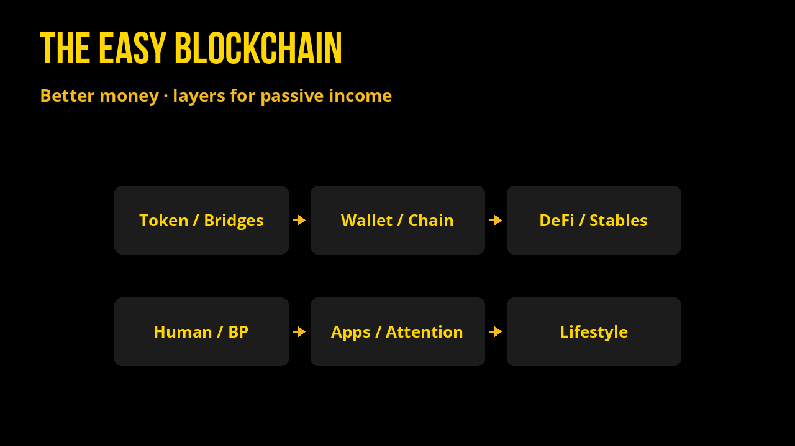
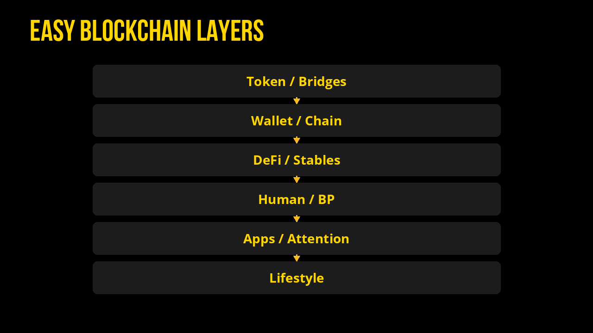
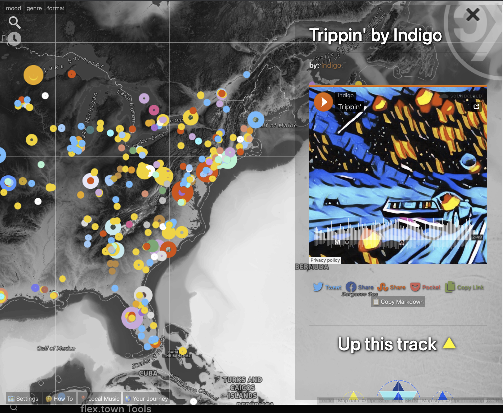
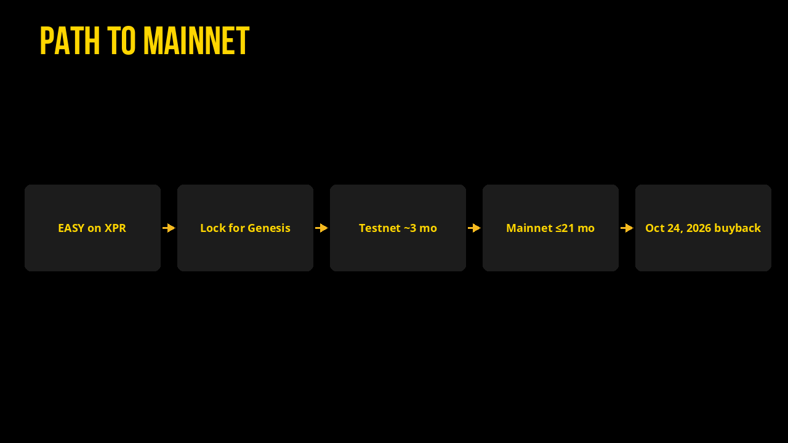

# Soon: The EASY Blockchain

Not live. Holding **EASY on XPR** is the current path. Intent: EASY you hold can be redeemed on the new chain. Dates below are a plan, not a guarantee.

## What is sketched

- Token: reflections to wallet from transfer tax
- Bridges: reflective and non-reflective wraps
- Wallet: WebAuth
- Chain: Antelope-style accounts, sponsored resources
- Stable backing: locked AMM + buybacks every **≈584 days**
- DeFi: Alcor-style DEX; **planned** negative-interest USDC loans with 1:1 EASY collateral. Not shipped
- Human layer: Club-style meetings
- Attention map: offers for real-world goods (cXc lineage)

## Snapshot

| | |
| --- | --- |
| Name + token | The EASY Blockchain (**EASY**, 6 decimals) |
| Status | Pending. Build window described as **21 months**, testnet aim **≈3 months**, date floated **24 Oct 2026** to match a buyback window |

Buy EASY today: [Alcor](https://alcor.exchange/v/xpr/swap?input=XUSDC-xtokens&output=EASY-mon3y). Follow this page for what actually ships.
