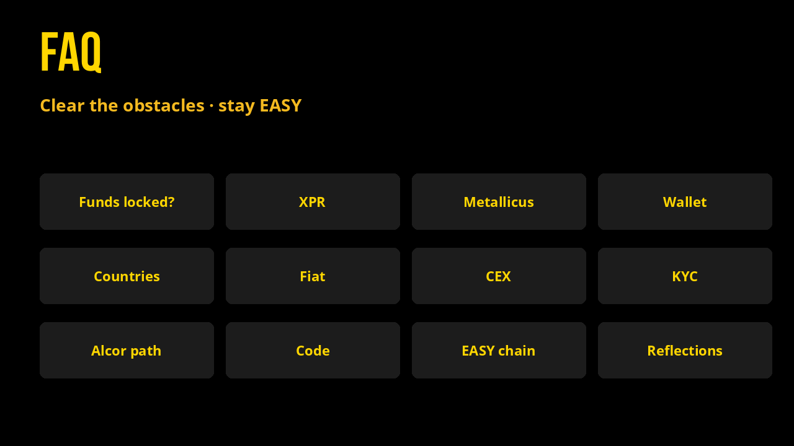

# FAQ

Short answers to the usual blockers. For deeper mechanics see [How it works](how-it-works.md), [Tokenomics](tokenomics.md), and [Legal & Terms](legal-and-terms.md).

## Are my funds safe?

EASY’s day-one liquidity lives in **date-locked project pools** on Alcor. Until a [Venus buyback](celestial-buybacks.md) window, that depth stays locked and is verifiable on-chain. Check each pool yourself:

- [EASY/XMD](https://alcor.exchange/v/xpr/analytics/pools/4067)
- [EASY/XUSDC](https://alcor.exchange/v/xpr/analytics/pools/4065)
- [EASY/XPYUSD](https://alcor.exchange/v/xpr/analytics/pools/4068)
- [EASY/XPAX](https://alcor.exchange/v/xpr/analytics/pools/4070)
- [EASY/XUSDT](https://alcor.exchange/v/xpr/analytics/pools/4066)

You hold EASY in **your** WebAuth / XPR account. Flex is not a custodial bank. Still experimental crypto: read [Legal & Terms](legal-and-terms.md).

## What is XPR Network?

[XPR Network](https://xprnetwork.org/) is the Antelope-based chain Flex Tokens live on: human-readable accounts, feeless-feeling transfers, and a wallet designed for one-click actions. Docs: [docs.xprnetwork.org](https://docs.xprnetwork.org/).

## Who is Metallicus?

[Metallicus](https://metallicus.com/) builds core XPR / Metal stack products people use to enter the ecosystem: [WebAuth](https://webauth.com) wallet, [Metal Pay](https://www.metalpay.com/), [Metal X](https://metalx.com/), and on-chain identity. Flex Tokens are a separate volunteer experiment that **runs on** XPR; Metallicus is not the Flex issuer.

## How do I set up a wallet?

1. Install **[WebAuth](https://webauth.com)** (iOS / Android / web).
2. Create an account, back up your recovery phrase, pick a human-readable `@name`.
3. Connect that wallet on [Alcor](https://alcor.exchange/v/xpr/swap) or [flex.town](https://www.flex.town/).

Official availability note: [Where is WebAuth available?](https://help.xprnetwork.org/hc/en-us/articles/4409630719255-Where-is-the-WebAuth-Wallet-available)

## Which countries are eligible?

- **WebAuth wallet:** widely available (Metallicus cites worldwide / 160+ countries for the app).
- **Identity verification (KYC):** Metallicus documents **140+ countries**; **not** available in New York State, OFAC-sanctioned regions, and some other restricted jurisdictions. See [WebAuth verification](https://help.xprnetwork.org/hc/en-us/articles/7986277148823-How-do-I-verify-my-WebAuth-Wallet-XPR-Network-account-using-WebAuth-Wallet) and [Metallicus](https://metallicus.com/).
- **Metal Pay fiat (card / bank-style buy):** currently marketed for the **United States, Australia, and New Zealand** ([Metal Pay](https://www.metalpay.com/)).

Eligibility changes; always confirm on Metallicus / WebAuth help before you plan a path.

## How do I bring on FIAT, and where is that possible?

Native Metallicus fiat on-ramp is **[Metal Pay](https://www.metalpay.com/)** (and Metal X fiat flows): debit/credit style buys into the Metal / WebAuth stack, today aimed at **US, Australia, and New Zealand**.

Outside those regions, use a local bank → CEX path (next question), then bridge or send crypto onto XPR.

## Can I onboard with Coinbase or another CEX after KYC?

Yes. Typical path: complete KYC on a major CEX (**Coinbase**, **KuCoin**, Binance where available, etc.), buy **XPR**, **METAL**, or a stable, withdraw to your WebAuth / XPR account (or bridge via [Metal X bridge](https://app.metalx.com/bridge) / [flex.town](https://www.flex.town/)), then [swap to EASY on Alcor](https://alcor.exchange/v/xpr/swap?input=XUSDC-xtokens&output=EASY-mon3y).

Always match the **network** on the withdrawal screen to XPR / the bridge instructions. Wrong network = lost funds.

## Is KYC hard? Is it free?

WebAuth / Metallicus identity is the compliant path for Metal Pay and Metal X features. Verification is **free**. Many people finish in **under an hour**; accounts that need manual review can take longer (Metallicus docs mention up to ≈24 hours in those cases). Start at [identity.metallicus.com](https://identity.metallicus.com) / [identity.metalx.com](https://identity.metalx.com) from WebAuth.

## Do I need KYC to get funds onto EASY?

**Yes and no.**

- **Yes**, if you want **Metal Pay** fiat buys and full **Metal X** swap / bridge / lending features that require Metal Identity.
- **No**, if you plan to use **[Alcor](https://alcor.exchange/v/xpr/swap)** (the DEX Flex is built around): connect WebAuth and trade; Alcor itself is no-KYC DEX UX.
- You can also buy **XPR** or **METAL** on a CEX like **KuCoin** after that exchange’s KYC, then withdraw to a WebAuth account that is **not** Metal-Identity verified, and swap to EASY on Alcor.

## Is the Flex code open source?

No. Flex token contracts are **proprietary**. We keep them closed to protect our edge. We plan to ship **tools so others can create Flex tokens** without forking the whole stack. Explorer receipts and public tables remain the ground truth for balances and actions.

## How do I invest in The EASY Blockchain?

Holding **EASY** is the path. Details TBA, but the intent is that **EASY you hold will be redeemable for EASY on the new chain**. So: [buy EASY](https://alcor.exchange/v/xpr/swap?input=XUSDC-xtokens&output=EASY-mon3y), hold, and follow [Soon: The EASY Blockchain](easy-blockchain.md).

## Do I have to stake or claim to earn reflections?

No stake lock. Hold **100+ EASY** in a normal wallet. Transfer tax fills the reflection pool; anyone can press **Send It** on [flex.town](https://www.flex.town/) (or call `distribute`). Rewards land in-wallet. See [Maximizing Your EASY](maximizing-your-easy.md) and [Success Stories](our-story/success-stories.md).
