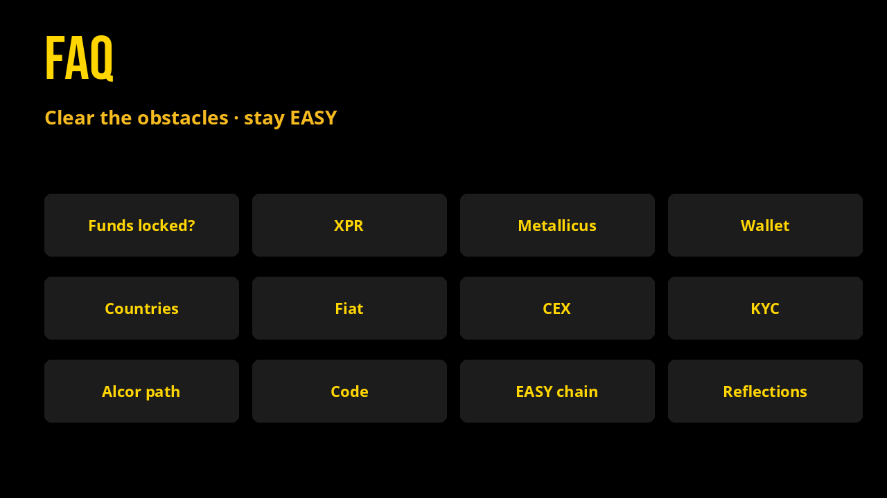

# FAQ

## Are my funds safe?

Day-one liquidity is in **date-locked** Alcor pools until a [Venus window](celestial-buybacks.md). Check the five pools yourself:

- [EASY/XMD 4067](https://alcor.exchange/v/xpr/analytics/pools/4067)
- [EASY/XUSDC 4065](https://alcor.exchange/v/xpr/analytics/pools/4065)
- [EASY/XPYUSD 4068](https://alcor.exchange/v/xpr/analytics/pools/4068)
- [EASY/XPAX 4070](https://alcor.exchange/v/xpr/analytics/pools/4070)
- [EASY/XUSDT 4066](https://alcor.exchange/v/xpr/analytics/pools/4066)

You hold EASY in **your** WebAuth account. Flex is not a bank. Experimental. Read [Legal](legal-and-terms.md).

## What is XPR Network?

Antelope chain Flex Tokens live on. Human-readable names, feeless-feeling transfers. [xprnetwork.org](https://xprnetwork.org/) · [docs](https://docs.xprnetwork.org/).

## Who is Metallicus?

Builds WebAuth, Metal Pay, Metal X, identity. Flex Tokens run **on** XPR. Metallicus is not the Flex issuer.

## How do I set up a wallet?

1. Install [WebAuth](https://webauth.com)
2. Create account, back up the phrase, pick an `@name`
3. Connect on [Alcor](https://alcor.exchange/v/xpr/swap) or [flex.town](https://www.flex.town/)

## Which countries are eligible?

- WebAuth app: Metallicus cites 160+ countries
- KYC: 140+; not NY, not OFAC, other limits. Confirm on Metallicus help
- Metal Pay fiat: marketed for US, Australia, New Zealand

## How do I bring on FIAT?

Metal Pay where it is offered. Elsewhere: local bank → CEX → withdraw / bridge to WebAuth → swap to EASY.

## Can I use Coinbase or another CEX?

Yes. Buy XPR, METAL, or a stable. Withdraw on the **correct network**. Wrong network = lost funds. Then swap on Alcor.

## Is KYC hard? Is it free?

Metal Identity is free. Many finish in under an hour; manual review can take up to ≈24 hours. Start from WebAuth → [identity.metallicus.com](https://identity.metallicus.com).

## Do I need KYC to get EASY?

Metal Pay / full Metal X: yes. Alcor DEX: no. You can CEX-KYC, withdraw to an unverified WebAuth, and swap on Alcor.

## Is the Flex code open source?

No. Contracts are proprietary. Explorer tables are the public record. Tools for others to mint Flex tokens are planned.

## Is there a new chain?

The tech is evolving into a new chain: [The Channel](https://github.com/TetraGrids/The-Channel).

## Do I have to stake to earn reflections?

No lock. Hold **100+ EASY**. Anyone presses Send It. Rewards land in-wallet.
