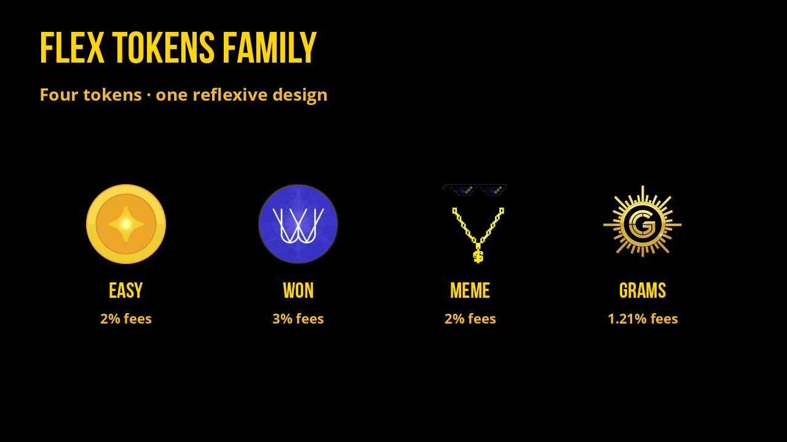

# Flex Tokens Family

The Flex token family: EASY, WON, MEME, and GRAMS, each with its own supply and fee design.

| Token | Supply | Reflection | Extra | Backing / role |
| --- | ---: | ---: | --- | --- |
| [EASY](../tokenomics.md) | 21M | 2% | - | Stable pools day one |
| [WON](won.md) | 1M | 2.2% | 0.8% team | EASY-backed · ecovillages |
| [MEME](meme.md) | 10T | 1% | 1% burn | Farm rewards |
| [GRAMS](grams.md) | 1B | 1.1% | 0.11% team | XPAXG gold |
