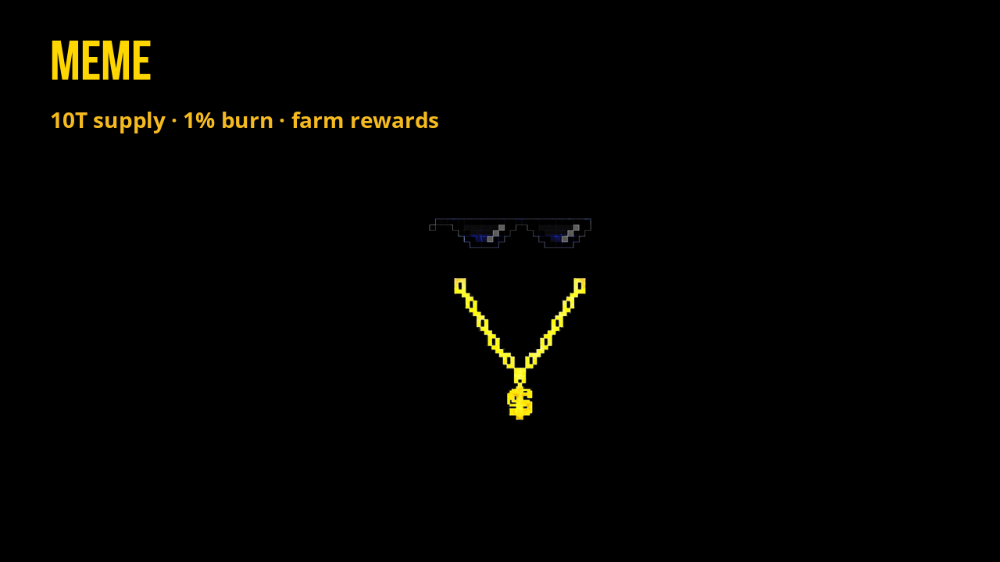
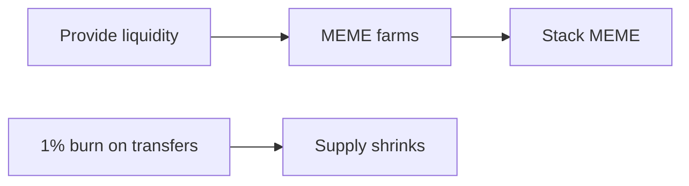

# MEME

| | |
| --- | --- |
| **Max supply** | 10T MEME |
| **Fees** | 1% reflection + 1% burn |
| **Earn threshold** | Hold 1M+ · 10M MEME in pool to pay |
| **Role** | Farm rewards for Flex pools |

## GM degens

M3m3 is the only FLEX token using the burn functionality, and has the highest supply.

We use MEME as farm rewards for pools for WON, EASY, and INDEX (our experimental, unadvertised, non-reflective index of XPR).

Maybe don’t ape into m3m3 as an investment, it’s not backed by anything but laughs and community alt-coins.

It’s no EASY ride.

Farm MEME by providing liquidity between flex + other tokens (farms) to stay in EASY and stack MEME.

We start our MEME at a memorable 4.2069 MCap~. Take initial liquidity into infinity positions for XPR and USDC.

Take the rest of supply as a standard 0.1% of supply reward for 360 day pools across the Flex ecosystem.

We plan to keep (slowly) dishing out m3m3 rewards for providing liquidity, mainly by opening 360-day farms.

We have dozens of MEME farms available to LP and earn MEME.

Farms: [alcor.exchange/v/xpr/analytics?tab=farms](https://alcor.exchange/v/xpr/analytics?tab=farms)
