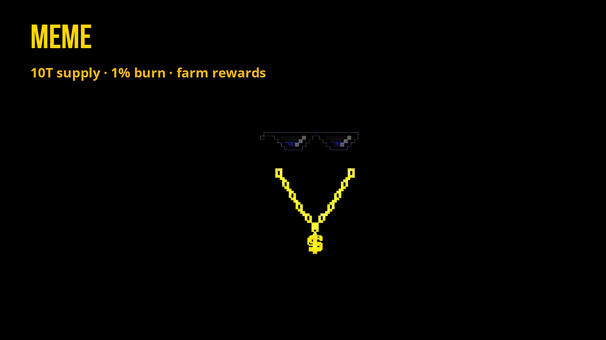
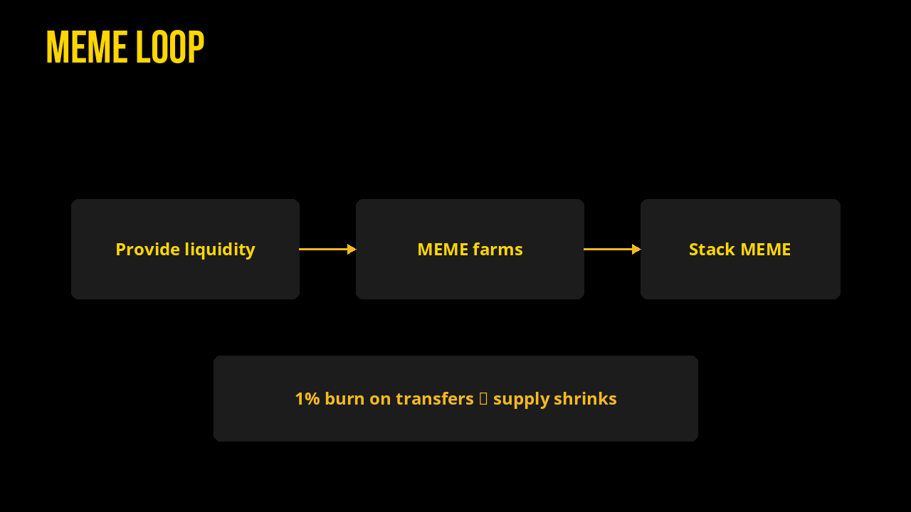

# MEME

| | |
| --- | --- |
| **Max supply** | 10T MEME |
| **Fees** | 1% reflection + 1% burn |
| **Earn threshold** | Hold 1M+ · 10M MEME in pool to pay |
| **Role** | Farm rewards for Flex pools |

It's no EASY ride. Farm it. Don't ape it as an investment.

10T max. 1% reflection + 1% burn. Hold **1M+**. Pool pays at **10M MEME**. EASY-side pool fees buy MEME into locked `glitch.mon3y`. Contract notes: [MEME (m3m3)](../smart-contracts/meme.md).

Farms: [alcor.exchange/v/xpr/analytics?tab=farms](https://alcor.exchange/v/xpr/analytics?tab=farms)
