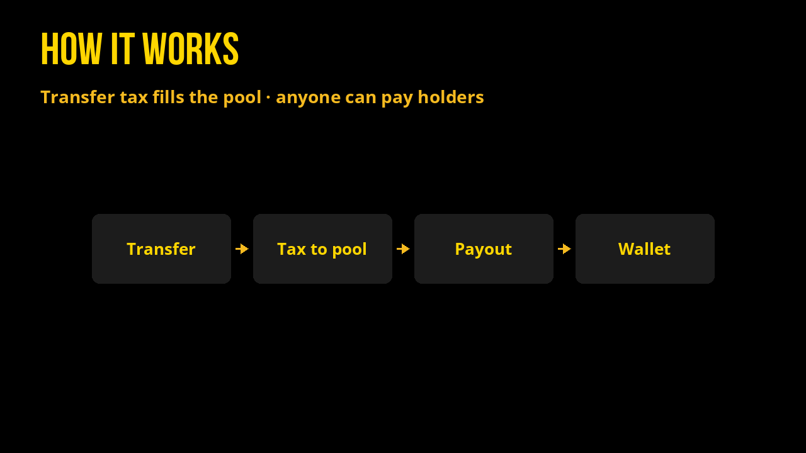
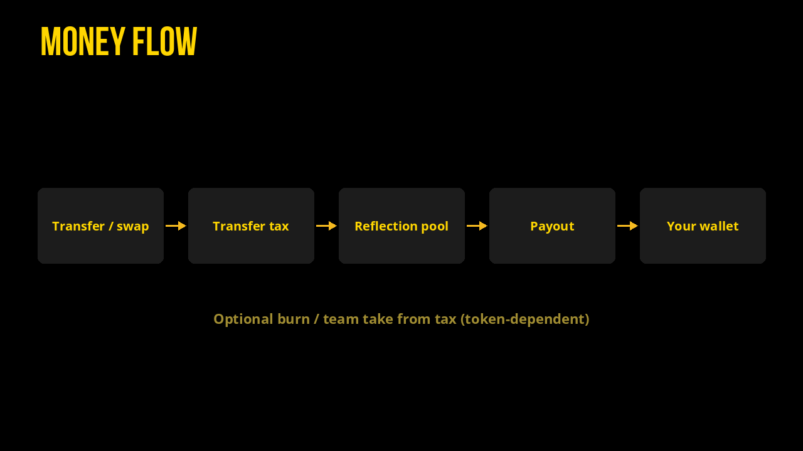
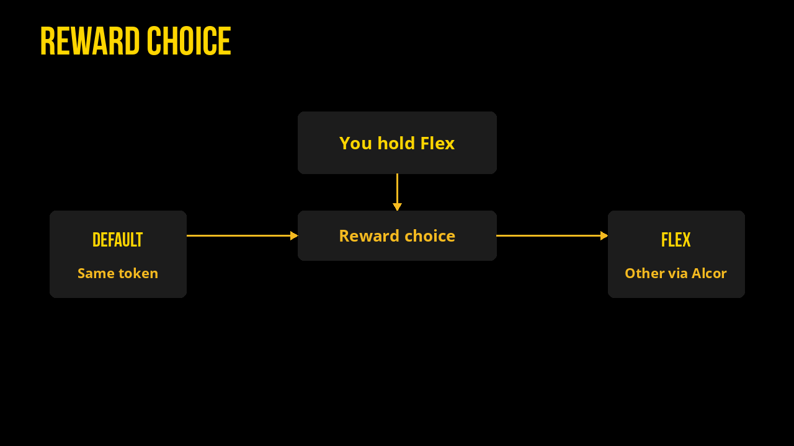

# How it works

Welcome.

> Flex Tokens live on **XPR Network**: free-feeling transfers, human-readable accounts, and a wallet built for one-click actions. Start with the [WebAuth wallet](https://www.xprnetwork.org/wallet), read the [XPR whitepaper](https://xprnetwork.org/whitepaper) and [docs](https://docs.xprnetwork.org/), and move assets in via the [Metal X bridge](https://app.metalx.com/bridge).

## Money flow

All Flex tokens send **proportional rewards** straight to your wallet. Those rewards come from a **reflection pool** filled by a small tax on transfers.

1. Someone transfers (or swaps through) a Flex token.
2. A configured % of that transfer lands in the reflection pool (and optionally burn / team).
3. Anyone can call the payout action (`distribute` / `radiate` / `reflect`).
4. Holders receive their share in-wallet. You can keep the same token (**reflect**) or **flex** rewards into another token via Alcor (BTC, SOL, other Flex tokens, and more).

Protocol fees (separate from the transfer tax above) are explained in [Legal & Terms](legal-and-terms.md).

Fee rates, supplies, and live major-token backing for **EASY · WON · MEME · GRAMS** live on [Tokenomics](tokenomics.md).

Each `distribute` on EASY pays **61.8%** of a flexer’s pro-rata share from the reflection pool (Fibonacci smoothing); the rest stays in the pool for later rounds.

## Take it EASY

[Swap EASY](https://alcor.exchange/v/xpr/swap?input=XUSDC-xtokens&output=EASY-mon3y) on Alcor, then keep reading for [tokenomics](tokenomics.md), [maximizing](maximizing-your-easy.md), and bi-weekly EASY Club meetings.
