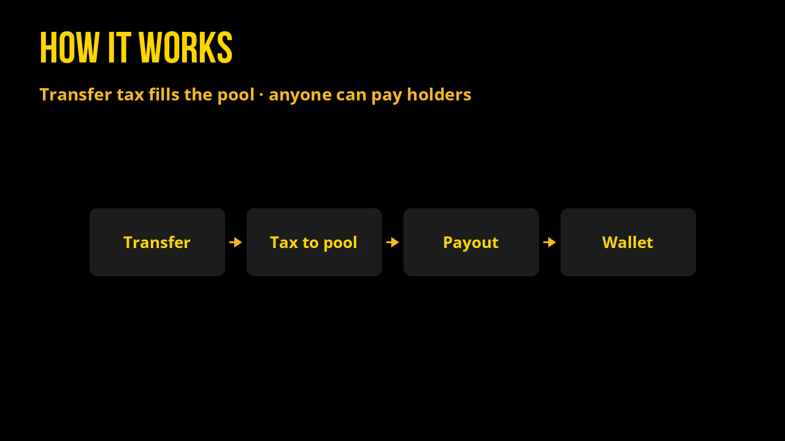
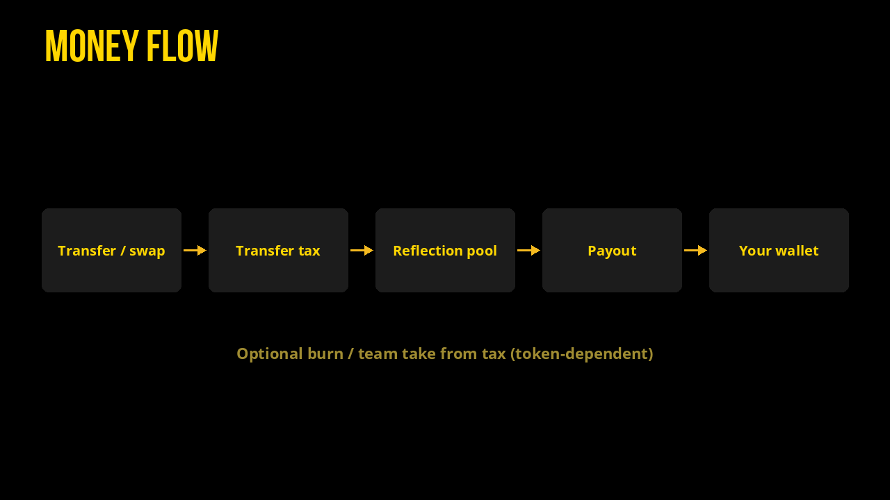
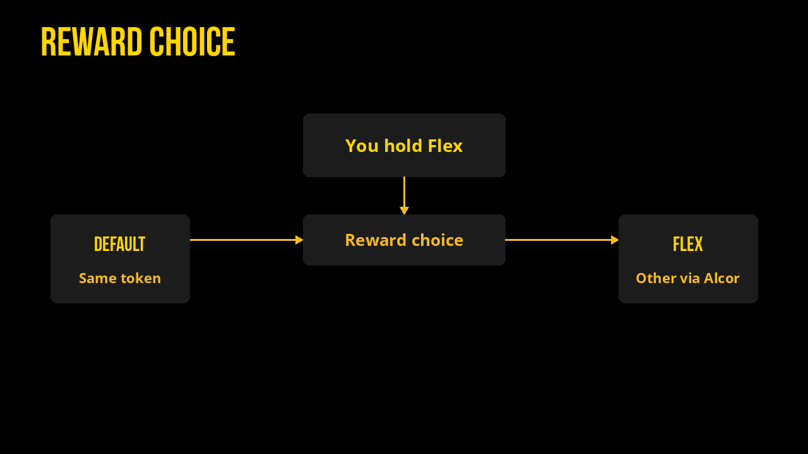

# How it works

Flex Tokens live on **XPR Network**: human-readable accounts, feeless-feeling transfers, one-click wallet. Start with [WebAuth](https://www.xprnetwork.org/wallet). Move assets in via the [Metal X bridge](https://app.metalx.com/bridge).

## Money flow

1. Someone transfers or swaps a Flex token.
2. A set % of that transfer lands in the reflection pool (and optionally burn / team).
3. Anyone calls `distribute` / `radiate` / `reflect` (Send It on flex.town).
4. Holders get their share in-wallet. Keep the same token (**reflect**) or **flex** it into another token on Alcor.

**EASY holder reflections by month** (finished months only; on-chain `distribute` payouts to wallets)

| Month | Payments | EASY paid | Unique recipients | `distribute` runs |
| --- | ---: | ---: | ---: | ---: |
| Jan 2026 | 11,285 | 60,177 | 190 | 2,255 |
| Feb 2026 | 22,582 | 104,236 | 199 | 2,398 |
| Mar 2026 | 15,161 | 69,813 | 211 | 1,345 |
| Apr 2026 | 12,395 | 66,680 | 213 | 287 |
| May 2026 | 13,308 | 67,127 | 332 | 578 |
| Jun 2026 | 22,211 | 57,883 | 392 | 859 |

Each EASY `distribute` pays **61.8%** of a flexer’s pro-rata share (Fibonacci smoothing). The rest stays in the pool for later rounds.

Protocol fee (separate from the 2% transfer tax): [Legal & Terms](legal-and-terms.md).  
Rates, supplies, backing: [Tokenomics](tokenomics.md).

[Swap EASY](https://alcor.exchange/v/xpr/swap?input=XUSDC-xtokens&output=EASY-mon3y). Then [tokenomics](tokenomics.md) and [maximizing](maximizing-your-easy.md).
