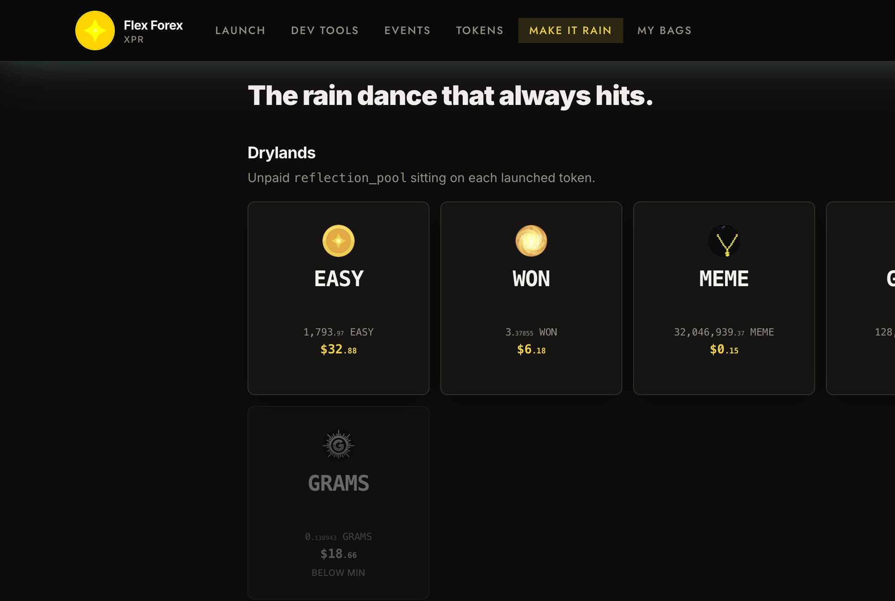

# Game guide

This is the holder side and the public buttons. You do not need to be the issuer to use them. You do need a connected wallet to sign.

## Presale

A presale exists only if the issuer signed `setpresale` before liftoff. If there is no row, there is no club window. The token opens with liftoff.

When there is a row:

1. **Insider buys** start at `insider_time`. Before that clock, Join stays disabled. The button counts the real wait (hours and minutes), not a rounded-up day.
2. You sign `reginsider` to get on the list. "Not on list" means that signature has not landed. An invite from the issuer can put you on the list without that click.
3. Gates are whatever the issuer set: a minimum hold, an NFT, LP, or any combination. Invites are not a gate. The panel prints the gate in words.
4. Your buy room is your cap minus what you already hold. The cap is `insider_bps` of supply, or `locked_insider_bps` if you have proved a lock.
5. **Prove lock** is optional and only shows when the issuer set a lock bonus. You paste your Alcor position id. `provelock` checks that position.
6. **Public launch** is `launch_time`. Buys on the open market wait for that clock, and for `golive` if the issuer has not opened the token yet. Liftoff with a presale row leaves `launched` false until `golive`.

The issuer can freeze the window (mode 0), move the clocks later, add or remove accounts, and call `golive`.

## Make it rain

Every transfer tax that is marked reflection sits in `reflection_pool` until someone calls `makeitrain`. The call pays **38.2%** of that pool to holders in proportion to balance. Accounts that are vaults (the swap, the contract, and a few others) are not in the share count.

On **Make it Rain**, each blue square is a token with unpaid reflections. Click it. Your wallet signs. If the pool is under the minimum, the square is gray and the click does nothing.

You can receive the pay in the token itself, or flexed into another token if you set that on the token page (`choosereward`). If you never choose, and the launch was set to swap the default, unpaid holders are paid in the launch quote through the launch pool.

## Call the angels

Angels exist on `for3x` only, and only if the issuer gave them a share of reflection. That share is not extra tax. It is a cut of the reflection slice, and it accumulates in `angel_numbers_pool`.

Holders pick a number from 0 to 999 with `setangelnum`. `pullangel` asks the randomness contract to draw. When the draw comes back, holders whose number matches get the pot. The white squares on Make it Rain are tokens with an angel pot above zero. Anyone can call. If the pot is empty, the square is not shown.

The draw can be in flight. A second call while one is pending fails on chain. Wait for it to finish.

## Jackpot

Jackpot is the same idea with a different pot and no number you pick. `jackpot_pool` fills from the jackpot share of reflection. `pulljackpot` draws winners. How many winners, and the minimum hold checked after the draw, are whatever the issuer set. Gold squares on Make it Rain are jackpots waiting. Anyone can call.

## What you can do on a token page

- **Make it rain**, **Pull angel**, **Pull jackpot** when that program has them and the pot is above zero.
- **Choose reward** so your splash arrives as another token.
- **Fee opt-out** turns tax off for your own sends. You can only turn that on. You cannot undo it.
- On `fl3x` and `for3x`, set a beneficiary so part of your splash pays someone else.
