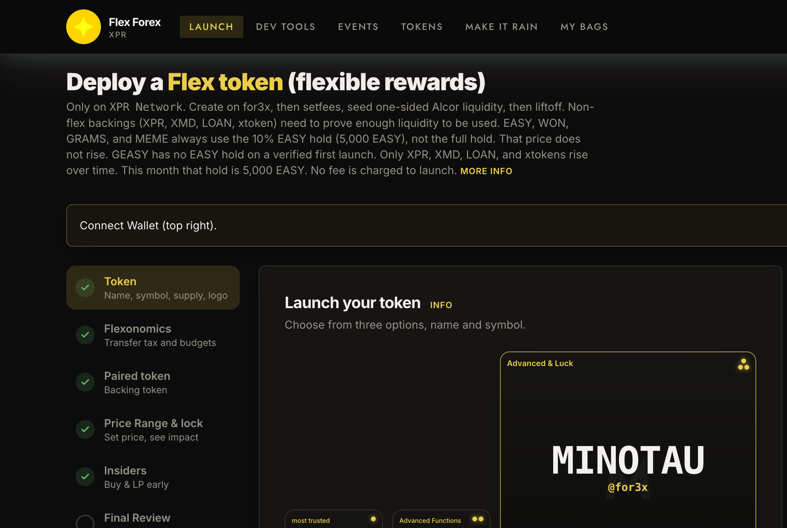
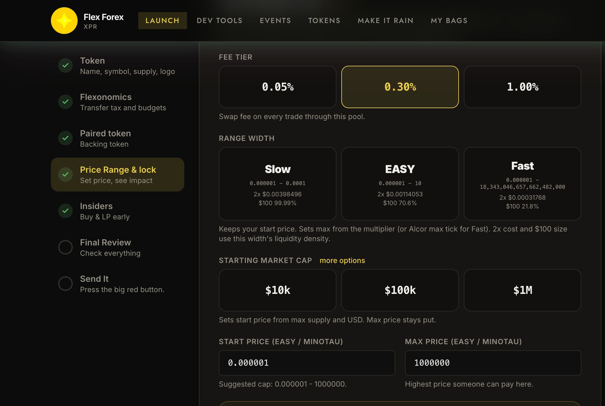
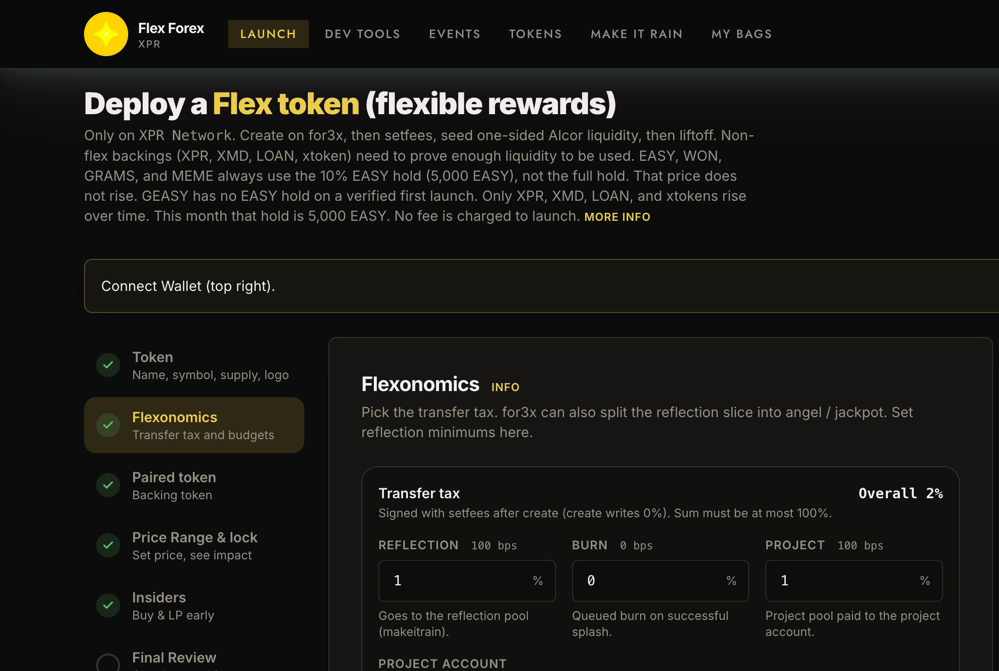
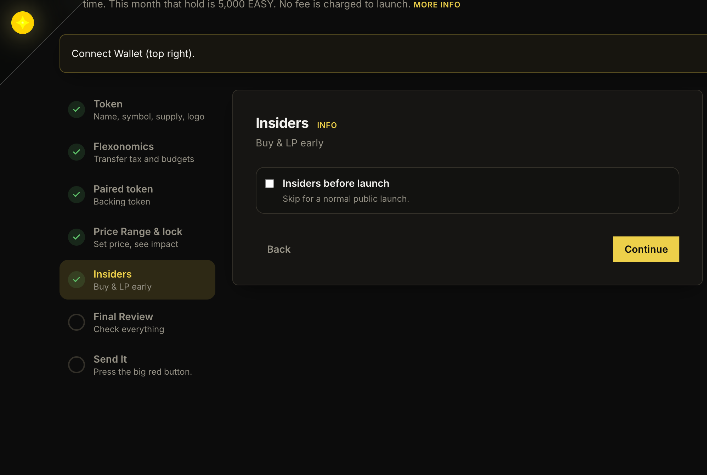

# How your token works

- Decide your name.
- Pick your token logo.
- Set a starting price and token supply.
- Decide your pre-sale, or go live together.
- Hold the EASY the contract asks for. The amount steps up on a clock, below.
- Launch.
- Promote.
- Send the rain and call the angels.

## Decide your name

The symbol is 1 to 7 uppercase letters and never changes. The display name can be 16 characters. Pick the program on the same step: `3asy` (reflection and burn), `fl3x` (plus a project share and inheritance), or `for3x` (plus angel numbers and a jackpot).

## Pick your token logo

Square PNG or SVG, about 256 to 1024 pixels. Pin it or paste a public URL. Wallets read logos from `token.proton`. That listing is signed by `3asy`, `fl3x`, or `for3x`, not by you. The wizard keeps your URL until the listing exists.

## Set a starting price and token supply

You set max supply. 100% is minted or issued to you, then deposited into one Alcor position. The position starts just outside the range, so it is entirely your token. Buyers pay the quote as they walk toward the top.

Three different percents, and they are not the same fee:

- **Swap fee.** 0.05%, 0.30%, or 1.00% on trades through this pool. It accrues to in-range liquidity. At launch the only position is yours, and it is locked.
- **Transfer tax.** `create` writes 0%. The first `setfees` can be any split up to 100%. Later calls cannot raise the total or lower reflection. Burn and project can be cut. `3asy` splits reflection and burn. `fl3x` and `for3x` add a project rate. A blank project account stays the issuer. On `for3x`, angel and jackpot take a share of the reflection slice only.
- **Protocol skim.** Taken from the reflection pool when someone calls `makeitrain`, not from the swap. Flex quotes (EASY, WON, GRAMS, MEME, GEASY) pay 0. Other quotes start at 0.25% to the protocol and 0.25% to Contributor's Club. After the LP unlocks, each of those can rise once by another 0.25%.

Width is the other half of price. Tight means a little money buys a lot of supply. Wide means the same money buys less. The screen shows what $100 buys. Set the starting market cap first, then read that percent. The shot uses a near-zero start so only the width is changing.

## Decide your pre-sale, or go live

Leave Insiders off and everyone starts at liftoff.

Turn it on and you set two clocks. Insider time must come first.

- From insider time until public launch, approved insiders may deposit into the pool. That deposit window closes at public launch.
- From public launch, buys out of the pool open, only to approved insiders, and only up to the cap.
- Wallet-to-wallet transfers stay closed until you `golive`. Liftoff with a presale row leaves `launched` false until that call.

The cap is a percent of supply, with a higher cap if someone proves a locked LP position. Gates can be a hold, an NFT, LP, or all of them. An invite puts a name on the list. It is not a buy gate by itself.

Join, prove lock, and the buttons are in the [game guide](game-guide.md).

## The EASY hold

At liftoff the contract reads your EASY balance on `mon3y`. A short balance stops liftoff. The EASY stays in your account.

Full hold, whole tokens, times (tokens you have already launched on this contract, plus one):

| Program | Account | Full hold |
| --- | --- | --- |
| easyflex | `3asy` | 5,000 EASY |
| complexflex | `fl3x` | 10,000 EASY |
| flexforex | `for3x` | 50,000 EASY |

The discount is in the contract from 9 Sep 2026 00:00 UTC, and it steps every 30 days:

- EASY, WON, GRAMS, and MEME always take 10% of the full hold. That price does not rise.
- A verified first launch against GEASY takes no EASY hold. Verified means `eosio.proton` `usersinfo`. Later GEASY launches use the monthly discount.
- XPR, XMD, LOAN, and xtokens start at 90% off, then 80%, then 70%, until the discount is gone. The first step up is 9 Oct 2026.

A first `for3x` token in the opening month is 5,000 EASY (10% of 50,000). After 9 Oct 2026, flex quotes stay at 10%. Non-flex quotes move to 20% of the full hold.

## Launch

You sign. The flex contract does not sign Alcor for you.

1. `create`
2. `setfees`
3. `issue` on `3asy`, or `mint` on `fl3x` and `for3x`, 100% to you
4. `startlaunch` (quote amount 0)
5. Alcor: `createpool`, activate if needed, deposit the supply, one-sided `addliquid`, `lockpos`
6. Optional `setpresale`, and invites, after the lock
7. `liftoff`
8. `addpool` of the launch quote pair

Do not put `liftoff` in the same transaction as `createpool`. After create, the wizard freezes token, tax, quote, and range. Insiders stay editable until `setpresale` is signed.

The chain requires at least 90 days left on the Alcor lock at the moment of liftoff. The slider starts at 91 days, which leaves about one day of slack. Wait longer than that and a 91-day lock fails the check.

## Promote

The calendar shows the insider date and the public launch. Say the start price, the lock, and what $100 buys. Those three numbers can be checked. Using the presale so the first result advertises the second is in [Smarts for success](smarts-for-success.md).

## Send the rain and call the angels

`makeitrain` pays 38.2% of `reflection_pool` to holders. Swap and contract balances are left out of the share count. On `for3x`, white squares call `pullangel` and gold squares call `pulljackpot` when those pots are above zero. The clicks are in the [game guide](game-guide.md).

