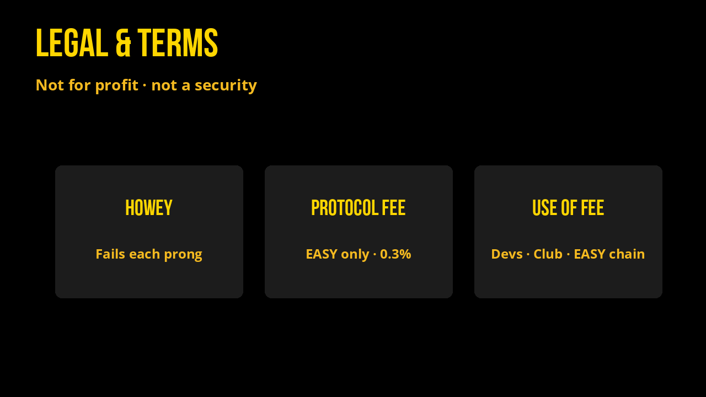

# Legal & Terms

Applies for all Flex tokens. Privacy is in the last section of this page.

**This project is not for profit.** It is a volunteer experiment in New Earth finance, not a company selling securities.

Not an investment token. No promise of return. No guarantee service will operate the same in the future. Changes will be reflected in this document, but we are not responsible for informing stakeholders of changes or seeking approval (though we often do polls in Telegram).

**Howey (fails fast, point by point)**

| Test | Why we fail it |
| --- | --- |
| Investment of money | No public sale; day-one liquidity was vaulted, not sold as an offering |
| Common enterprise | Open, permissionless contracts anyone can use; no managed fund |
| Expectation of profits | No promise of profit; reflections and volume are experimental mechanics |
| From the efforts of others | You hold and act yourself; volunteers ship tools, they do not manage your bag |

EASY is an experiment and part of an ideology. This ideology is of abundance and reversing the debt problem through abundance systems that automatically return the value created in the market through movement to the stakeholders of those markets.

This is not an investment token, and there is no public sale.

EASY is not an asset that can be possessed by an individual or organization, and 100% of the token is owned by the contract as data in the tables.

## Protocol fees

The **0.3% protocol fee applies to EASY only** (not WON, MEME, or GRAMS). It is taken of/from the EASY reflection pool on each rewards payout action.

Proceeds are used to **pay developers**, fund **Contributors Club**, and support **development of The EASY Blockchain**.

**How the 0.3% protocol fee works**

- A **0.3% protocol fee of/from the reflection pool** is taken **for each reflection** (each rewards payout action on EASY).
- The fee happens in the background as balances adjust on the contract: it takes a small portion of the **reward pool** on each action of sending out rewards.
- Because it is **per action**, the fee amount varies with how often payouts run. It is tied to the **total amount in the pool (0.3%)**, not to the size of any single holder’s reflection.
- More frequent community payouts leave holders with a higher share of rewards over time.

`reflections` houses volunteer reward budget that pays for Contributors Club and EASY Quests, and maintains some liquidity positions. Club budget is determined before each meeting; the rest stays until the next meeting, with small LP adjustments as needed.

Transfer taxes (reflection / burn / team rates on each Flex token) are separate from this protocol fee. See [How it works](how-it-works.md). Pool-fee routing (Welcome / Club / MEME buyback) is documented under [Tokenomics](tokenomics.md).

As always, we do our best and you’ll see that in our track record, including cXc.world and the performance of EASY in the markets.

This legal note protects our volunteers and those we serve. Thank you for your trust in the project and the developer, Douglas James Butner.

We put our trust in projects with public devs and teams with a track record of success, and we hope you do too.

## Privacy

*Effective: August 22, 2026. Covers **[flex.report](https://flex.report)** (these docs) and how the Flex Tokens volunteer project handles information. It also applies to all apps by **Gudasol**, founding father of Flex Tokens, unless otherwise noted.*

**Default is public.** Meetings (including Contributors Club) are public. Everything on chain is public. If you show up or sign a transaction, treat it as visible.

### Who this covers

This section covers the Flex Report documentation site (flex.report) and how volunteers use public information when writing about Flex tokens (EASY, WON, MEME, GRAMS). Community calls, Club, and on-chain activity are in the open: see **Public by design** below.

It does **not** control third-party products we link to. Those have their own policies:

| Service | What it is |
| --- | --- |
| [GitBook](https://www.gitbook.com/privacy) | Hosts and serves these docs |
| [GitHub](https://docs.github.com/en/site-policy/privacy-policies/github-general-privacy-statement) | Source repo and the daily stats refresh |
| [flex.town](https://www.flex.town/) | Send It, reward token, Welcome, swap/bridge UI |
| [Alcor](https://alcor.exchange) | Swap, pools, farms |
| [WebAuth](https://webauth.com) / Metallicus | Wallet, optional KYC, fiat on-ramps |
| [Telegram](https://telegram.org/privacy) | [t.me/flextokens](https://t.me/flextokens) community |
| Google Meet / Calendar | Contributors Club calls |
| Notion | Living contributions board |

If you buy, swap, farm, or verify identity on those products, their rules apply, not this page.

### What we do not collect

On flex.report we do **not** run user accounts, mailing lists, or a Flex-owned analytics product. We do not ask for your name, email, government ID, seed phrase, or private keys. Do not send seed phrases or keys to anyone in the project.

We do not use the docs to profile you for ads.

### What hosting may process

flex.report is published as a GitBook space. GitBook (and the usual web stack in front of it: DNS, CDN, TLS) may process standard technical data so the site loads and stays up, for example:

- IP address, browser and device type, language, referrer
- Pages viewed, timestamps, approximate location from IP
- Cookies or similar storage that GitBook needs for the reader (session, preferences, security)

We do not get a Flex-owned dump of “who read which page.” For GitBook’s own processing, see [GitBook Privacy Policy](https://www.gitbook.com/privacy). You can use browser controls to block or delete cookies; some site features may then fail.

GitHub stores this documentation source. If you open issues, star the repo, or send a pull request, GitHub processes that under its terms.

### Public by design

Two rules, no fine print:

1. **Meetings are public.** Contributors Club, roundtables, and other Flex calls we host are public sessions. Expect recording, screenshots, notes, clips, and names on the [contributions board](community-and-contributions.md). Join only if you are fine being seen and quoted. There is no private “off the record” Club.
2. **Everything on chain is public.** XPR account names, balances, transfers, memos, pool reserves, and contract tables are public forever. Explorers, APIs, these docs, and anyone else can read them. We cannot hide or delete a transaction.

### Public blockchain data

Flex tokens live on **XPR Network**. We use that public data to:

- Refresh [Market Stats](market-stats.md), [Tokenomics](tokenomics.md), and [Stablecoin Arbitrage](arbitrage.md)
- Tell on-chain stories such as [`thelake`](our-story/success-stories.md) (reflections, balances, comparison marks)

Case studies name **on-chain accounts**, not off-chain legal identities. If you tie your face or Telegram to an account in a memo or a meeting, that is public too. We will not treat a public XPR name as a secret.

Market comparison prices (for example Binance marks and DefiLlama yield series) are public market data, not information about you.

### Wallet tools (flex.town and others)

[flex.town](https://www.flex.town/) talks to **your** wallet and to public contracts. Signing a transaction publishes it on-chain. Volunteers do not receive your seed phrase. We cannot spend from your account unless you sign.

Optional features (Welcome, invites, beneficiary, opt-out of tax) write to public tables or send public transfers. Treat those as public.

### Community channels

**Contributors Club and other project meetings are public.** Video, audio, chat, rankings, and payouts may be watched live, recorded, or written up. Payouts go on chain (public). The Notion contributions board is a public working doc.

[Telegram](https://t.me/flextokens) is a public community channel. Handles, messages, and media you post there are visible to members and can be forwarded. Telegram still processes that data under [its policy](https://telegram.org/privacy). Google Meet and Calendar process join info for the call.

Do not put secrets in meetings, group chat, or memos. We are not responsible for other members’ screenshots or forwards. Skip Club and stay off the board if you want to stay off camera.

### Children

These docs and Flex tools are not directed at children. Do not use them if you are not old enough to use crypto and third-party wallets in your jurisdiction.

### What we do with information we actually hold

Most “Flex data” is public chain state or sits with a host above. When a volunteer **does** hold something off-chain (a Telegram DM, an email, a Club note), we use it only to operate the experiment: answer you, run Contributors Club, fix docs, or pay on-chain rewards you asked for.

We do not sell it. We do not rent it. We do not use it for unrelated marketing lists.

### Retention

Public chain history is permanent. GitBook and GitHub logs follow those products. Off-chain notes we control are kept only as long as needed for the task, then dropped.

### Your choices

- Read the docs without connecting a wallet.
- Use a tracker blocker or cookie controls in your browser.
- Leave Telegram, skip Club. Meetings are public: skipping is the way to stay off the record.
- Use a fresh XPR account if you do not want an old name in examples. We may still cite **already published** explorer links.
- Ask us to remove **off-chain** personal details we posted (a photo, an email, a legal name) via Telegram. We cannot erase the blockchain.

If a privacy law in your region grants access, correction, or deletion rights, contact us. For GitBook/GitHub/Telegram/Google/Notion, use their tools: we cannot operate those dashboards for you.

### Changes

We may update this page as the docs, hosts, or tools change. The date under **Privacy** is the current version. We are not required to ping every reader, though we often mention material shifts in Telegram.

Questions: [t.me/flextokens](https://t.me/flextokens) or the volunteers who maintain these docs.
