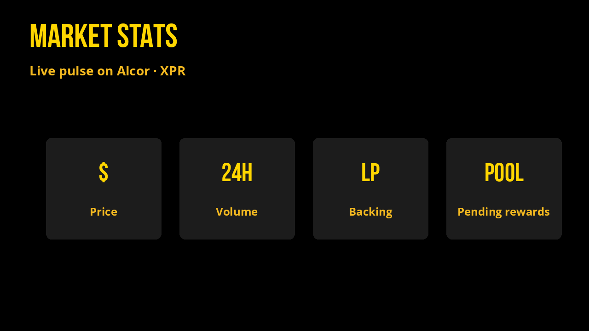
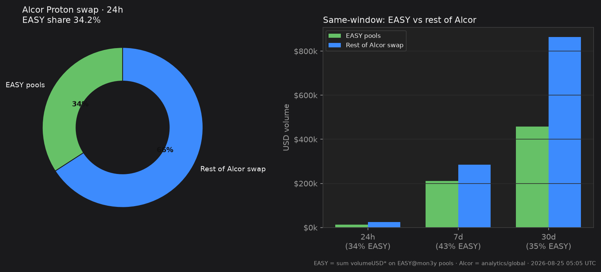

# Market Stats

Live pulse of EASY on XPR Alcor: liquidity, volume, and pending holder rewards.

*Last updated: 2026-08-25 05:05 UTC · Sources: [Alcor API](https://api.alcor.exchange/) (`proton.alcor.exchange/api/v2`) + `mon3y` chain tables*

## At a glance

| | |
| --- | --- |
| **24h volume (all EASY pools)** | **$12,795** |
| **EASY price** | **$0.0186** (≈6.59 XPR) |
| **EASY price in XUSDC** | **0.018836 XUSDC** |
| **Total EASY pools TVL** | **$2,287,351** |
| **Total USD backing (stables)** | **$81,679** (XMD + XUSDC + XPYUSD + XPAX + XUSDT sides) |
| **Pending holder rewards** | **845.28 EASY** (≈$15.69) in the reflection pool |
| **7d volume** | **$211,764** |
| **30d volume** | **$457,478** |
| **Flexers (holders on contract)** | **950** |
| **Market cap (fully circulating)** | **$389,790** |
| **Share of Alcor Proton swap volume (24h)** | **≈34.16%** |

## Volume

EASY pool volume is the sum of `volumeUSD24` / `volumeUSDWeek` / `volumeUSDMonth` across every Alcor swap pool where one side is `EASY@mon3y`.

**Share** = EASY volume ÷ Alcor Proton **swap** volume for the **same window** (`analytics/global` resolutions `1D` / `1W` / `1M`). That answers: *how much of Alcor’s swap tape is EASY?*

| Window | EASY pools | Rest of Alcor swap | EASY share |
| --- | ---: | ---: | ---: |
| 24h | $12,795 | $24,660 | **34.2%** |
| 7d | $211,764 | $284,961 | **42.6%** |
| 30d | $457,478 | $864,034 | **34.6%** |

### Top EASY pools (24h)

| Pool | 24h volume | TVL | EASY in pool | Other side | 24h Δ |
| --- | ---: | ---: | ---: | ---: | ---: |
| EASY/XUSDC | $2,963 | $74,110 | 3,072,398 EASY | 17,082.19 XUSDC | -0.1% |
| EASY/XMD | $2,916 | $73,291 | 3,085,565 EASY | 16,139.13 XMD | -0.1% |
| EASY/XPR | $2,495 | $43,845 | 842,918 EASY | 10,017,356.46 XPR | -0.2% |
| EASY/XXRP | $2,114 | $12,774 | 378,746 EASY | 3,798.89 XXRP | -1.5% |
| EASY/XBTC | $901.63 | $4,669 | 212,400 EASY | 0.01 XBTC | -2.2% |
| EASY/XUSDT | $289.59 | $72,447 | 3,061,694 EASY | 15,619.63 XUSDT | -0.2% |
| EASY/XXLM | $221.64 | $1,152 | 40,057 EASY | 2,089.10 XXLM | -1.0% |
| EASY/XHBAR | $195.69 | $425.11 | 22,853 EASY | 13.14 XHBAR | -2.0% |

### Stable backing (deepest pool each)

| Pool | Stable side | EASY in pool | Pool TVL |
| --- | ---: | ---: | ---: |
| [EASY/XMD](https://alcor.exchange/v/xpr/analytics/pools/4067) | $16,042 XMD | 3,085,565 EASY | $73,291 |
| [EASY/XUSDC](https://alcor.exchange/v/xpr/analytics/pools/4065) | $17,082 XUSDC | 3,072,398 EASY | $74,110 |
| [EASY/XPYUSD](https://alcor.exchange/v/xpr/analytics/pools/4068) | $15,195 XPYUSD | 3,093,045 EASY | $57,393 |
| [EASY/XPAX](https://alcor.exchange/v/xpr/analytics/pools/4070) | $15,998 XPAX | 3,141,627 EASY | $58,294 |
| [EASY/XUSDT](https://alcor.exchange/v/xpr/analytics/pools/4066) | $15,617 XUSDT | 3,061,694 EASY | $72,447 |

Trade: [alcor.exchange/v/xpr/swap](https://alcor.exchange/v/xpr/swap) · Analytics: [EASY token](https://alcor.exchange/v/xpr/analytics/tokens/EASY-mon3y)

## Alcor Proton (exchange-wide)

| | 1D | 1W | 1M |
| --- | ---: | ---: | ---: |
| **TVL** | $3,035,621 | (snapshot) | (snapshot) |
| **Swap TVL** | $2,879,997 | - | - |
| **Swap volume** | $37,455 | $496,725 | $1,321,512 |
| **Spot volume** | $239.30 | $1,023 | $16,371 |
| **Swap fees** | $232.05 | $2,803 | $7,116 |
| **DAU (avg)** | ≈78 | ≈77 | ≈77 |
| **Liquidity pools** | 11,429 | - | - |
| **Spot pairs** | 1,656 | - | - |

## Holder rewards (on-chain)

| | |
| --- | --- |
| Reflection pool (`mon3y` / EASY `stat`) | **845.28 EASY** |
| Approx. USD | **≈$15.69** |
| How it fills | 2% transfer tax into the pool |
| How it pays | Anyone calls `distribute` → splash to flexers |

Track real bags over time on [Success Stories](our-story/success-stories.md).
