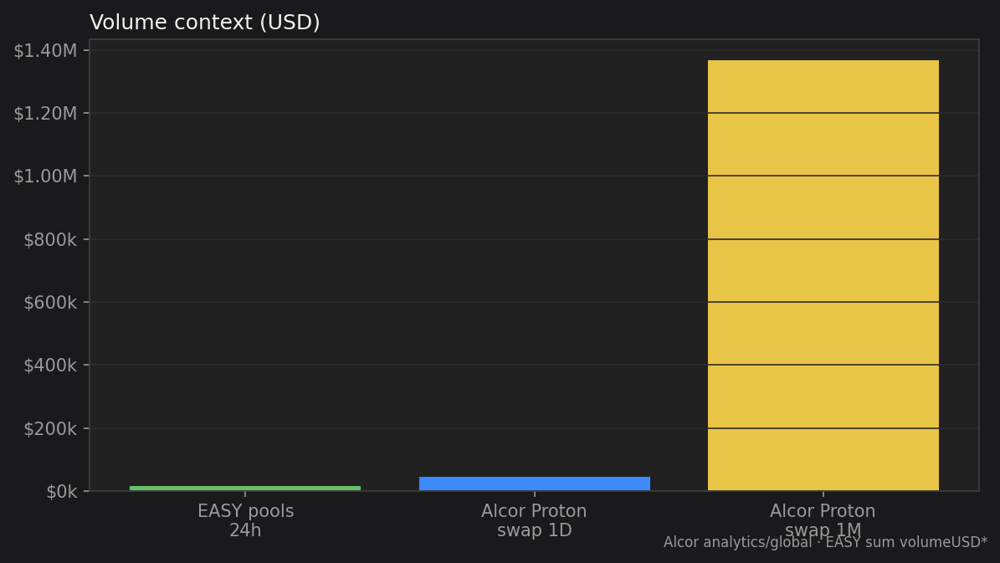
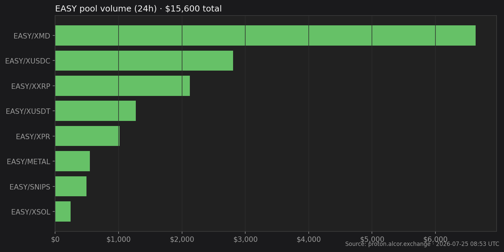

# Market Stats

Live pulse of EASY on XPR Alcor — liquidity, volume, and pending holder rewards.

*Last updated: 2026-07-25 08:53 UTC · Sources: [Alcor API](https://api.alcor.exchange/) (`proton.alcor.exchange/api/v2`) + `mon3y` chain tables*

## At a glance

| | |
| --- | --- |
| **EASY price** | **$0.0162** (~6.48 XPR) |
| **EASY price in XUSDC** | **0.016529 XUSDC** |
| **Liquidity (EASY pools TVL)** | **$3,023** |
| **Pending holder rewards** | **954.22 EASY** (~$15.50) in the reflection pool |
| **24h volume (all EASY pools)** | **$15,600** |
| **7d volume** | **$114,842** |
| **30d volume** | **$393,941** |
| **Flexers (holders on contract)** | **888** |
| **Market cap (fully circulating)** | **$341,074** |
| **Share of Alcor Proton swap volume (24h)** | **~33.67%** |

USDC-style rewards dashboards inspired this layout: **liquidity**, **pending rewards**, and **volume that feeds holders**.

## Volume

EASY pool volume is the sum of `volumeUSD24` / `volumeUSDWeek` / `volumeUSDMonth` across every Alcor swap pool where one side is `EASY@mon3y` ([swap pools API](https://proton.alcor.exchange/api/v2/swap/pools)).

Alcor Proton exchange totals use [`GET /api/v2/analytics/global?resolution=1D|1M`](https://api.alcor.exchange/) on the **proton** subdomain.

| Window | EASY pools | Alcor Proton (swap) | Alcor Proton (total) |
| --- | ---: | ---: | ---: |
| 24h / 1D | $15,600 | $46,328 | $47,182 |
| 30d / 1M | $393,941 | $1,366,681 | $1,407,603 |

### Top EASY pools (24h)

| Pool | 24h volume | TVL | 24h Δ |
| --- | ---: | ---: | ---: |
| EASY/XMD | $6,633 | $65,174 | -0.4% |
| EASY/XUSDC | $2,807 | $65,183 | -0.4% |
| EASY/XXRP | $2,127 | $13,913 | +0.7% |
| EASY/XUSDT | $1,270 | $64,989 | -0.3% |
| EASY/XPR | $1,013 | $23,511 | -0.2% |
| EASY/METAL | $547.72 | $8,882 | -0.2% |
| EASY/SNIPS | $494.73 | $5,272 | +0.5% |
| EASY/XSOL | $240.41 | — | +0.8% |

Trade: [proton.alcor.exchange](https://proton.alcor.exchange) · Analytics: [EASY token](https://proton.alcor.exchange/analytics/tokens/EASY-mon3y)

## Alcor Proton (exchange-wide)

| | 1D | 1M |
| --- | ---: | ---: |
| **TVL** | $1,005,313 | (same snapshot) |
| **Swap TVL** | $886,162 | — |
| **Swap volume** | $46,328 | $1,366,681 |
| **Spot volume** | $854.02 | $40,922 |
| **Swap fees** | $228.67 | $7,523 |
| **DAU (avg)** | ~78 | ~77 |
| **Liquidity pools** | 11,124 | — |
| **Spot pairs** | 1,601 | — |

## Holder rewards (on-chain)

| | |
| --- | --- |
| Reflection pool (`mon3y` / EASY `stat`) | **954.22 EASY** |
| Approx. USD | **~$15.50** |
| How it fills | 2% transfer tax into the pool |
| How it pays | Anyone calls `distribute` → splash to flexers |

Track a real bag over time on [Success in Community](our-story/success-in-community.md) (`thelake`).

## Supply

| | |
| --- | --- |
| Max / issued | 21,000,000 EASY |
| Circulating in pools + wallets | 21,000,000 (100% minted day one into liquidity) |

---

*Numbers drift every block. Say **update stats** in Cursor to refresh this page from Alcor + chain.*
