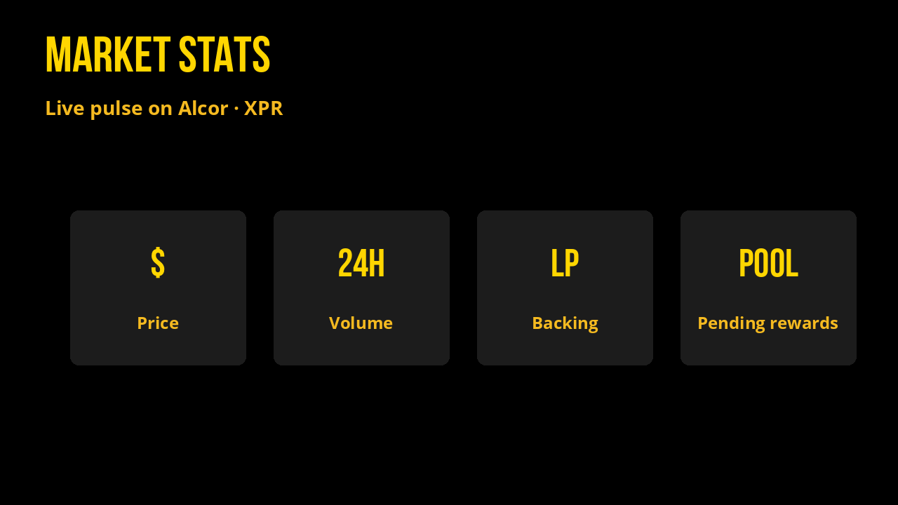
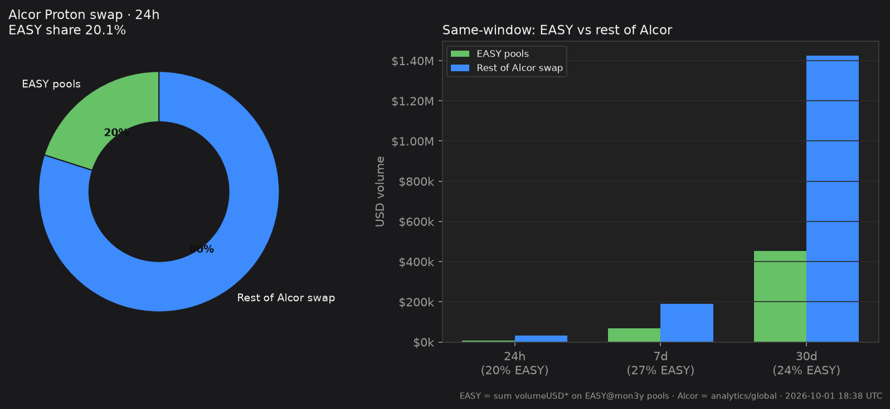
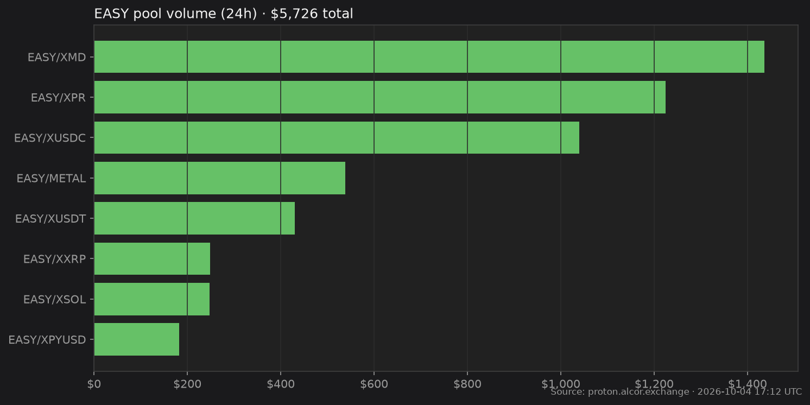

# Market Stats

Live pulse of EASY on XPR Alcor: liquidity, volume, and pending holder rewards.

*Last updated: 2026-10-08 19:04 UTC · Sources: [Alcor API](https://api.alcor.exchange/) (`proton.alcor.exchange/api/v2`) + `mon3y` chain tables*

## At a glance

| | |
| --- | --- |
| **24h volume (all EASY pools)** | **$13,073** |
| **EASY price** | **$0.0179** (≈8.09 XPR) |
| **EASY price in XUSDC** | **0.017983 XUSDC** |
| **Total EASY pools TVL** | **$413,090** |
| **Total USD backing (stables)** | **$72,206** (XMD + XUSDC + XPYUSD + XPAX + XUSDT sides) |
| **Pending holder rewards** | **701.20 EASY** (≈$12.52) in the reflection pool |
| **7d volume** | **$102,857** |
| **30d volume** | **$459,905** |
| **Flexers (holders on contract)** | **1,015** |
| **Market cap (fully circulating)** | **$374,867** |
| **Share of Alcor Proton swap volume (24h)** | **≈29.74%** |

## Volume

EASY pool volume is the sum of `volumeUSD24` / `volumeUSDWeek` / `volumeUSDMonth` across every Alcor swap pool where one side is `EASY@mon3y`.

**Share** = EASY volume ÷ Alcor Proton **swap** volume for the **same window** (`analytics/global` resolutions `1D` / `1W` / `1M`). That answers: *how much of Alcor’s swap tape is EASY?*

| Window | EASY pools | Rest of Alcor swap | EASY share |
| --- | ---: | ---: | ---: |
| 24h | $13,073 | $30,886 | **29.7%** |
| 7d | $102,857 | $218,289 | **32.0%** |
| 30d | $459,905 | $1,373,721 | **25.1%** |

### Top EASY pools (24h)

| Pool | 24h volume | TVL | EASY in pool | Other side | 24h Δ |
| --- | ---: | ---: | ---: | ---: | ---: |
| EASY/XUSDC | $3,325 | $70,238 | 3,132,367 EASY | 14,322.26 XUSDC | -0.8% |
| EASY/XPR | $2,617 | $23,406 | 466,826 EASY | 6,826,822.77 XPR | -0.4% |
| EASY/XMD | $2,563 | $71,087 | 3,157,677 EASY | 14,813.50 XMD | -0.9% |
| EASY/XUSDT | $1,084 | $70,235 | 3,148,693 EASY | 14,028.15 XUSDT | -0.8% |
| EASY/XXRP | $733.95 | $14,755 | 284,210 EASY | 7,250.18 XXRP | +2.4% |
| EASY/METAL | $624.14 | $14,704 | 45,621 EASY | 117,694.81 METAL | -1.2% |
| EASY/XPYUSD | $575.85 | $55,922 | 3,132,732 EASY | 14,313.58 XPYUSD | -1.0% |
| EASY/XDOGE | $378.37 | $1,461 | 41,322 EASY | 8,778.94 XDOGE | +2.9% |

### Stable backing (deepest pool each)

| Pool | Stable side | EASY in pool | Pool TVL |
| --- | ---: | ---: | ---: |
| [EASY/XMD](https://alcor.exchange/v/xpr/analytics/pools/4067) | $14,719 XMD | 3,157,677 EASY | $71,087 |
| [EASY/XUSDC](https://alcor.exchange/v/xpr/analytics/pools/4065) | $14,322 XUSDC | 3,132,367 EASY | $70,238 |
| [EASY/XPYUSD](https://alcor.exchange/v/xpr/analytics/pools/4068) | $14,413 XPYUSD | 3,132,732 EASY | $55,922 |
| [EASY/XPAX](https://alcor.exchange/v/xpr/analytics/pools/4070) | $14,459 XPAX | 3,137,364 EASY | $56,005 |
| [EASY/XUSDT](https://alcor.exchange/v/xpr/analytics/pools/4066) | $14,028 XUSDT | 3,148,693 EASY | $70,235 |

Trade: [alcor.exchange/v/xpr/swap](https://alcor.exchange/v/xpr/swap) · Analytics: [EASY token](https://alcor.exchange/v/xpr/analytics/tokens/EASY-mon3y)

## Alcor Proton (exchange-wide)

| | 1D | 1W | 1M |
| --- | ---: | ---: | ---: |
| **TVL** | $1,123,669 | (snapshot) | (snapshot) |
| **Swap TVL** | $980,210 | - | - |
| **Swap volume** | $43,958 | $321,146 | $1,833,627 |
| **Spot volume** | $70.44 | $2,832 | $12,841 |
| **Swap fees** | $277.06 | $1,773 | $9,657 |
| **DAU (avg)** | ≈396 | ≈420 | ≈419 |
| **Liquidity pools** | 11,679 | - | - |
| **Spot pairs** | 1,673 | - | - |

## Holder rewards (on-chain)

| | |
| --- | --- |
| Reflection pool (`mon3y` / EASY `stat`) | **701.20 EASY** |
| Approx. USD | **≈$12.52** |
| How it fills | 2% transfer tax into the pool |
| How it pays | Anyone calls `distribute` → splash to flexers |

Track real bags over time on [Success Stories](our-story/success-stories.md).
