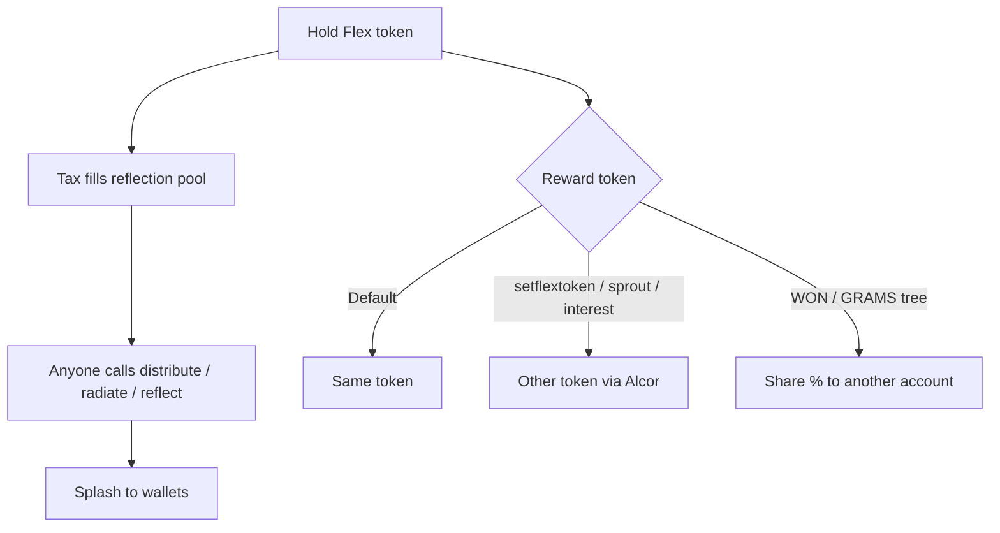

# Maximizing Your EASY

## Track pending rewards

Look at the balance of EASY on [`mon3y`](https://explorer.xprnetwork.org/account/mon3y), WON on [`w3won`](https://explorer.xprnetwork.org/account/w3won), or GRAMS on [`gold.mon3y`](https://explorer.xprnetwork.org/account/gold.mon3y).

## Pay people

Activate the payout action and you’ll use your CPU to pay everyone:

| Token | Contract | Action |
| --- | --- | --- |
| EASY / MEME | `mon3y` / `m3m3` | `distribute` |
| WON | `w3won` | `radiate` |
| GRAMS | `gold.mon3y` | `reflect` |

## Change your reward token

| Token | Action |
| --- | --- |
| EASY / MEME | `setflextoken` |
| WON | `sprouttoken` |
| GRAMS | `interestoken` |

Enter desired token symbol (some capital letters, that’s all).

Or do it visually on [flex.town](https://flex.town).

## Inheritance (WON + GRAMS)

Pass a % of rewards to any account:

| Token | Recipient | Custom memo |
| --- | --- | --- |
| WON | `settree` | `settreememo` |
| GRAMS | `inheritance` | `inheritmemo` |

## Opt out of fees (+ rewards)

Understand this is **one-way** — you can’t opt back in to rewards on the account.

| Token | Action |
| --- | --- |
| EASY / MEME | `noflexzone` |
| WON | `optoutoftax` |
| GRAMS | `renounce` |

We are open to improve.
