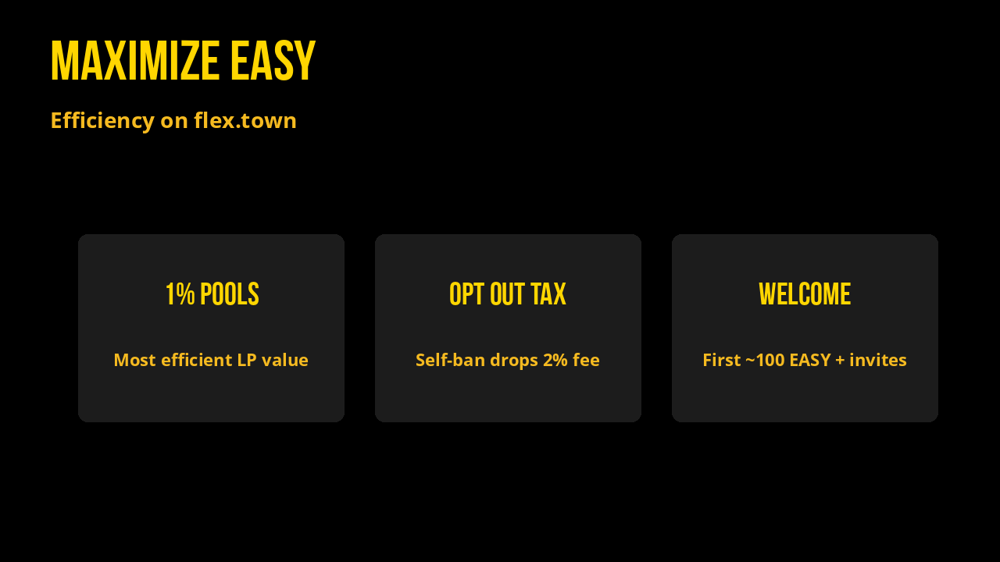
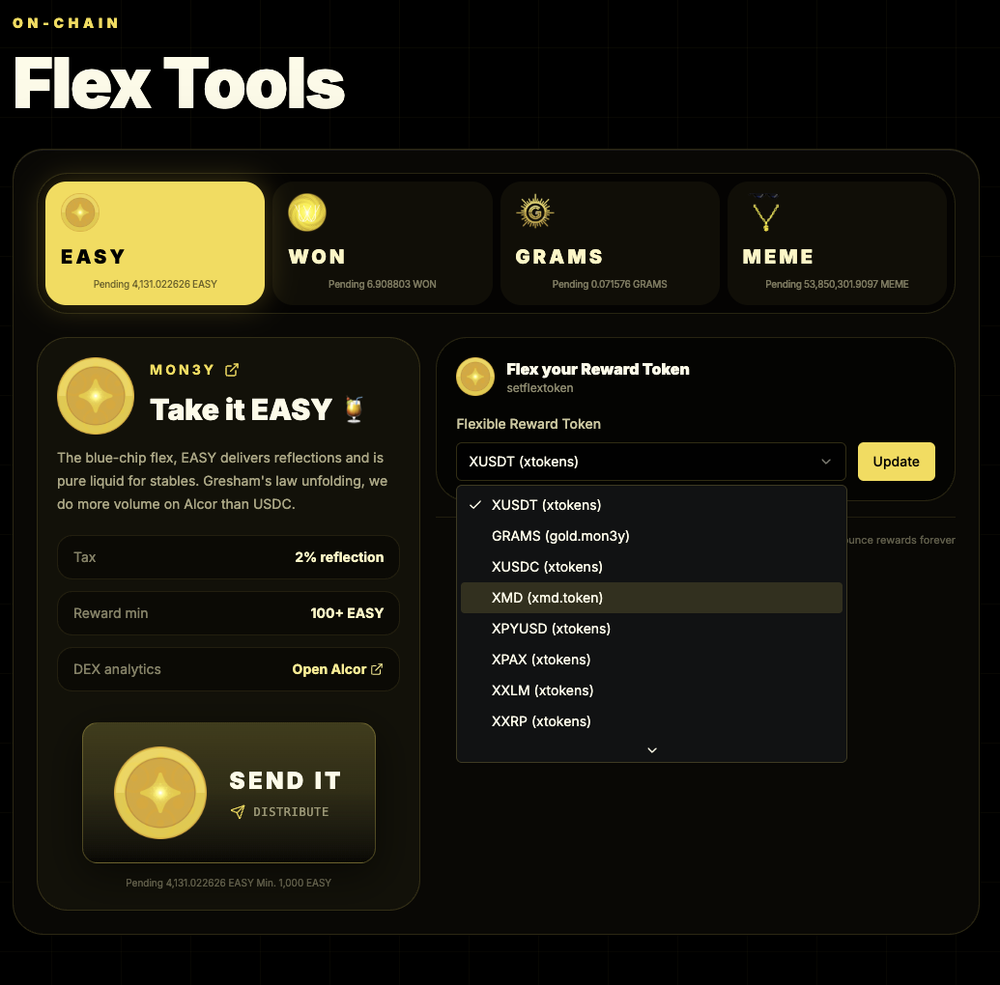
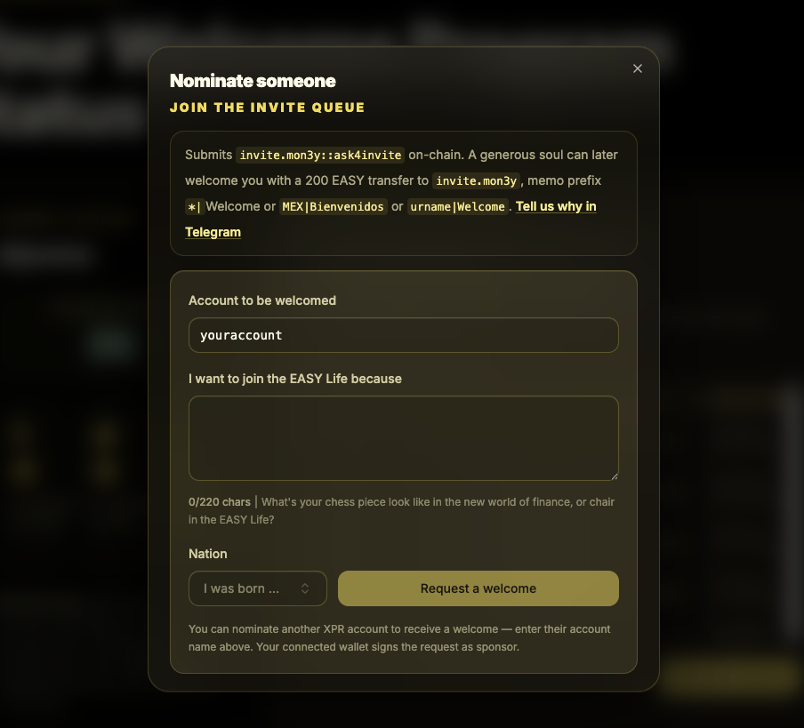

# Maximizing Your EASY

Do everything on **[flex.town](https://www.flex.town/)**. Connect your WebAuth wallet and use Flex Tools. You do not need contract actions for day-to-day use.

## What you can do on flex.town

| Do this | Where |
| --- | --- |
| [Send It](https://www.flex.town/) (splash pending reflections to holders) | Flex Tools |
| [Change your reward token](https://www.flex.town/) (compound EASY or pick another token) | Flex Tools → Flexible Reward Token |
| [Opt out of tax](https://www.flex.town/) (self-ban / `noflexzone`) | Flex Tools → Opt out of tax |
| [Welcome someone](https://www.flex.town/) or [request your first EASY](https://www.flex.town/) | Welcome |
| [Swap / trade](https://www.flex.town/) without leaving the page | Trading Terminal |
| [Bridge EASY](https://www.flex.town/) between XPR and Solana | Bridge |

Contract details live under [Smart Contracts](smart-contracts/README.md) and [API Reference](api-reference.md) if you need them.

## Trade efficiently

**Prefer 1% fee pools** when you provide liquidity or route size. Higher-fee EASY pools capture more value from volume, which feeds the live fee split in [Tokenomics](tokenomics.md) (Welcome, Contributors Club, MEME buyback).

## Ban yourself to drop the reflection tax

If you move EASY often and want maximum transfer efficiency, use **Opt out of tax** on [flex.town Flex Tools](https://www.flex.town/). That self-ban (`noflexzone` on EASY) removes the **2% reflection tax** on your transfers.

This is **one-way** for that account: you renounce reflection rewards forever on that wallet. Use a separate account if you still want to earn reflections.

## Welcome Program

The Welcome Program runs on [`invite.mon3y`](https://explorer.xprnetwork.org/account/invite.mon3y) (contract: `easyinvite`), with banked EASY in [`inbank.mon3y`](https://explorer.xprnetwork.org/account/inbank.mon3y). The UI is on [flex.town → Welcome](https://www.flex.town/). EASY itself is the flex token contract (`takeiteasy` / [`mon3y`](https://explorer.xprnetwork.org/account/mon3y)).

**Request your first ~100 EASY.** Submit **Request a welcome** on flex.town (`invite.mon3y::ask4invite`). Someone later pays the welcome package: **200 EASY** total → **100 EASY to your wallet** and **100 EASY to the collective vault** (`inbank.mon3y`). Vault yield splits among participants; multipliers grow with your network.

**Invite people for infinite money forever.** Once you are welcomed, welcome others the same way. Each welcome bumps invite score up your upline, banks your share in the vault, and compounds network rewards when anyone calls claim. Grow the tree; claim forever.

| Flow | On flex.town |
| --- | --- |
| Ask to be welcomed | Welcome → Request a welcome |
| Welcome an account | Welcome → send 200 EASY package |
| Share invite links | Welcome → Telegram / WhatsApp / X / email / text |
| View your network | Welcome → View welcome network |

Pool swap fees also fund invites: **38.2%** of EASY pool fees go to `invite.mon3y`. See [Tokenomics](tokenomics.md).
