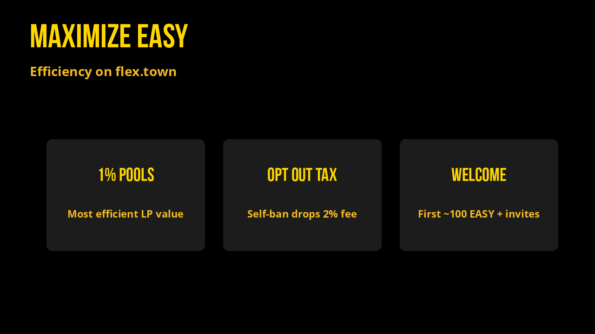
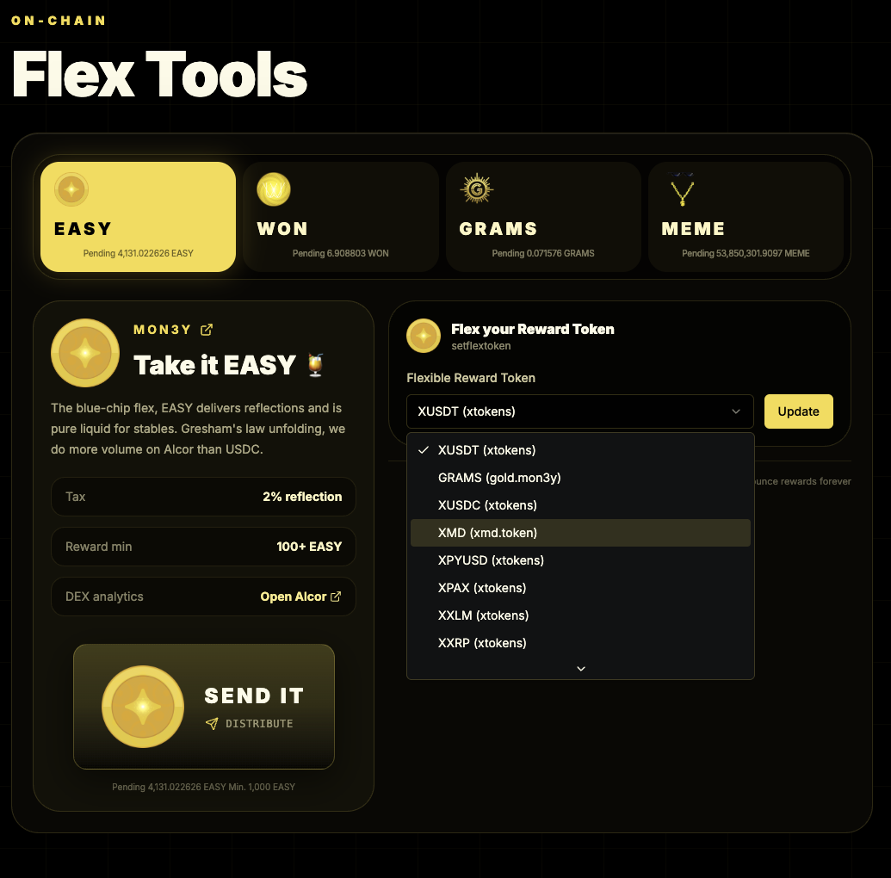
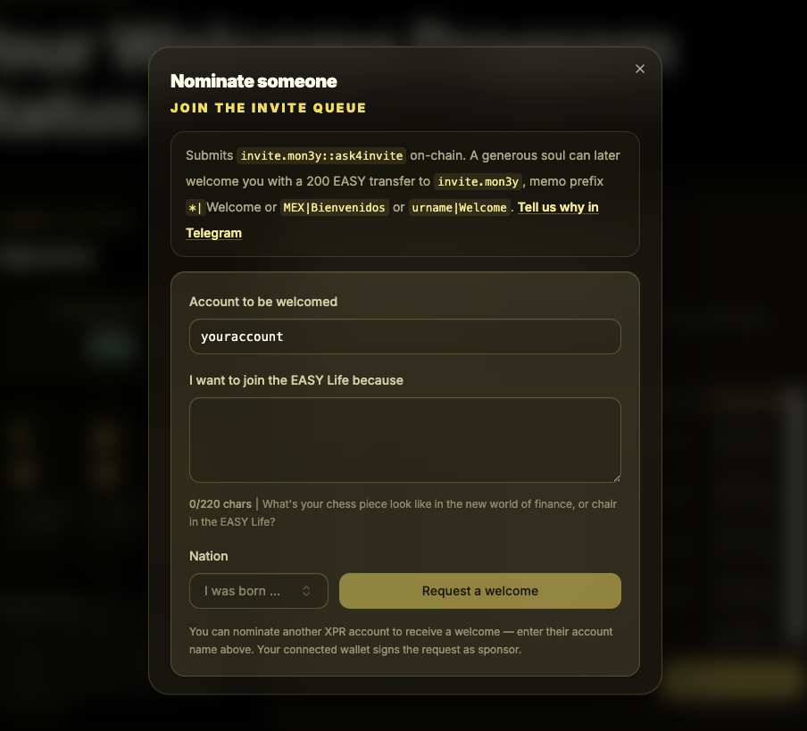

# Maximizing Your EASY

## Provide liquidity

Prefer **1% fee** EASY pools. Higher fee on busy books feeds Welcome, Club, and MEME buybacks.

Example (moves with volume): [EASY/XPR](https://alcor.exchange/v/xpr/analytics/pools/4512) · 1% fee · recent ≈14% fee APY (≈$890/day on ≈$24k TVL).

Check [Alcor Farms](https://alcor.exchange/v/xpr/analytics?tab=farms) before you size.

If you LP, **opt out of tax on that account first**. Opt-out is one-way on that wallet. Use a second account if you still want reflections.

No LP capital? **100 EASY** is enough to earn reflections when anyone hits Send It.

## What you can do on flex.town

| Do this | Where |
| --- | --- |
| [Send It](https://www.flex.town/) (splash pending reflections to holders) | Flex Tools |
| [Change your reward token](https://www.flex.town/) (compound EASY or pick another token) | Flex Tools → Flexible Reward Token |
| [Opt out of tax](https://www.flex.town/) (self-ban / `noflexzone`) | Flex Tools → Opt out of tax |
| [Welcome someone](https://www.flex.town/) or [request your first EASY](https://www.flex.town/) | Welcome |
| [Swap / trade](https://www.flex.town/) without leaving the page | Trading Terminal |
| [Bridge EASY](https://www.flex.town/) between XPR and Solana | Bridge |

Contract details live under [Smart Contracts](smart-contracts/README.md) and [API Reference](api-reference.md) if you need them.

## Opt out of tax

Flex Tools → Opt out of tax. Removes the **2%** tax on that account. You also drop reflection rewards on that account forever.

## Welcome Program

Contract [`invite.mon3y`](https://explorer.xprnetwork.org/account/invite.mon3y). Bank [`inbank.mon3y`](https://explorer.xprnetwork.org/account/inbank.mon3y). UI: flex.town → Welcome.

Request a welcome (`ask4invite`). Someone later pays **200 EASY**: **100 to you**, **100 to the vault**. Vault yield splits among the tree.

Once welcomed, welcome the next person. Grow the tree. Claim forever.

| Flow | On flex.town |
| --- | --- |
| Ask to be welcomed | Welcome → Request a welcome |
| Welcome an account | Welcome → send 200 EASY package |
| Share links | Welcome → Telegram / WhatsApp / X / email / text |
| View network | Welcome → View welcome network |

**38.2%** of EASY-side pool fees fund `invite.mon3y`.
