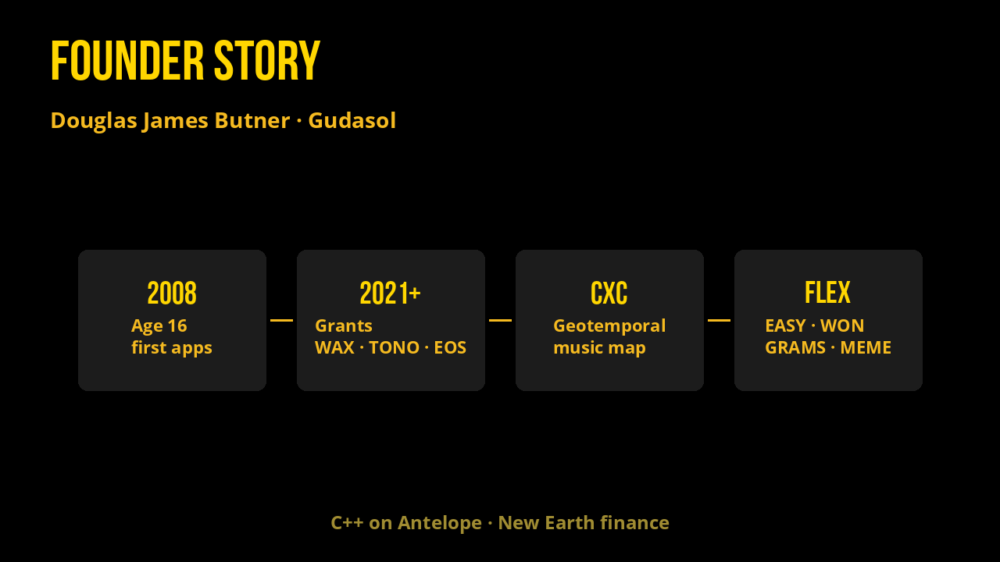

# Founder Story

Hi, I'm **Douglas James Butner**, and I'm pleased you're here.

Since age 16 (2008), I've channeled passion to build, release, and maintain web apps — starting with a Myspace-style social network, then a long arc toward maps, music, and money that behave like living systems.

I grew up near Deep Creek Lake, Maryland. For years I've been a digital nomad across the Americas — mostly Latin America — based between Medellín and Lago de Atitlán. Travel sharpened the question that runs through everything I ship: how do people coordinate freely, create together, and keep the value they generate?

## What I build

I believe the fundamentals of the chain more than trends. We write smart contracts in **C++** on EOSIO / Antelope.

I chose a smaller pond, and with room to swim I grew.

Along the way:

- **[cXc.world](https://cxc.world)** — a geotemporal dmap of music (web3 → web4), plus open media NFT metadata standards and minter tools
- **Ups** — time-token voting / “web4 Reddit” contract patterns for collective curation
- **Loot** — gamified NFT staking
- **[Aquarius Academy](https://aquarius.academy)** — open education around consciousness, geometry, and new-earth systems
- **[Tetra](https://tetra.earth)** / **[XParty](https://xparty.win)** — experiments in fractal coordination and collective play
- Grants-backed work across **WAX**, **TONO**, and **EOS** (from 2021 onward)

I write about this stack in pieces like the [Web 4 Manifesto](https://douglas-life.medium.com/provable-democracy-the-web-4-manifesto-by-douglas-butner-3c8785d2f92a) — provable democracy, time tokens, geotribes, and systems that make collaboration visible on-chain.

More: [douglas.life](https://douglas.life/) · [GitHub @dougbutner](https://github.com/dougbutner) · [LinkedIn](https://www.linkedin.com/in/douglasbutner)

## Why Flex Tokens

I loved the *idea* of reflection tokens — money that pays you for holding — but the ones I tried on BSC and Solana were rugpulls.

So I wrote a new type of reflection token: a **flexible reward token**. Holders choose what they get paid in. Fees are transparent. Liquidity is vaulted day one. That family is EASY, WON, GRAMS, and MEME — Flex Tokens on XPR Network.

EOSIO enabled me to build the systems I couldn't fake on hype chains: real contracts, real tables, real explorer receipts.

## Key: EASY Tokens

1. Go to [alcor.exchange/v/xpr/swap](https://alcor.exchange/v/xpr/swap) + connect your WebAuth wallet  
2. Swap any token for EASY  
3. Ensure you have at least 100 EASY to get reflections (about 1 USD worth)

Welcome to the first day of the rest of your life.

Take it EASY — then check [Success in Community](success-in-community.md) for what reflections look like on a real account.
