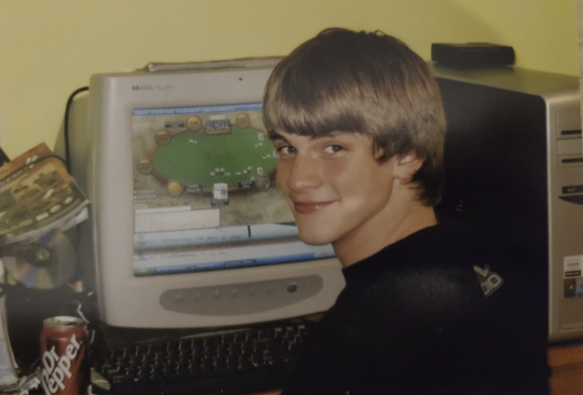
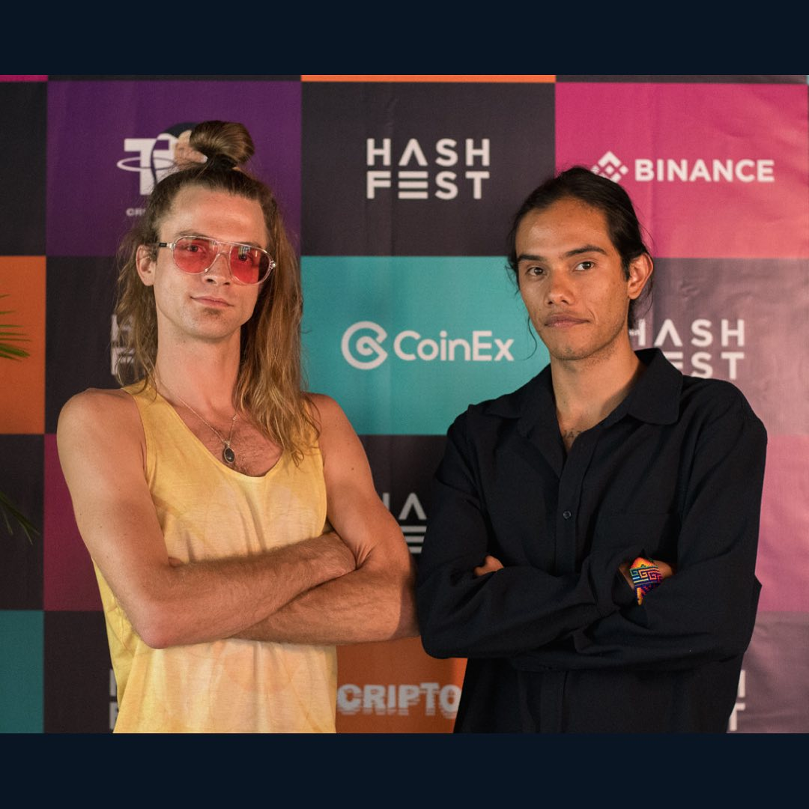
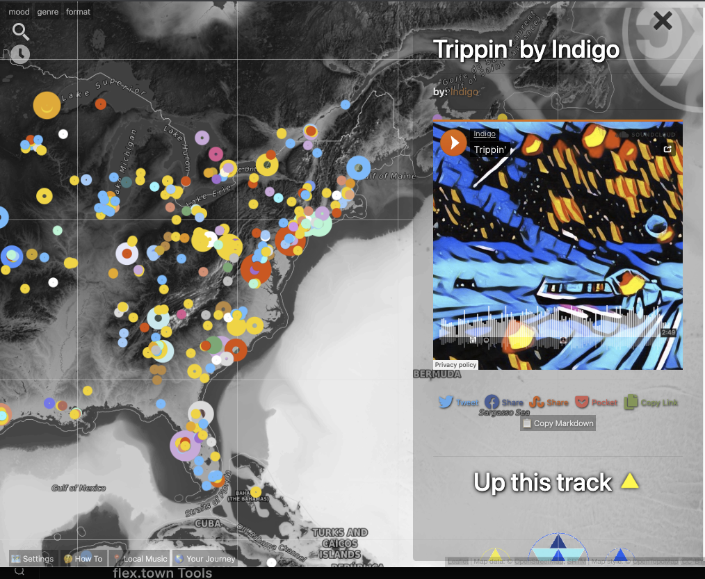

# Founder Story

*The first thing I coded was a bot to play PokerStars using AutoIt, at age 15.*

Hi, I'm **Douglas James Butner**, and I'm pleased you're here.

Since age 16 (2008), I've channeled passion to build, release, and maintain web apps: starting with a Myspace-style social network, then a long arc toward maps, music, and money that behave like living systems.

Learn about me at [douglas.life](https://douglas.life/) or on GitHub ([dougbutner](https://github.com/dougbutner)).

## What I build

I believe the fundamentals of the chain more than trends. We write smart contracts in **C++** on EOSIO / Antelope.

I chose a smaller pond, and with room to swim I grew.

Along the way:

- **[cXc.world](https://cxc.world)**: a geotemporal dmap of music (web3 → web4), plus open media NFT metadata standards and minter tools
- **Ups**: time-token voting / “web4 Reddit” contract patterns for collective curation
- **Loot**: gamified NFT staking
- **[Tetra](https://tetra.earth)**: experiments in fractal coordination and collective play
- Grants-backed work across **WAX**, **TONO**, and **EOS** (from 2021 onward)

I write about this stack in pieces like the [Web 4 Manifesto](https://douglas-life.medium.com/provable-democracy-the-web-4-manifesto-by-douglas-butner-3c8785d2f92a): provable democracy, time tokens, geotribes, and systems that make collaboration visible on-chain.

## Why Flex Tokens

I loved the *idea* of reflection tokens (money that pays you for holding), but the ones I tried on BSC and Solana were rugpulls.

So I wrote a new type of reflection token: a **flexible reward token**. Holders choose what they get paid in. Fees are transparent. Liquidity is vaulted day one. That family is EASY, WON, GRAMS, and MEME: Flex Tokens on XPR Network.

EOSIO enabled me to build the systems I couldn't fake on hype chains: real contracts, real tables, real explorer receipts.

## Key: EASY Tokens

1. Go to [alcor.exchange/v/xpr/swap](https://alcor.exchange/v/xpr/swap) + connect your WebAuth wallet  
2. Swap any token for EASY  
3. Ensure you have at least 100 EASY to get reflections (about 1 USD worth)

Welcome to the first day of the rest of your life.

Take it EASY: then check [Success Stories](success-stories.md) for what reflections look like on a real account.

## Key Volunteers

- **Mateo** — first raving fan and EASY OG
- **Christophe** — epic projects inside the EASY and GRAMS ecosystem
- **Trenia** — bridging us to the KSTO community
- **holdone** — generous invites that grew the tree
- **Douglas** — obsession, and all the code
