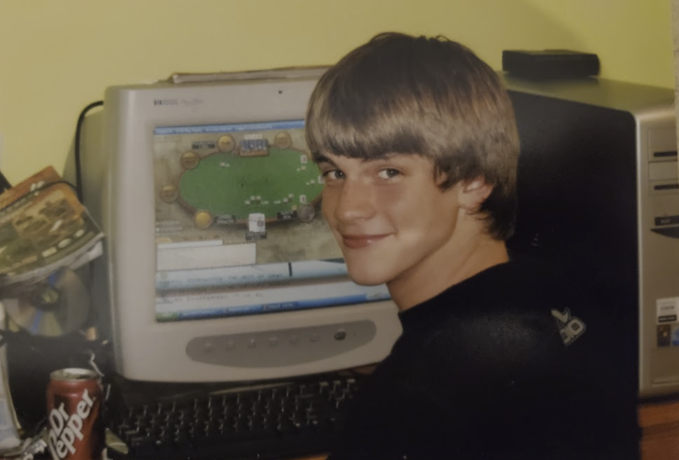
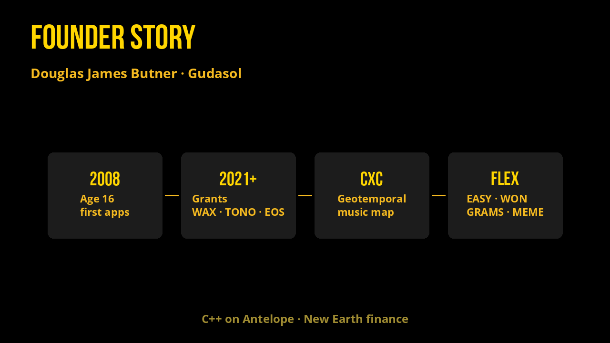
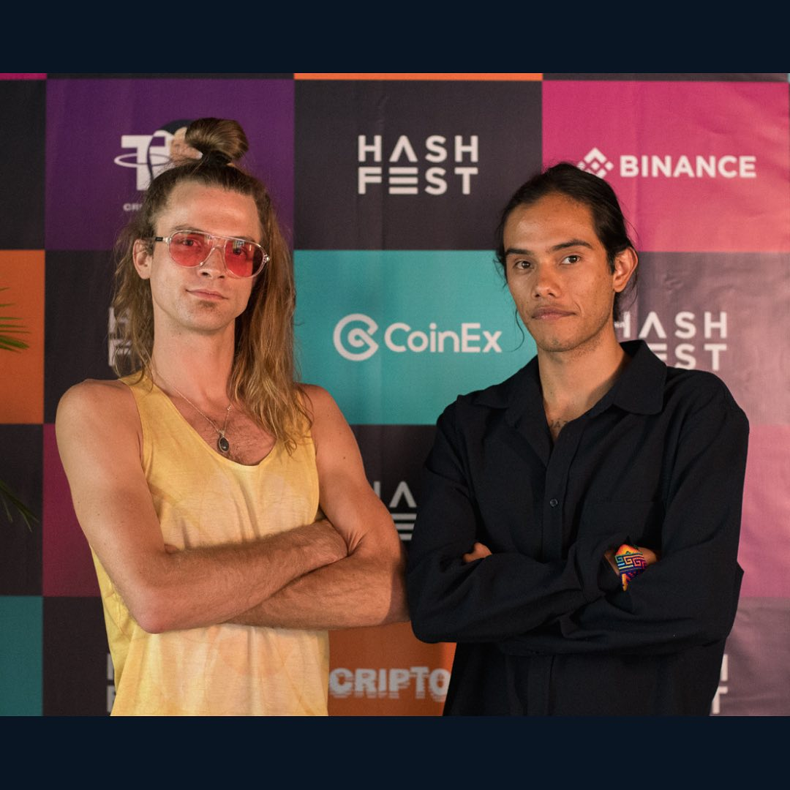

# Founder Story

Hi, I'm **Douglas James Butner**.

First program: a PokerStars bot in AutoIt at 15. Since 2008: social apps, maps, music, money that pays holders.

- [douglas.life](https://douglas.life/) · GitHub [@dougbutner](https://github.com/dougbutner)
- Contracts in **C++** on EOSIO / Antelope
- [cXc.world](https://cxc.world): geotemporal music map
- Ups: time-token voting
- Loot: NFT staking
- [Tetra](https://tetra.earth): fractal coordination
- Grants on WAX, TONO, EOS from 2021
- [Web 4 Manifesto](https://douglas-life.medium.com/provable-democracy-the-web-4-manifesto-by-douglas-butner-3c8785d2f92a)

Reflection tokens I tried on BSC and Solana were rugs. Flex Tokens are the rewrite: you pick the reward token, fees are public, liquidity is vaulted day one. Family: EASY, WON, GRAMS, MEME on XPR.

## Start

1. [Alcor swap](https://alcor.exchange/v/xpr/swap) + WebAuth
2. Swap into EASY
3. Hold **100+ EASY** (~$1+) so reflections pay

What that looks like on a real account: [Success Stories](success-stories.md).

## Volunteers

- **Mateo**: first raving fan
- **Christophe**: EASY and GRAMS projects
- **Trenia**: KSTO bridge
- **holdone**: invites
- **Douglas**: the contracts
