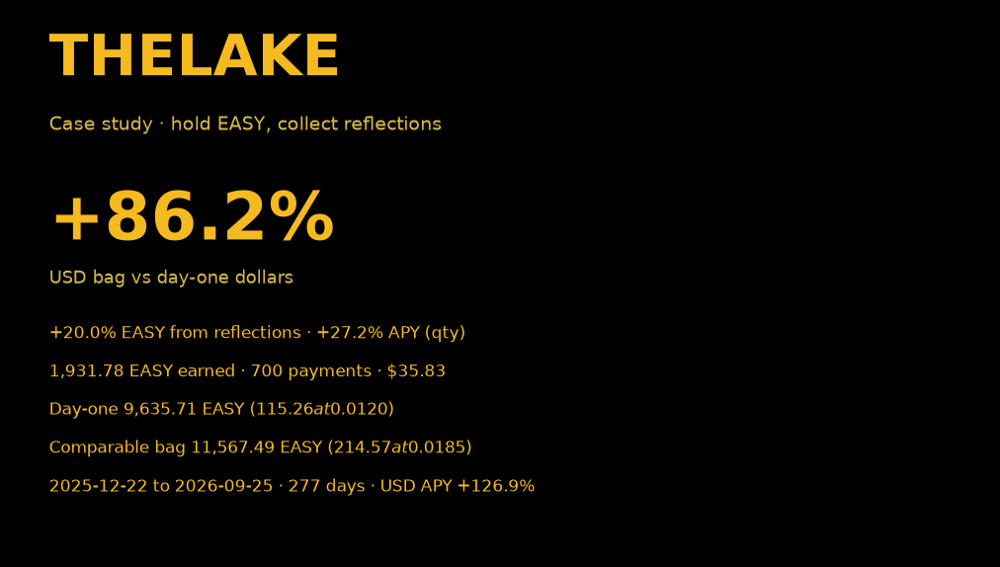
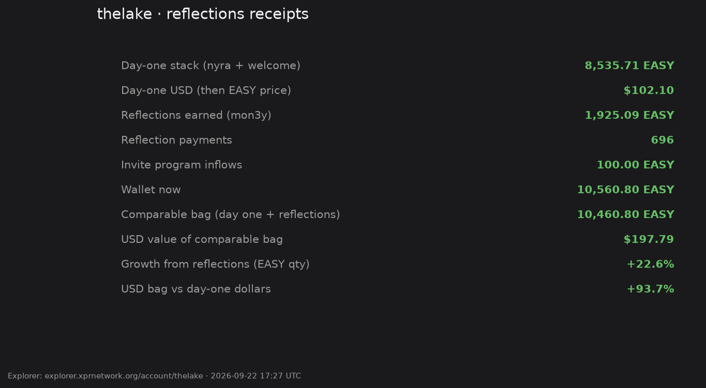
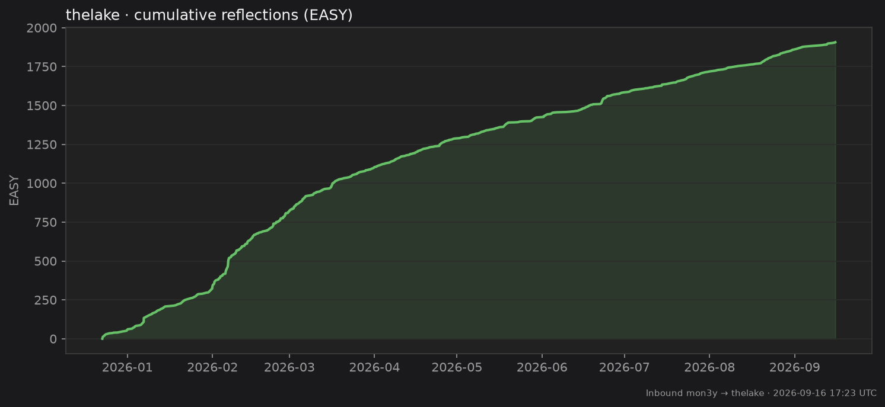
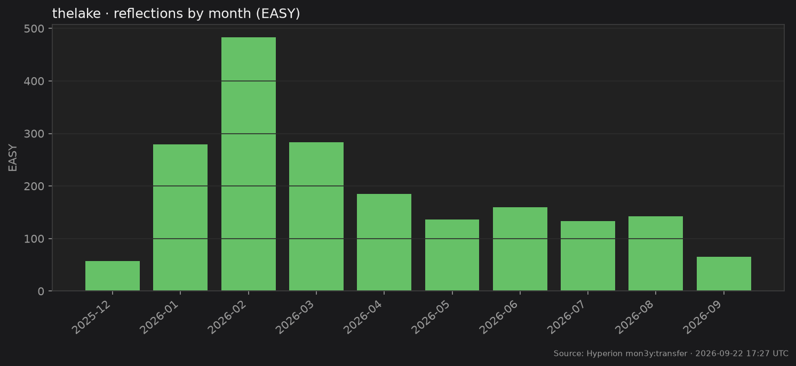
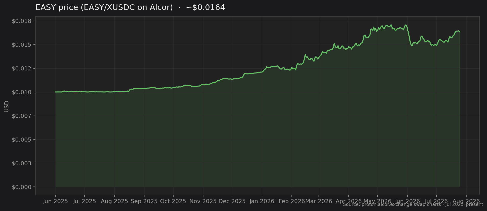
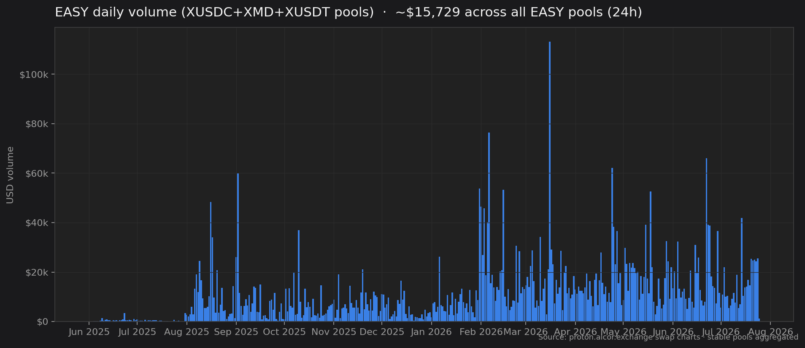
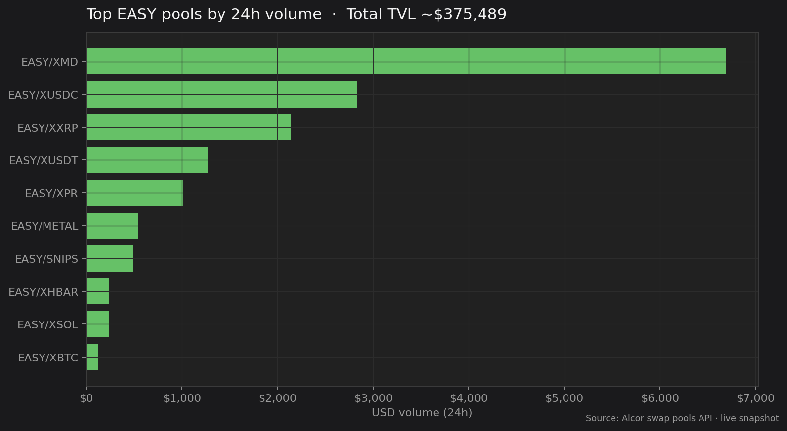

# Success in Community

Pics or it didn’t happen.

## Case study: `thelake`

On **December 22, 2025**, XPR account [`thelake`](https://explorer.xprnetwork.org/account/thelake) entered EASY — the “put in ~100 USD worth of EASY” story from the original playbook.

**Day-one stack:** 8,535.71 EASY  
(7,880.71 from the funding transfer + 655 welcome / welcome bonus)

**Reflections earned since then:** **1,671.98 EASY** across **578** on-chain payments from `mon3y` (through July 25, 2026).

That’s **+19.6%** grown from reflections alone — without selling — while the bag kept collecting.

| | |
| --- | --- |
| Account created | Dec 22, 2025 |
| Day-one stack | 8,535.71 EASY |
| Reflections (mon3y → thelake) | **1,671.98 EASY** |
| Reflection payments | 578 |
| Balance now | **10,320.67 EASY** |
| Explorer | [thelake](https://explorer.xprnetwork.org/account/thelake) |

You can verify any payment on the explorer: transfers from `mon3y` with memos like “Take it EASY 🍹 Reflect & Collect ❇️” / “Be EASY 🍹 flex.town 🏘”.

## EASY price (recent)

From the Alcor EASY/XUSDC pool — price stepped up from ~$0.01 at launch into the mid‑teens of cents.

Live analytics: [proton.alcor.exchange/analytics/tokens/EASY-mon3y](https://proton.alcor.exchange/analytics/tokens/EASY-mon3y)

## Volume

Daily volume across the main stable pools (XUSDC + XMD + XUSDT). Quiet at first, then the bots found the rails.

Where that volume sits today — top EASY pools by 24h USD:

Volume followed. See [Unintended Consequences](unintended-consequences.md) for how EASY became #1 on Alcor.

## Farms

Extensive rewards pools for [Alcor Farms (XPR)](https://alcor.exchange/v/xpr/analytics?tab=farms).

Flex tokens are not magic. The feeling you get when you check your wallet and see it working for you, that’s magic.
