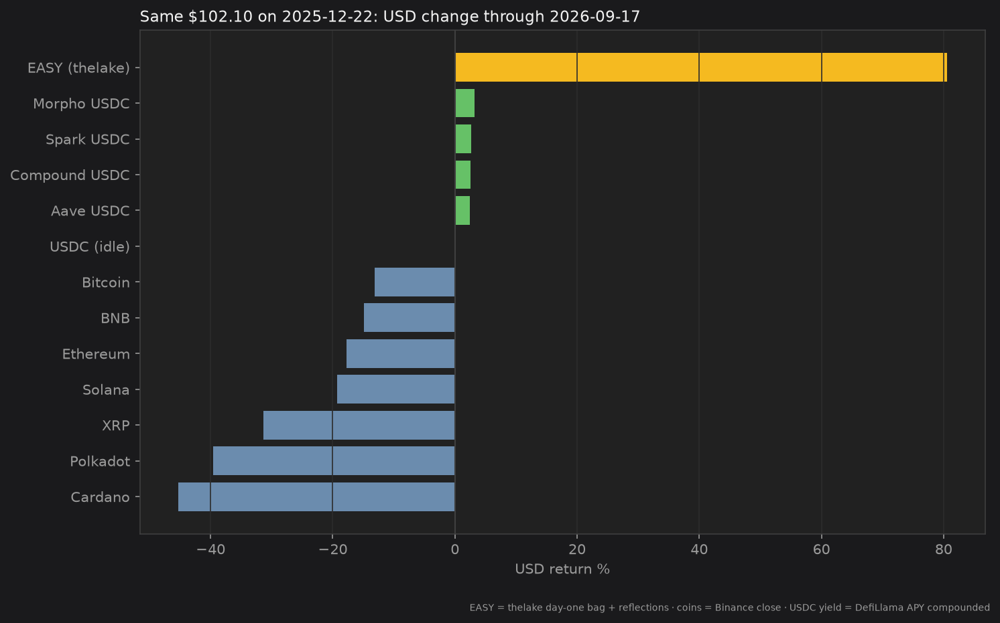

# Success Stories

Pics or it didn’t happen.

*Last updated: 2026-09-17 17:23 UTC · thelake is a live on-chain bag, not a backtest.*

## Case study: `thelake`

On **December 22, 2025**, XPR account [`thelake`](https://explorer.xprnetwork.org/account/thelake) bought into EASY. That is the original playbook example: put in about **$100** of EASY and leave it.

**Day-one stack:** 8,535.71 EASY  
(7,880.71 from the funding transfer + 655.00 welcome)

At the **then** EASY mark (**$0.0120** on the Alcor EASY/XUSDC pool), that stack was **$102.10**: the ~$100 entry the playbook talks about.

**Reflections earned since then:** **1,907.73 EASY** across **686** on-chain payments from `mon3y` (through 2026-09-16).

That is **+22.3% more EASY** from reflections alone (about **+31.5% APY** on quantity over 269 days), without selling. A later invite bonus of **100.00 EASY** sits in the wallet too. The comparison below ignores that bonus so the story stays “the original ~$100 bag.”

USD is a different lens. EASY itself moved from **$0.0120** to **$0.0176**. The comparable bag (day one + reflections) is **10,443.44 EASY**, about **$184.32** now: **+80.5%** vs those day-one dollars (**+123.0% APY** in USD).

| | |
| --- | --- |
| Account created | 2025-12-22 |
| Day-one stack | 8,535.71 EASY (**$102.10** at $0.0120) |
| Reflections (mon3y → thelake) | **1,907.73 EASY** (≈**$33.67** at today’s mark) |
| Reflection gain (EASY qty) | **+22.3% EASY** · **+31.5% APY** |
| USD bag vs day-one dollars | **+80.5%** · **+123.0% APY** |
| Reflection payments | 686 |
| Comparable bag | **10,443.44 EASY** (≈**$184.32**) |
| Wallet now | **10,543.44 EASY** (includes 100.00 invite EASY) |
| Explorer | [thelake](https://explorer.xprnetwork.org/account/thelake) |

You can verify any payment on the explorer: transfers from `mon3y` with memos like “Take it EASY 🍹 Reflect & Collect ❇️” / “Be EASY 🍹 flex.town 🏘”.

## Same dollars, other bags

What if that **$102.10** had bought a major coin on **2025-12-22** instead, or sat in USDC / supplied USDC?

Buy-and-hold, no leverage, no trading. Coin marks are Binance USDT daily close vs now. Idle USDC is the USDC/USDT pair. “Staked USDC” rows compound DefiLlama daily supply APY on the named venue (Aave V3 Ethereum, Compound III Ethereum, Morpho Steakhouse USDC on Base, Spark Savings Ethereum). EASY is thelake’s day-one stack plus reflections, marked in USD.

| Rank | Bag | Kind | Value now | USD change | USD APY |
| ---: | --- | --- | ---: | ---: | ---: |
| 1 | **EASY (thelake)** | Flex token | $184.32 | **+80.5%** | +123.0% |
| 2 | Morpho USDC | staked USDC | $105.41 | +3.2% | +4.4% |
| 3 | Spark USDC | staked USDC | $104.83 | +2.7% | +3.6% |
| 4 | Compound USDC | staked USDC | $104.67 | +2.5% | +3.4% |
| 5 | Aave USDC | staked USDC | $104.63 | +2.5% | +3.4% |
| 6 | USDC (idle) | stable | $102.13 | 0.0% | 0.0% |
| 7 | Bitcoin | blue chip | $88.65 | -13.2% | -17.4% |
| 8 | BNB | blue chip | $86.85 | -14.9% | -19.7% |
| 9 | Ethereum | blue chip | $84.00 | -17.7% | -23.3% |
| 10 | Solana | blue chip | $82.45 | -19.2% | -25.2% |
| 11 | XRP | blue chip | $70.12 | -31.3% | -40.0% |
| 12 | Polkadot | blue chip | $61.64 | -39.6% | -49.6% |
| 13 | Cardano | blue chip | $55.85 | -45.3% | -55.9% |

The twelve comparison bags: Bitcoin, Ethereum, XRP, Solana, BNB, Cardano, Polkadot, idle USDC, plus four large USDC supply/savings venues. This is not advice, and a different window can reverse the ranking.

## `kinship1`

[`kinship1`](https://explorer.xprnetwork.org/account/kinship1) got **1,000.00 EASY** from `reflections` on **2025-11-27** (“When things seem hard, Take it EASY”). Since then it has taken **330.44 EASY** in reflections across **827** payments (≈**$5.83** at $0.0176), a **+33.0%** gain in EASY (≈**+42.6% APY** over 294 days). Balance now: **1,330.44 EASY** (≈**$23.48**).

## EASY price (recent)

From the Alcor EASY/XUSDC pool: price stepped up from ≈$0.01 at launch into the mid-teens of cents.

Live analytics: [alcor.exchange/v/xpr/analytics/tokens/EASY-mon3y](https://alcor.exchange/v/xpr/analytics/tokens/EASY-mon3y)

## Volume

Daily volume across the main stable pools (XUSDC + XMD + XUSDT). Quiet at first, then the bots found the rails.

Where that volume sits today (top EASY pools by 24h USD):

Volume followed. See [Unintended Consequences](unintended-consequences.md) for how EASY became #1 on Alcor.

## Farms

Extensive rewards pools for [Alcor Farms (XPR)](https://alcor.exchange/v/xpr/analytics?tab=farms).

This is just what happens if you **buy and hold**. There are also other ways to earn with EASY, including the [Welcome Program](../maximizing-your-easy.md#welcome-program) and [providing liquidity](../maximizing-your-easy.md#provide-liquidity) against other coins.
