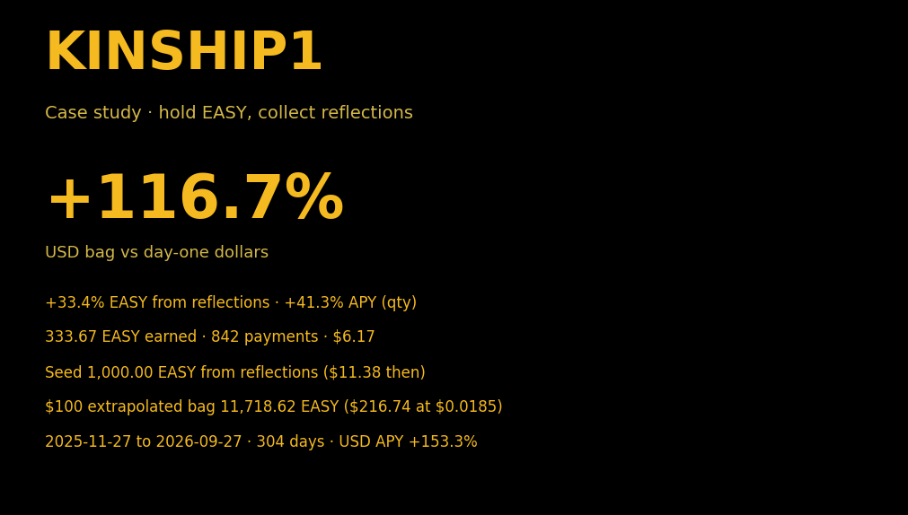
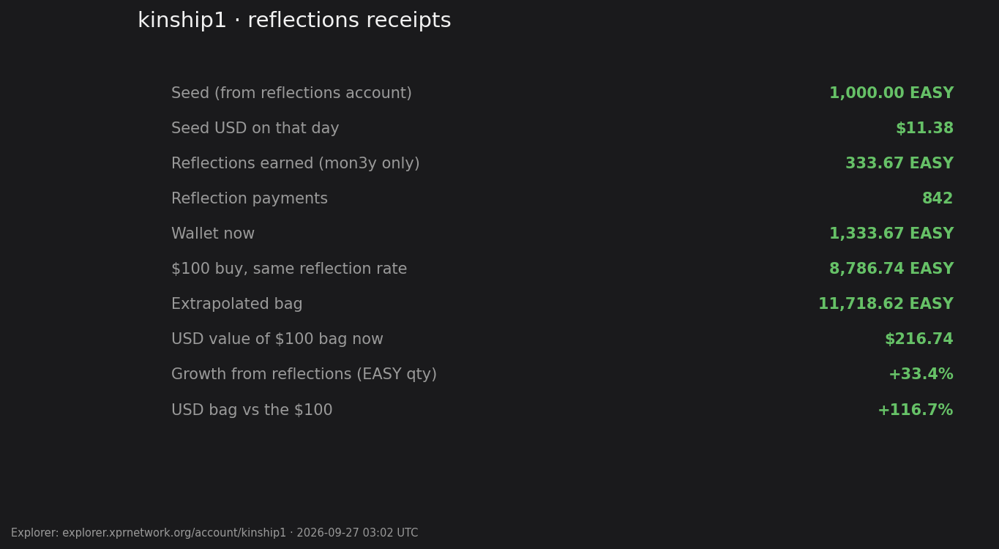
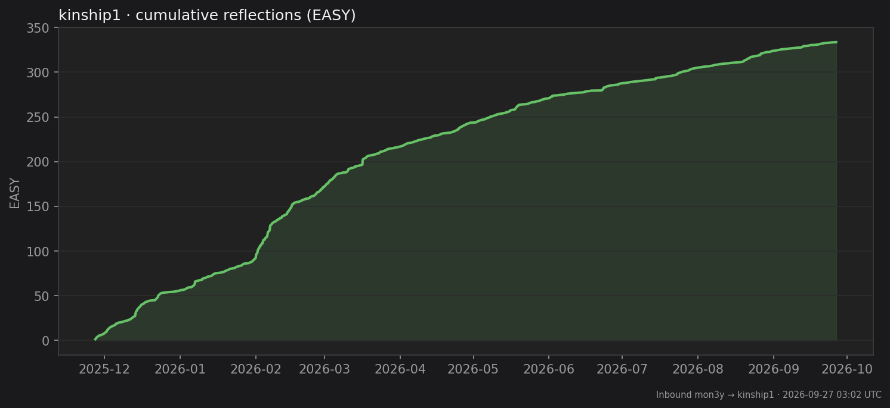
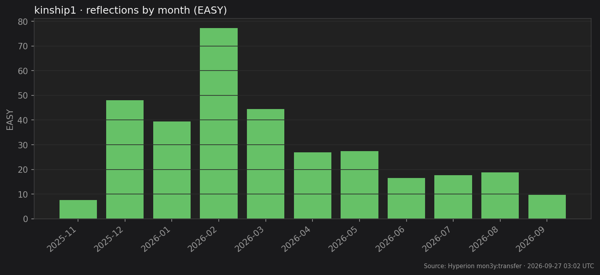
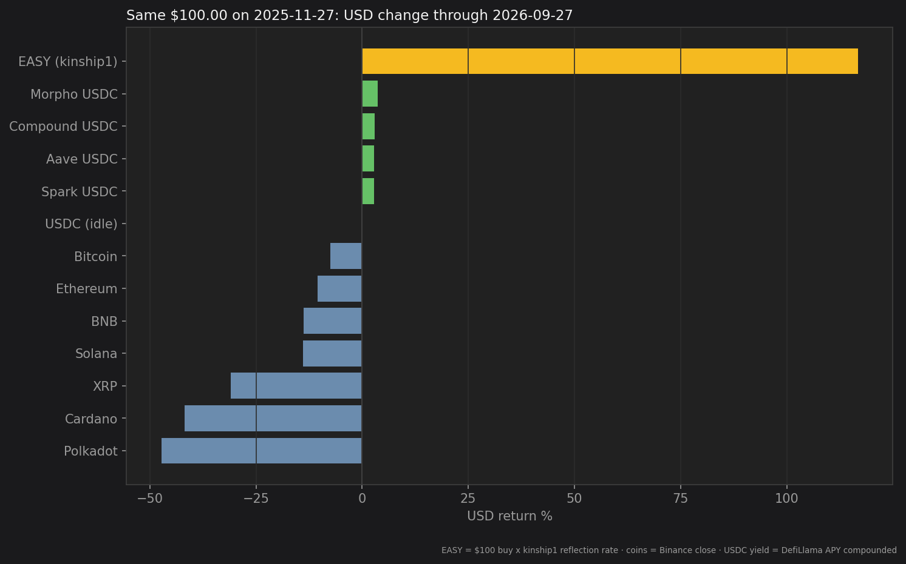
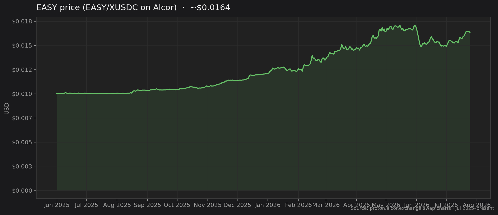
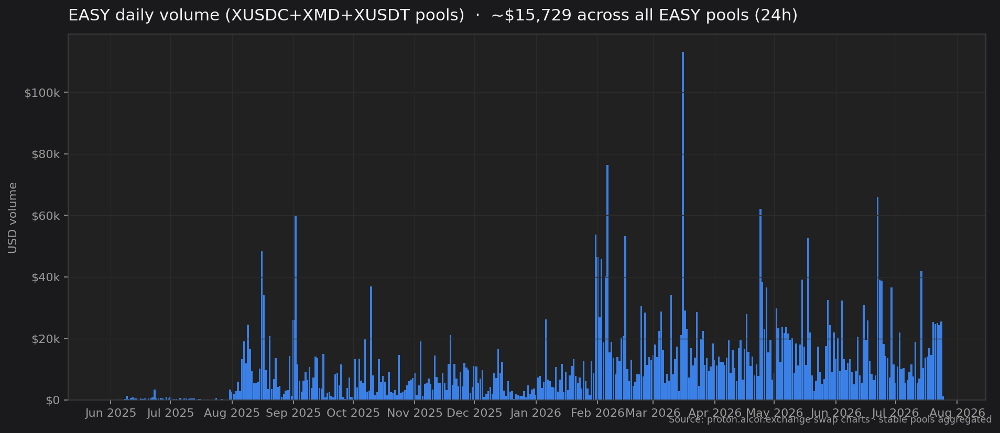
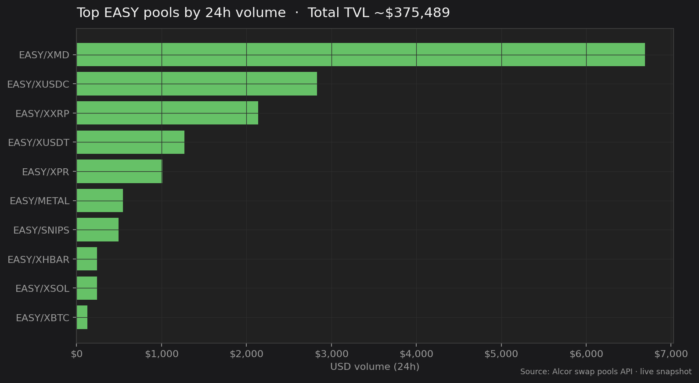

# Success Stories

Pics or it didn’t happen. `kinship1` is a live XPR account, not a backtest. *Updated 2026-10-06 18:42 UTC.*

## Case study: `kinship1`

[`kinship1`](https://explorer.xprnetwork.org/account/kinship1) received **1,000.00 EASY** from the `reflections` account on **2025-11-27** (“When things seem hard, Take it EASY”). That seed is the principal. It is not counted as yield. Yield is only inbound transfers from `mon3y`.

**Reflections earned since then:** **334.95 EASY** across **848** payments from `mon3y` (through 2026-10-05).

That is **+33.5% more EASY** on the seed (about **+40.1% APY** on quantity over 313 days). Wallet now: **1,334.95 EASY** (≈**$24.74**).

The comparison below takes that same reflection rate and applies it to a **$100** buy of EASY on **2025-11-27**, when EASY was **$0.0114**. That buy is **8,786.74 EASY**. After the same reflection rate it is **11,729.90 EASY**, about **$217.41** at **$0.0185**: **+117.4%** vs the $100 (**+147.5% APY** in USD).

| | |
| --- | --- |
| Account | [kinship1](https://explorer.xprnetwork.org/account/kinship1) |
| Seed (from `reflections`, not yield) | 1,000.00 EASY on 2025-11-27 |
| Reflections (mon3y → kinship1) | **334.95 EASY** (≈**$6.21** at today’s mark) |
| Reflection gain (EASY qty) | **+33.5% EASY** · **+40.1% APY** |
| $100 buy on that day | **8,786.74 EASY** at $0.0114 |
| Same rate, extrapolated bag | **11,729.90 EASY** (≈**$217.41**) |
| USD bag vs the $100 | **+117.4%** · **+147.5% APY** |
| Reflection payments | 848 |
| Wallet now | **1,334.95 EASY** |

You can verify any payment on the explorer: transfers from `mon3y` with memos like “Take it EASY 🍹 Reflect & Collect ❇️” / “Be EASY 🍹 flex.town 🏘”.

## The Perfect Gift

Your relatives probably do not know crypto, and they do not want it. Open the wallet for them. Put in **100 EASY** and **1 WON**. That is a few dollars. They can ignore it. It still pays.

[`jolly.1won`](https://explorer.xprnetwork.org/account/jolly.1won) is one of those wallets.

On **2025-12-24**, `printy` sent **200 EASY** once, and **1 WON** twice (**2 WON**). Memos said Merry Christmas. At that day's prices the package was **$4.85** (200 EASY at $0.0120, 2 WON at $1.22).

| | Gift day | Now |
| --- | --- | --- |
| EASY | 200.00 ($2.40) | **393.96** ($7.30) |
| WON | 2.00 ($2.45) | **2.00** ($3.67) |
| Together | **$4.85** | **$10.97** |

The EASY count is **+97.0%** higher. The dollars are **+126.4%** higher (**+183.9% APY** over 286 days). The WON count is still 2. WON's pay arrived as **125.61 EASY** through the WON/EASY pool. Holding the EASY added **68.35 EASY** from `mon3y`. No second deposit.

Copy the size, or copy this wallet's size. **100 EASY and 1 WON** is the same kind of gift. This account was given **200 EASY** and **2** transfers of **1 WON**. Set up the wallet. Put a few dollars in their name. Hand them the account.

## Same dollars, other bags

What if that **$100** had bought a major coin on **2025-11-27** instead, or sat in USDC / supplied USDC?

Buy-and-hold, no leverage, no trading. Coin marks are Binance USDT daily close vs now. Idle USDC is the USDC/USDT pair. “Staked USDC” rows compound DefiLlama daily supply APY on the named venue (Aave V3 Ethereum, Compound III Ethereum, Morpho Steakhouse USDC on Base, Spark Savings Ethereum). The EASY row is a **$100** buy on 2025-11-27, grown by kinship1’s reflection rate, marked in USD.

| Rank | Bag | Kind | Value now | USD change | USD APY |
| ---: | --- | --- | ---: | ---: | ---: |
| 1 | **EASY (kinship1)** | Flex token | $217.41 | **+117.4%** | +147.5% |
| 2 | Morpho USDC | staked USDC | $103.80 | +3.8% | +4.4% |
| 3 | Compound USDC | staked USDC | $103.01 | +3.0% | +3.5% |
| 4 | Aave USDC | staked USDC | $102.92 | +2.9% | +3.4% |
| 5 | Spark USDC | staked USDC | $102.87 | +2.9% | +3.4% |
| 6 | USDC (idle) | stable | $100.01 | 0.0% | 0.0% |
| 7 | Bitcoin | blue chip | $93.75 | -6.3% | -7.3% |
| 8 | Ethereum | blue chip | $89.40 | -10.6% | -12.3% |
| 9 | BNB | blue chip | $87.26 | -12.7% | -14.7% |
| 10 | Solana | blue chip | $85.88 | -14.1% | -16.3% |
| 11 | XRP | blue chip | $68.50 | -31.5% | -35.7% |
| 12 | Cardano | blue chip | $62.69 | -37.3% | -42.0% |
| 13 | Polkadot | blue chip | $52.08 | -47.9% | -53.3% |

The twelve comparison bags: Bitcoin, Ethereum, XRP, Solana, BNB, Cardano, Polkadot, idle USDC, plus four large USDC supply/savings venues. This is not advice, and a different window can reverse the ranking.

## EASY price (recent)

From the Alcor EASY/XUSDC pool: price stepped up from ≈$0.01 at launch into the mid-teens of cents.

Live analytics: [alcor.exchange/v/xpr/analytics/tokens/EASY-mon3y](https://alcor.exchange/v/xpr/analytics/tokens/EASY-mon3y)

## Volume

Daily volume across the main stable pools (XUSDC + XMD + XUSDT). Quiet at first, then the bots found the rails.

Where that volume sits today (top EASY pools by 24h USD):

Volume followed. See [Unintended Consequences](unintended-consequences.md) for how EASY became #1 on Alcor.

## Farms

Extensive rewards pools for [Alcor Farms (XPR)](https://alcor.exchange/v/xpr/analytics?tab=farms).

This is just what happens if you **buy and hold**. There are also other ways to earn with EASY, including the [Welcome Program](../maximizing-your-easy.md#welcome-program) and [providing liquidity](../maximizing-your-easy.md#provide-liquidity) against other coins.
