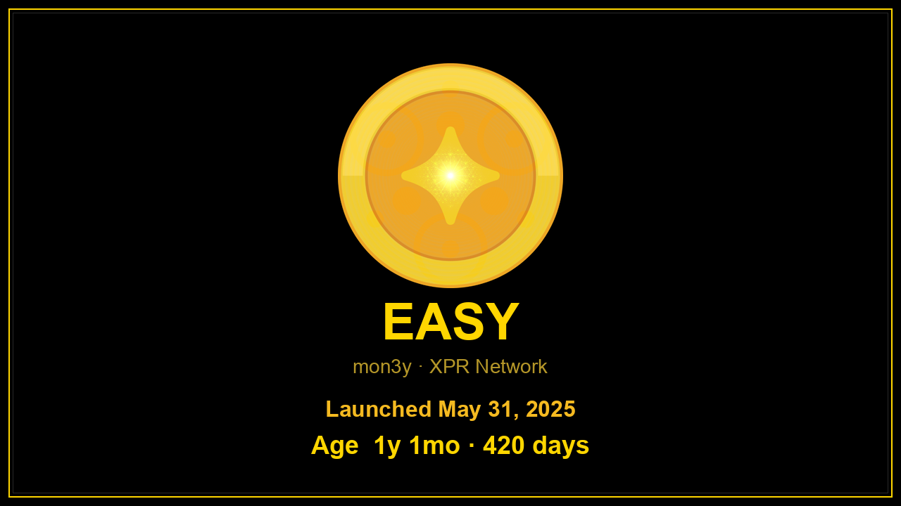

# Unintended Consequences

EASY was built to make reflections easy. The market had other plans.

## How EASY ate the stables

Day one, 100% of EASY supply was paired into stablecoin pools — including **XPAX** and **XPYUSD** alongside XUSDC, XUSDT, and XMD.

Traders and bots needed a liquid, always-on route between stables and everything else. EASY became that route. Volume stacked into the EASY pairs. Liquidity deepened. More volume followed.

Then the unintended part: those quieter stables — especially **XPAX** and **XPYUSD** — got pulled into EASY’s gravity well. Holding and routing through EASY was simply more useful than parking in the thin pools. Depth migrated. Attention migrated. The stables that were supposed to be “just backing” became fuel for the most traded non-chain-native pairs on Alcor.

## #1 on Alcor — sometimes beating XPR

EASY didn’t set out to top the leaderboard. It set out to pay holders.

Outcome: EASY became **#1 on Alcor by volume** — some days **crossing XPR itself in 24-hour volume**, and **consistently beating every other stablecoin** on the exchange.

That’s not a pitch deck metric. It’s what happens when you put a useful money-primitive in a place where bots and humans already trade: the rails get used harder than the asset you thought was the main character.

Live pulse (share of Alcor Proton swap volume, pool depth, price): [Market Stats](../market-stats.md). Story charts for a real bag: [Success in Community](success-in-community.md).

## Why it matters

Flex tokens are not magic. The feeling you get when you check your wallet and see it working for you — that’s magic.

EASY sucking up XPAX and XPYUSD, then out-volume-ing most of the book, is the proof that “infinitely liquid + reflections” isn’t just lore. It’s market behavior.

Take it EASY.
