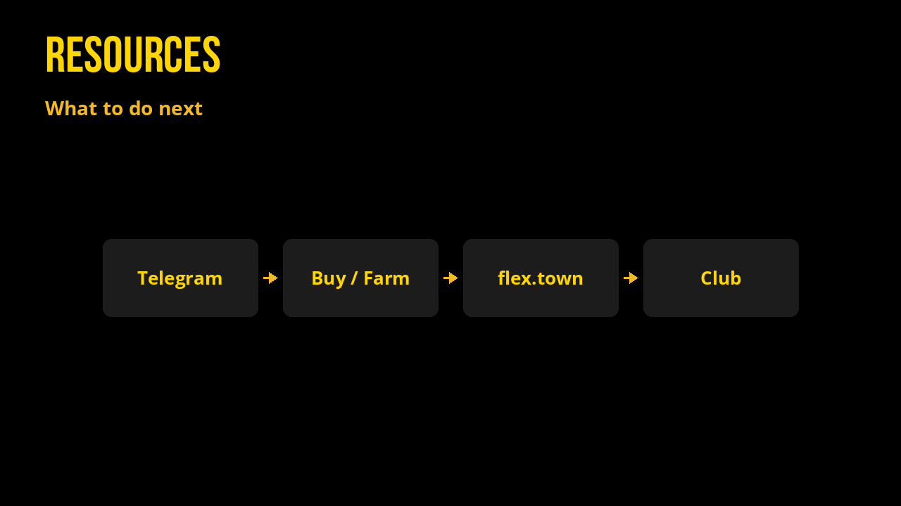

# Resources

Actions you might take next:

- Ask questions in [Telegram](https://t.me/flextokens)
- [Buy](https://alcor.exchange/v/xpr/swap?input=XUSDC-xtokens&output=EASY-mon3y) EASY or [farm](https://alcor.exchange/v/xpr/analytics?tab=farms)
- [Change reflections](https://flex.town) on flex.town
- Join Contributors Club: [add to Google Calendar](https://calendar.google.com/calendar/u/0/r/eventedit?text=Contributors+Club&dates=20260127T170000Z/20260127T180000Z&details=Share+your+contributions+to+EASY+and+WON+in+3-5+minutes+and+rank+others+to+distribute+shares.+www.flex.town.%0A%0AAlways+5PM+UTC%0AReal+Link:+https://meet.google.com/dqq-yian-hch&location=https://meet.google.com/dqq-yian-hch&recur=RRULE:FREQ%3DWEEKLY;INTERVAL%3D2;BYDAY%3DTU) (every 2 weeks, 5PM UTC)
- Check [Market Stats](market-stats.md) or [stablecoin arb](arbitrage.md)
- Study the docs, then dig into [Alcor docs](https://api.alcor.exchange/) / [API Reference](api-reference.md)

**Take it EASY** ✨
