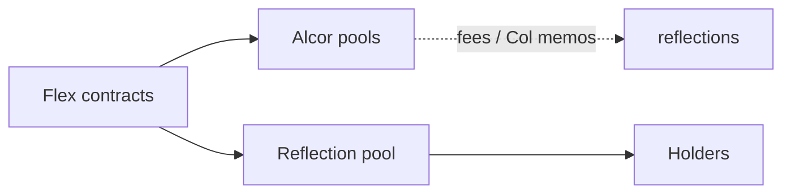

# Smart Contracts

Reflexive EOSIO tokens with flexible swap targets. Each Flex token lives on its own contract account.

| Token | Contract |
| --- | --- |
| EASY | [`mon3y`](https://explorer.xprnetwork.org/account/mon3y) |
| WON | [`w3won`](https://explorer.xprnetwork.org/account/w3won) |
| MEME | [`m3m3`](https://explorer.xprnetwork.org/account/m3m3) |
| GRAMS | [`gold.mon3y`](https://explorer.xprnetwork.org/account/gold.mon3y) |

Open any account above, then click **contract** on the explorer to see the actions you’ll use to submit transactions.

Browse the pages below for actions, tables, and on-chain tokenomics.
