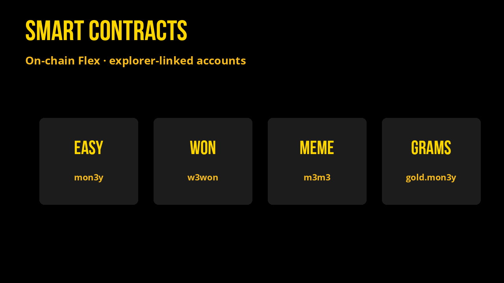
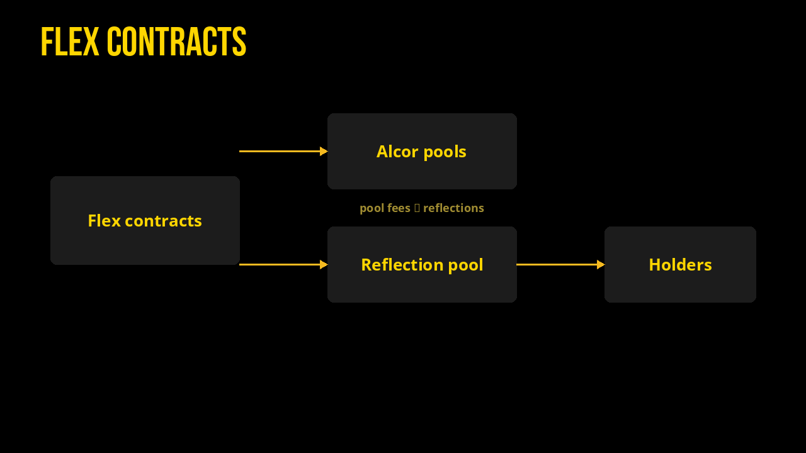

# Smart Contracts

Explorer first. Actions second.

| Token | Contract |
| --- | --- |
| EASY | [`mon3y`](https://explorer.xprnetwork.org/account/mon3y) |
| WON | [`w3won`](https://explorer.xprnetwork.org/account/w3won) |
| MEME | [`m3m3`](https://explorer.xprnetwork.org/account/m3m3) |
| GRAMS | [`gold.mon3y`](https://explorer.xprnetwork.org/account/gold.mon3y) |
| flexforex (any symbol) | [`for3x`](https://explorer.xprnetwork.org/account/for3x) |

- [EASY (`mon3y`)](easy.md)
- [WON (`w3won`)](won.md)
- [MEME (`m3m3`)](meme.md)
- [GRAMS (`gold.mon3y`)](grams.md)
- [flexforex (`for3x`)](flexforex.md)
- [API Reference](../api-reference.md)

Code is proprietary. Balances and actions are public on the explorer.
