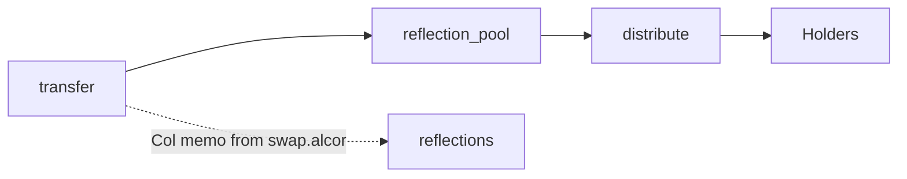

# EASY (contract: [`mon3y`](https://explorer.xprnetwork.org/account/mon3y))

Reflexive EOSIO token with flexible swap targets and configurable burn.

## Contract Surface (actions)

- `create`, `issue`, `open`, `close`, `burn` — standard token lifecycle; `burn` (contract-only in practice) reduces supply and the caller’s balance.
- `transfer` — enforces 2% reflection; fees are skipped for distributions sent by the contract and for banned flexers; Alcor-originated sends avoid adding fees on top of the transfer amount.
- `distribute` — paginates flexers, shares the reflection pool (≥100 tokens balance + 1K EASY in contracts pending reward pool), then burns the accumulated burn pool.
- `setconfig` — start key, page limit (≤1000), reflection rate, burn rate (sum ≤100%).
- `noflexzone` — ban/unban a flexer from fees/reflections (self-ban allowed; unban requires contract auth).
- `setflexpool` — register or update a flex pool hint (token, contract, Alcor pool IDs).
- `setflextoken` — pick a preferred flex pool by symbol (blank/EASY resets to default).
- `handle_transfer` (notify) — when receiving from `swap.alcor` with memos starting `Col`, forwards fees to `reflections`.

## Data Model (tables)

- `accounts` (per owner) — balances.
- `stat` (per symbol) — supply, max_supply, reflection_pool, burn_pool, issuer.
- `flexers` (contract scope) — owner, balance, banned flag, flextoken (pool id).
- `flexpools` — id, token_symbol, token_contract, pool_ids (Alcor hints).
- `settings` (singleton) — token_symbol, start_key, limit, reflection_rate, burn_rate.

## Tokenomics — EASY on XPR Network

- **Supply:** 21,000,000 EASY max.
- **Liquidity allocation:** 4,200,000 EASY paired day-one into each stable pool on `hands.mon3y`: XMD, XUSDC, XPYUSD, XPAX, XUSDT (100% of supply placed).
- **Bridges:** Bridges exist (Solana, Base, Optimism, BSC) but no supply is pre-allocated to bridges.
- **Rates:** 2% reflection (per transfer).
- **Fee skips:** Contract-driven distributions and banned flexers skip fees.
- **Distribution math:** Excludes balances of `alcor`, `mon3y`, and `swap.alcor` from supply; requires both holder and reflection pool to have ≥100 tokens; distributes 61.8% of pro-rata share (for smoothing, Fibonacci ratio is used).
- **Flex pools:** Holders can opt into swap-routing memos via `setflextoken`; memos target `swap.alcor` with provided pool ids and token hints.
