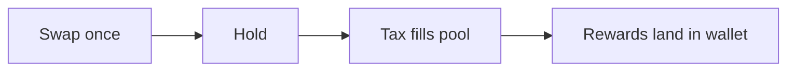

# Start Here

Welcome,

You landed here to **swap** once and take it EASY as you stack.

How it works: All Flex tokens send proportional rewards directly to your wallet from a pool filled by a token transfer fee.

Each Flex token customizes three fee options: reflection, burn, and project. All allow you to **flex** what token you get (BTC, SOL, other Flex tokens, and more).

## Fee glance

| Token | Reflection | Burn | Team | Tagline |
| --- | ---: | ---: | ---: | --- |
| **EASY** | 2% | — | — | Take it EASY |
| **WON** | 2.2% | — | 0.8% | We WON |
| **MEME** | 1% | 1% | — | burns + farms |
| **GRAMS** | 1.1% | — | 0.11% | gold-backed |

Each may have additional farming rewards. EASY alone has a protocol fee to fund Flex volunteer efforts and infrastructure.

## Take it EASY

Click this link, then click swap: [alcor.exchange/v/xpr/swap](https://alcor.exchange/v/xpr/swap)

Keep reading for [tokenomics](tokenomics.md), [maximizing](maximizing-your-easy.md), and bi-weekly EASY Club meetings.
