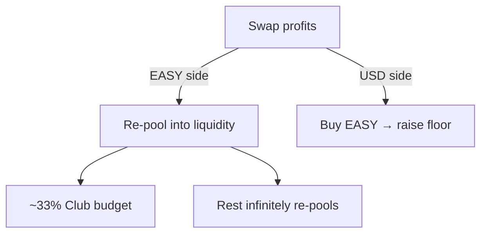
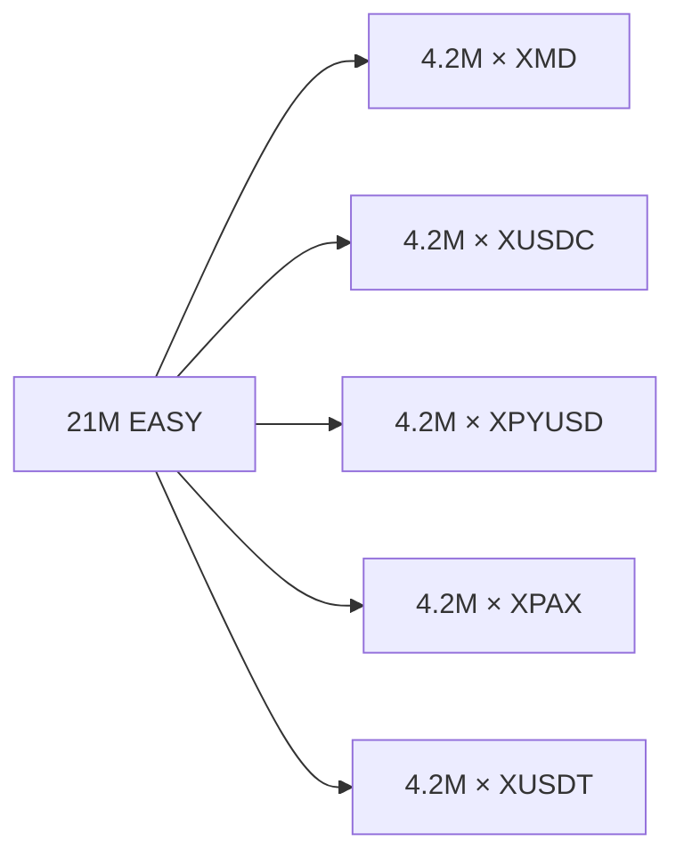

# Tokenomics of EASY

Take it EASY 👄 💰 You have EASY 👄 → You are given more EASY.

Get a Wallet | [Buy EASY](https://alcor.exchange/v/xpr/swap) | [Analytics](https://alcor.exchange/v/xpr/analytics/tokens/EASY-mon3y) | [Farms](https://alcor.exchange/v/xpr/analytics?tab=farms) | [Telegram](https://t.me/flextokens)

## Brief

| | |
| --- | --- |
| **Max supply** | 21M EASY |
| **Day-one placement** | 100% in stablecoin pools (no presale) |
| **Transfer tax** | 2% (opt-out) |
| **Earn threshold** | Hold 100+ EASY · 1,000 EASY in pool to pay |
| **Bridges** | Solana, Base, Optimism, BSC |

## Infinitely Liquid

Fair launched 100% max supply into Alcor pools from $0.01-100,000 USD(c).

The math keeping EASY on the up and up is… easy… Every token was purchased with at least 0.01 USD(c) and is instantly redeemable in the same liquidity pools it was originally purchased from. There’s over 25K USD in stablecoins (USDC, USDT, PyUSD, XMD, and PAX) backing EASY, and growing.

Pools earn some profit on EASY/USD(c) swap fee of 0.05%-1%.

EASY provides a highly-used service to the market, liquidity for humans and bots to trade. Over 1.6M USD in 90d volume (and growing).

- 100% of EASY swap profits are infinitely re-pooling.
- 100% of USD(c) profits used to purchase EASY (raising the redeemable price of EASY).
- ~33% re-pool profits paid to Club budget, the rest infinitely re-pools.

## Day-one liquidity allocation

4,200,000 EASY paired day-one into each stable pool on `hands.mon3y` (100% of supply):

| Pool | EASY day one |
| --- | ---: |
| EASY / XMD | 4,200,000 |
| EASY / XUSDC | 4,200,000 |
| EASY / XPYUSD | 4,200,000 |
| EASY / XPAX | 4,200,000 |
| EASY / XUSDT | 4,200,000 |
| **Total** | **21,000,000** |

Live depth and volume: [Market Stats](market-stats.md) · Buyback rhythm: [Celestial Buybacks](celestial-buybacks.md).
