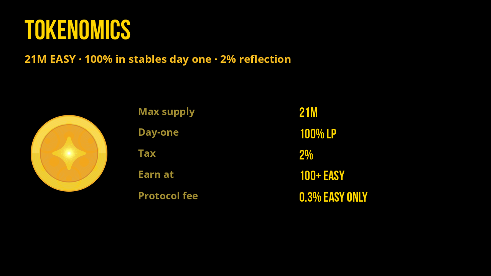
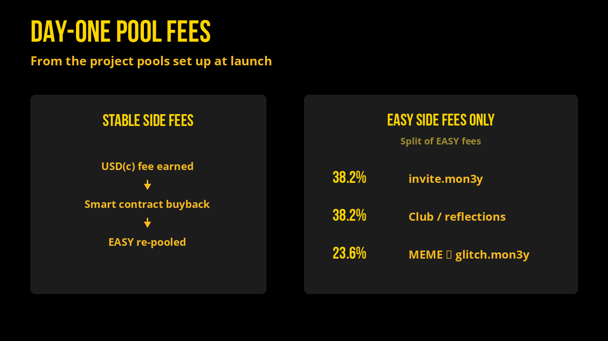
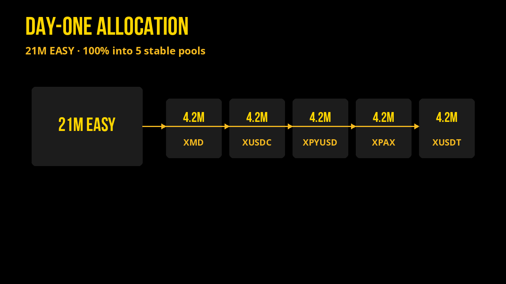

# Tokenomics

[Get a Wallet](https://webauth.com) | [Buy EASY](https://alcor.exchange/v/xpr/swap?input=XUSDC-xtokens&output=EASY-mon3y) | [Analytics](https://alcor.exchange/v/xpr/analytics/tokens/EASY-mon3y) | [Farms](https://alcor.exchange/v/xpr/analytics?tab=farms) | [Telegram](https://t.me/flextokens)

## EASY

| | |
| --- | --- |
| **Max supply** | 21M EASY (100% minted day one into liquidity) |
| **Day-one placement** | 100% in stablecoin pools (no presale) |
| **Transfer tax** | 2% reflection (opt-out) |
| **Earn threshold** | Hold 100+ EASY · 1,000 EASY in pool to pay |
| **Payout smoothing** | Each `distribute` pays **61.8%** of each flexer’s pro-rata share (Fibonacci smoothing); the rest stays in the pool for later rounds |
| **Protocol fee** | **0.3%** of/from the reflection pool per payout action ([Legal & Terms](legal-and-terms.md)) |
| **Bridges** | Solana, Base, Optimism, BSC |

## Infinitely Liquid

Fair launched 100% max supply into Alcor pools from $0.01-100,000 USD(c).

The math keeping EASY on the up and up is… easy… Every token was purchased with at least 0.01 USD(c) and is instantly redeemable in the same liquidity pools it was originally purchased from. There’s over 25K USD in stablecoins (USDC, USDT, PyUSD, XMD, and PAX) backing EASY, and growing.

Pools earn fees on the **day-one project pools** the team set up at launch (EASY paired into XMD, XUSDC, XPYUSD, XPAX, XUSDT). Swap fees are typically 0.05%–1% depending on the pool.

**How those fees are used**

- **Stablecoin-side fees** (USD(c) earned in the pools) are **automatically bought back into EASY** by smart contract, then **re-pooled** (raising redeemable depth).
- **EASY-side fees only** are split for ecosystem use. That EASY is what funds Welcome, Contributors Club, and MEME buybacks into the locked [`glitch.mon3y`](https://explorer.xprnetwork.org/account/glitch.mon3y) contract.

- **38.2%** of EASY-side fees → [`invite.mon3y`](https://explorer.xprnetwork.org/account/invite.mon3y) (Welcome Program)
- **38.2%** → Contributor Club budget (`reflections`)
- **23.6%** → MEME buyback to locked [`glitch.mon3y`](https://explorer.xprnetwork.org/account/glitch.mon3y)

Reasoning: the Welcome Program has led to many smaller accounts, which means less EASY to give out at Contributor Club meetings, so a larger share now funds invites + Club, with the rest buying MEME into `glitch.mon3y`.

## Day-one liquidity allocation

4,200,000 EASY paired day-one into each stable pool on `hands.mon3y` (100% of supply):

| Pool | EASY day one | Alcor |
| --- | ---: | --- |
| EASY / XMD | 4,200,000 | [4067](https://alcor.exchange/v/xpr/analytics/pools/4067) |
| EASY / XUSDC | 4,200,000 | [4065](https://alcor.exchange/v/xpr/analytics/pools/4065) |
| EASY / XPYUSD | 4,200,000 | [4068](https://alcor.exchange/v/xpr/analytics/pools/4068) |
| EASY / XPAX | 4,200,000 | [4070](https://alcor.exchange/v/xpr/analytics/pools/4070) |
| EASY / XUSDT | 4,200,000 | [4066](https://alcor.exchange/v/xpr/analytics/pools/4066) |
| **Total** | **21,000,000** | |

Live depth and volume: [Market Stats](market-stats.md) · Venus unlocks (one pool at a time): [Celestial Buybacks](celestial-buybacks.md).

## Flex family (all tokens)

<!-- LIVE:FLEX-TOKENOMICS -->
*Live snapshot: **2026-08-25 05:05 UTC** · Alcor + chain `stat` tables*

### Supply (all Flex tokens)

| Token | Circulating Supply | Max Supply | Price (USD) |
| --- | ---: | ---: | ---: |
| **EASY** | 21M | 21M | $0.018561 |
| **WON** | 1M | 1M | $1.862779 |
| **MEME** | 9.985T | 10T | $0.000000 |
| **GRAMS** | 1B | 1B | $146.985655 |

**MEME burned:** **0.15%** of max supply (15.283B of 10T burned; circulating 9.985T).

### Fee rates

| Token | Reflection | Burn | Team | Hold to earn | Pool to pay | Tagline |
| --- | ---: | ---: | ---: | ---: | ---: | --- |
| **EASY** | 2% | - | - | 100+ | 1,000 EASY | Take it EASY |
| **WON** | 2.2% | - | 0.8% | 1.0+ | 8 WON | We WON |
| **MEME** | 1% | 1% | - | 1M+ | 10M MEME | burns + farms |
| **GRAMS** | 1.1% | - | 0.11% | see contract | see contract | gold-backed |

### Major-token USD backing (live)

USD value of **major** counter-assets sitting in each token’s Alcor pools (not full Alcor `tvlUSD`).

| Token | Total major backing | Breakdown |
| --- | ---: | --- |
| **EASY** | **$81,679** | XMD $16,511, XUSDC $18,357, XPYUSD $15,195, XPAX $15,998, XUSDT $15,617 |
| **WON** | **$1,855** | EASY $1,665, XPR $189.92 |
| **MEME** | **$1,785** | XPR $373.15, XUSDC $289.63, EASY $1,122 |
| **GRAMS** | **$1,200** | XPAXG $1,200 |

- **EASY majors:** XMD · XUSDC · XPYUSD · XPAX · XUSDT  
- **WON majors:** EASY · XPR  
- **MEME majors:** XPR · XUSDC · EASY  
- **GRAMS majors:** XPAXG  

<!-- /LIVE:FLEX-TOKENOMICS -->

Each may have additional farming rewards. EASY alone has a protocol fee path that funds Flex volunteer work and infrastructure (see [Legal & Terms](legal-and-terms.md)).
