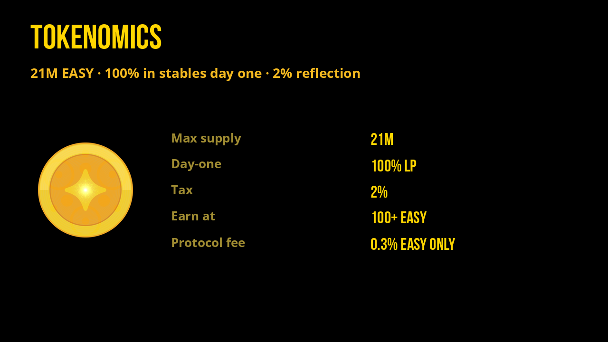
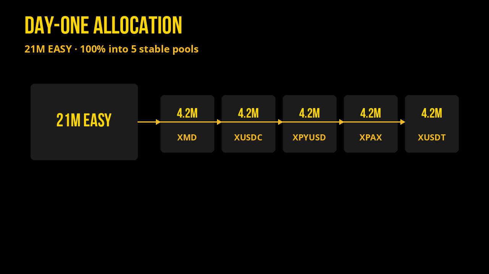
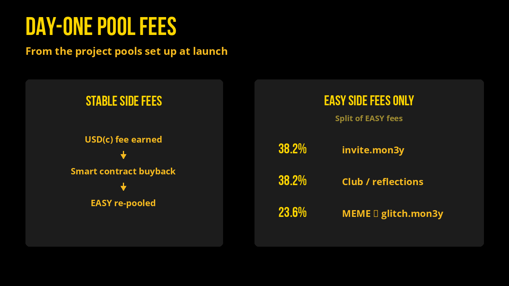

# Tokenomics

[Get a Wallet](https://webauth.com) | [Buy EASY](https://alcor.exchange/v/xpr/swap?input=XUSDC-xtokens&output=EASY-mon3y) | [Analytics](https://alcor.exchange/v/xpr/analytics/tokens/EASY-mon3y) | [Farms](https://alcor.exchange/v/xpr/analytics?tab=farms) | [Telegram](https://t.me/flextokens)

## EASY

| | |
| --- | --- |
| **Max supply** | 21M EASY (100% minted day one into liquidity) |
| **Day-one placement** | 100% in stablecoin pools (no presale) |
| **Transfer tax** | 2% reflection (opt-out) |
| **Earn threshold** | Hold 100+ EASY. Pool needs 1,000 EASY to pay |
| **Payout smoothing** | Each `distribute` pays **61.8%** of each flexer’s share |
| **Protocol fee** | **0.3%** of the reflection pool per payout ([Legal](legal-and-terms.md)) |
| **Bridges** | Solana, Base, Optimism, BSC |

## Day-one liquidity

Fair launch: 100% of max supply into Alcor pools from $0.01-$100,000 USD(c). Every token was bought with at least $0.01 USD(c) and can be sold back into the same pools.

4,200,000 EASY into each stable pool on `hands.mon3y`:

| Pool | EASY day one | Alcor |
| --- | ---: | --- |
| EASY / XMD | 4,200,000 | [4067](https://alcor.exchange/v/xpr/analytics/pools/4067) |
| EASY / XUSDC | 4,200,000 | [4065](https://alcor.exchange/v/xpr/analytics/pools/4065) |
| EASY / XPYUSD | 4,200,000 | [4068](https://alcor.exchange/v/xpr/analytics/pools/4068) |
| EASY / XPAX | 4,200,000 | [4070](https://alcor.exchange/v/xpr/analytics/pools/4070) |
| EASY / XUSDT | 4,200,000 | [4066](https://alcor.exchange/v/xpr/analytics/pools/4066) |
| **Total** | **21,000,000** | |

Swap fees on those pools are typically 0.05%-1%.

**How those fees are used**

- **Stablecoin-side fees** → smart contract buys EASY → re-pooled (more redeemable depth)
- **EASY-side fees only**
  - **38.2%** → [`invite.mon3y`](https://explorer.xprnetwork.org/account/invite.mon3y) (Welcome)
  - **38.2%** → Contributor Club (`reflections`)
  - **23.6%** → MEME buyback into locked [`glitch.mon3y`](https://explorer.xprnetwork.org/account/glitch.mon3y)

Live depth: [Market Stats](market-stats.md). Venus unlocks (one pool at a time): [Celestial Buybacks](celestial-buybacks.md).

## Flex family (all tokens)

<!-- LIVE:FLEX-TOKENOMICS -->
*Live snapshot: **2026-09-29 18:23 UTC** · Alcor + chain `stat` tables*

### Supply (all Flex tokens)

| Token | Circulating Supply | Max Supply | Price (USD) |
| --- | ---: | ---: | ---: |
| **EASY** | 21M | 21M | $0.018426 |
| **WON** | 1M | 1M | $1.831080 |
| **MEME** | 9.981T | 10T | $0.000000 |
| **GRAMS** | 1B | 1B | $133.405900 |

**MEME burned:** **0.19%** of max supply (18.81B of 10T burned; circulating 9.981T).

### Fee rates

| Token | Reflection | Burn | Team | Hold to earn | Pool to pay | Tagline |
| --- | ---: | ---: | ---: | ---: | ---: | --- |
| **EASY** | 2% | - | - | 100+ | 1,000 EASY | Take it EASY |
| **WON** | 2.2% | - | 0.8% | 1.0+ | 8 WON | We WON |
| **MEME** | 1% | 1% | - | 1M+ | 10M MEME | burns + farms |
| **GRAMS** | 1.1% | - | 0.11% | see contract | see contract | gold-backed |

### Major-token USD backing (live)

USD value of **major** counter-assets sitting in each token’s Alcor pools (not full Alcor `tvlUSD`).

| Token | Total major backing | Breakdown |
| --- | ---: | --- |
| **EASY** | **$76,325** | XMD $15,885, XUSDC $15,693, XPYUSD $15,058, XPAX $14,730, XUSDT $14,959 |
| **WON** | **$1,777** | EASY $1,724, XPR $52.81 |
| **MEME** | **$1,500** | XPR $423.27, XUSDC $256.26, EASY $820.73 |
| **GRAMS** | **$1,486** | XPAXG $1,486 |

- **EASY majors:** XMD · XUSDC · XPYUSD · XPAX · XUSDT  
- **WON majors:** EASY · XPR  
- **MEME majors:** XPR · XUSDC · EASY  
- **GRAMS majors:** XPAXG  

<!-- /LIVE:FLEX-TOKENOMICS -->
