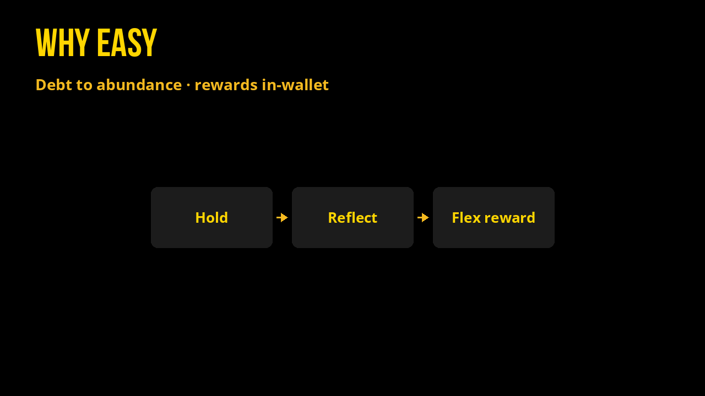

# Why EASY

## Why I Built EASY, and all Flex Tokens.

I believe token tech can free people financially to love more in their unique way.  
Decentralized fintech needs be easy, and exciting.

EASY experiments as the conversion layer from debt-backed FIAT systems (via stablecoins) to abundant systems where time pays you.[^1]

Holders receive proportional rewards in-wallet. You can keep EASY, or **flex** those rewards into assets that match what you actually care about.[^2]

## New-Earth money is EASY

There’s an ocean of money energy moving around every second. To channel it can reorganize the planet.

Today, financial energy is being channeled by governments (money-issuers) from citizens to fund public services.

Gasp! The channel is leaking, to the tune of ~ a trillion dollars a year (USA)

The crack is interest on interest resulting in 20% of the revenue to the US government (40% of all revenue from citizens' taxes) paid to other nations.

Today, we work below that layer, on a money that is an evolution of money: Flex Tokens.

Reflexive technology allows more than a quick interest payment. It turns the energy of time into an investment in tokens that represent your interests and beliefs, by letting you collect that interest in other tokens like XBTC (wrapped BTC), GRAMS, or 20+ others.

The difference? When you let your EASY compound, it reflects EASY to your account. When you choose GRAMS, MEME, XBTC, it’s now reflexive.

## EASY is part of a plan to rewire the global financial system

An important layer of the financial system is inefficient: FIAT.

When energy seeks a more efficient path, it writhes until latching, transferring the potential, and relaxing to become a path.

It all starts with a simple concept: financial energy channeled better.

Look at EASY as an early route in that lattice: money that pays stakeholders for holding, while staying redeemable into the stables that already touch the old system.[^3]

EASY is among the first customizable-reflection tokens built as a real experiment on Antelope rails, with transparent fees and day-one vaulted liquidity.[^4]

In a real-life experiment.

We can base economies on stablecoins that collect + redistribute “tax” automatically.

Those flows are fed by volume: humans and bots racing each other across liquid pairs.

Interest on debt taxes the productive economy. Currency with yield built in gives every stakeholder a reason to hold the unit that keeps the system alive.

People can slowly invest in other tokens like XBTC or GRAMS via auto-swapping rewards, just by holding a stabler option.

Rewards over time create value and incentive.

Tokens can be used in a voting system, governing system, legal system, patterns already sketched in open Web 4 / time-token work.[^5]

Imagine: all distributions of “tax money” are transparent, the people (or reps) vote on budgets and proposals with clarity in decision, checked by public knowledge.

If you’re here for dead-simple yield you can still see in your wallet, you’re in the right place. If you’re here to help rebuild how value moves, you’re in good company. Live pulse: [Market Stats](market-stats.md). Proof on a real bag: [Success Stories](our-story/success-stories.md). The builder’s arc: [Founder Story](our-story/founder-story.md).

[^1]: [Bridged EASY contracts](https://github.com/dougbutner/Bridged-EASY-Contracts)

[^2]: [sol-flex](https://github.com/dougbutner/sol-flex)

[^3]: [Tokenomics](tokenomics.md) · [Celestial Buybacks](celestial-buybacks.md)

[^4]: [alcor-ui](https://github.com/dougbutner/alcor-ui) · [flex-spot-bot](https://github.com/dougbutner/flex-spot-bot) · [Smart Contracts](smart-contracts/README.md)

[^5]: [Web 4 Manifesto](https://douglas-life.medium.com/provable-democracy-the-web-4-manifesto-by-douglas-butner-3c8785d2f92a) · [web-4](https://github.com/dougbutner/web-4) · [cXc.world](https://cxc.world)
